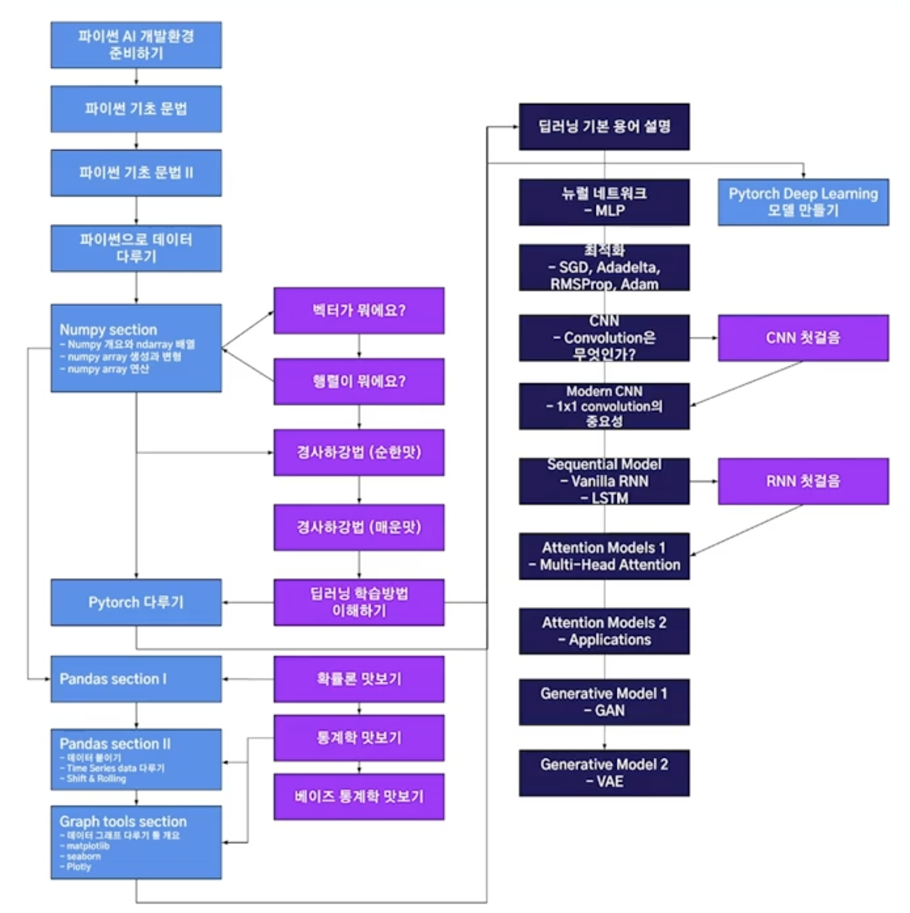
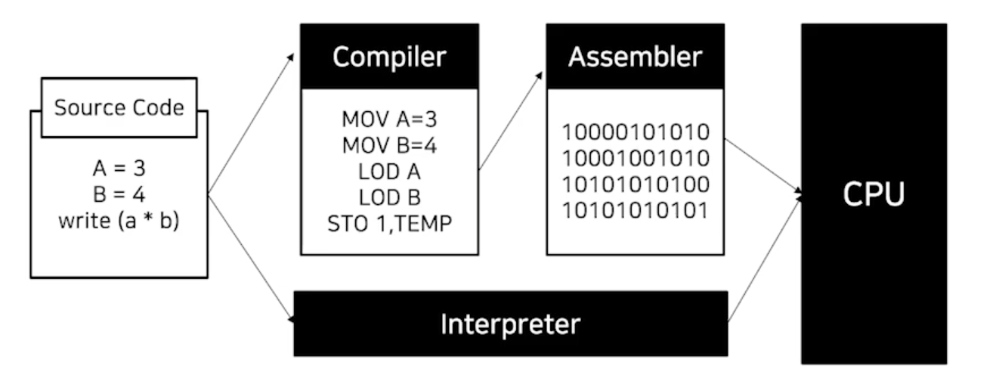
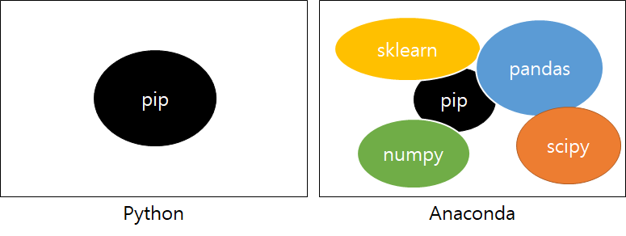

# Day 0 & Day 1 File System & Terminal
1주차
- 파이썬 기초

2주차

- 파이썬 데이터 분석 도구
- 딥러닝에 사용되는 수학 

3주차

- PyTorch
- 딥러닝에 대한 개념/코드를 이해
    - 딥러닝에 사용되는 코드를 low-level까지 이해하는 것이 목표
    - 남들이 만들어놓은 라이브러리 코드에 대한 이해


## 개요
- 강좌에 대한 정리를 진행하고, 추가로 제공하는 references 및 추가 공부를 정리
- 피어 세션 정리

## Hidden class - Basic computer class for newbies
shell programming - terminal에서 쓰는 프로그래밍

1. 컴퓨터 OS
2. 파일 시스템
3. 터미널

**컴퓨터 OS**
> 프로그램이 동작하기 위한 기반이 되는 환경
> Hardware 자체 만으로 컴퓨터가 동작할 수 없다
> Software와 Hardware의 연결의 기반이 되는 것

ex) OS마다 서로 다른 프로그램을 실행 (applications들은 운영체제에 의존적 - .exe), python interpreter도 운영체제에 의존적

**파일 시스템**
> OS에서 파일을 저장하는 트리구조 저장 체계
> 파일: 컴퓨터 등의 기기에서 의미 있는 정보를 담는 논리적인 단위
> 디렉토리: 폴더(파일과는 다른 디렉토리를 포함할 수 있는 그릇)

파일: 컴퓨터에서 정보를 저장하는 논리적인 단위.
- 파일명과 확장자로 식별됨
- 확장자로 어떤 종류의 파일인지를 알 수 있음
- 실행, 읽기 쓰기 등의 작업 가능

윈도우 C드라이브를 기준으로 시스템이 시작, 맥은 root 디렉토리부터 시작
- 90년대의 플로피 디스크
- [참조](https://www.youtube.com/watch?v=PSOHb2GC-rM&ab_channel=%EB%A0%88%EB%93%9C%EB%85%B8%ED%8B%B0)

경로: 컴퓨터 파일이 있는 고유의 위치
절대경로: 루트디렉토리부터 파일의 위치
상대경로: 현재 내가 있는 디렉토리부터 타겟 파일의 위치 (./ ../)

**터미널**
> mouse가 아닌 키보드로 명령을 입력 프로그램 실행

CLI(Command Line Interface)
- GUI(Graphic User Interface)와 대비되는 CLI와 달리 Text를 사용하여 컴퓨터에 명령을 입력하는 인터페이스 체계
- console = terminal = cmd창

각 터미널에서는 프로그램을 작동하는 shell(껍데기)이 존재
- shell마다 다른 명령어를 사용
- shell: interface between core and user

기본 명령어
 명령어 | 의미 
---|:---:
cd | change directory
mkdir | make directory
ls | list
../ | 현재 위치의 디렉토리에서 한칸 앞으로 가라 (탭으로 자동완성)
cp 카피하고싶은경로 카피할경로 | 파일 복사
clear | clear screen
rm | delete

## 파이썬 개요

**파이썬의 시작**
- 1991년 귀도 반 로섬이 발표
- 플랫폼 독립적
- 인터프리터 언어
- 객체지향
- 동적 타이핑 언어
- 처음 C언어로 구현되었음
- 1989년 크리스마에 할일이 없어 파이썬 개발
- Monty Python's Flycing Circus에서 유래
- 자비로운 종신 독재자: 파이썬의 개선 사항(PEP)에 대한 최종 의사결정자

**Python 이름의 유래**
- Python(피톤)은 그리스 신화속의 괴물 뱀
- 몬티 파이썬이라는 코메디 그룹의 이름에서 유래
- 로고도 뱀모양

**Python의 특징**
- 플랫폼 독립적인 인터프리터 언어
    - 플랫폼 = OS: 
    - 독립적인 = 관계없는, 상관없는: 운영체제에 상관없이 작동되는 언어다
    - 인터프리터 = 통역기를 사용하는 언어: 파이썬의 문법으로 만들어진 코드를 통역
- 플랫폼 독립적: 윈도우에서 작성하든, 맥OS에서 작성하든.. 
    - 각 OS에 적절한 인터프리터만 설치되어 있다면 파이썬이 돌아간다.

**컴파일러 Vs. 인터프리터**
컴파일러
> 사람이 말하는 것을 처음부터 끝까지 듣고 나서 한꺼번에 바꿔주는 것을 컴파일(compile) 방식
- 소스코드를 기계어로 먼저 번역
- 프로그램을 실행시키기전에 그 운영체제에 맞춰서 번역을 시켜줌
    - 번역된 파일은 같은 운영체제에서 어디든 실행 가능
인터프리터
> 사람이 한 마디 할 때마다 동시통역해주는 방식을 인터프리트(interpret) 방식
- 별도의 번역과정 없이 바로 실행 (실행 시점에서 해석)
    - 실행할 때마다 해석하기 때문에 조금 느림

**프로그램의 동작 과정**
인터프리터
- 한번에 번역
컴파일러
- OS에 맞춰서 만들어진 프로그램을 다시 한번 실행시키는 과정을 거침
인터프리터가 조금 더 간단하게 실행 됨. 하지만 컴파일러 언어가 인터프리터 언어보다 빠르다



객체 지향적 언어
- 실행 순서가 아닌 단위 모듈(객체) 중심으로 프로그램을 작성
    - 하나의 객체는 어떤 목적을 달성하기 위한 행동(method)와 속성(attribute)을 가지고 있음
동적 타이핑 언어
- 프로그램이 **실행하는 시점**에 프로그램이 사용해야할 **데이터에 대한 타입을 결정**

**Why Python**
- 과거에는 컴퓨터가 느려서 컴퓨터의 시간이 중요했지만, 이제는 컴퓨터의 발달로 사람의 시간이 중요해짐
- 손쉬운 타이핑
- 다양한 라이브러리

## 파이썬 코딩환경

**개발 환경 설정**
1. 운영체제
- windows, linux, Mac OS
2. Python Interpreter
- 3.X 버전
    - 기존 라이브러리 사용 여부에 따라 버전 선택
- Python: 일반적인 파이썬, 기본적인 모듈을 포함
- Anaconda: 다양한 과학 계산용 모듈들을 묶어서 패키지
    - minconda 추천
3. 코드 편집기 (Editor)
- 프로그래밍에 적합화된 문서 편집기

**Jupyter 개요**
- IPython(interactive python - web에서 파이썬 shell을 좀 더 쉽게 사용하는) 프로젝트의 발전
- 확장자 notebook
- Julia + Python + R

`conda install jupyter`

**Jupyter**
- 박스하나를 cell 이라고 함
- `ctrl + enter`: cell의 코드 실행(메모리에 올라간다)
-` alt + enter`: cell 추가
- dir() `shift + tab`: tooltip 보기
- edit mode: cell안에서 코딩 
- command mode: esc누르면 
    - `dd`: 삭제
    - `shift + m`: 셀 합치기 
    - `x`: 오려두기
    - `v`: 붙여넣기
    - `esc + a`: 위에 셀 추가
    - `esc + b`: 아래 셀 추가
    - `esc + m`: 문서 셀로 변경 
    - `esc + y`: 코드 셀로 변경
    - `h` key에서 shortcuts 확인 가능

**Colab**
- Jupyter랑 동일 (구글이 개발 클라우드 기반의 jupyter notebook)
- 구글 드라이브 + GCP + jupyter
- GPU를 무료로 사용 가능
- VScode와 연결해서 사용 가능ㅋ
- 단축키
    - 컨트롤 m이 붙음
- [참조](https://www.youtube.com/watch?v=Q7XMSDpBb7g&ab_channel=todaycode%EC%98%A4%EB%8A%98%EC%BD%94%EB%93%9C)

## 개인학습 및 references 정리

**python vs. anaconda**

- 해당 교육에서는 minconda를 사용
    - anaconda의 light version
    - 기본적인 요구사항만 포함하여, 필요한 패키지를 그때그때 설치하여 사용 가능
- [참조1](https://jwkim96.tistory.com/32)
- [참조2](https://kim-dragon.tistory.com/19)
- conda는 가상 환경 관리자

[구글 코랩 (Google Colab) 튜토리얼 강의와 꿀팁](https://www.youtube.com/watch?v=nQu9yycRaMI&feature=youtu.be&ab_channel=%ED%85%8C%EB%94%94%EB%85%B8%ED%8A%B8)
- **비싼 GPU 제공해줌**
단축키
- `cmd + M A`: 위에 삽입
- `cmd + M B`: 아래에 삽입
- `cmd + M D`: 셀 삭제
- `cmd + M M`: 텍스트/코드 셀 토글
- `cmd + enter`: 해당 셀 실행 후 커서 유지
- `shift + enter`: 해당 셀 실행 후 커서 다음 칸
- `alt + enter`: 해당 셀 실행 후 다음에 새로운 셀 추가
- `cmd + M H`: 단축키 도움말

파일업로드
방법.1 직접 업로드하기
```
from google.colab import files
myfile = files.upload()
```

방법.2 드라이브에서 가져오기
```
from google.colab import drive
drive.mount('content/drive')
```
좌측 세번째 폴더 클릭하고 새로고참
- 원하는 파일 우클릭 -> 경로복사

방법.3 github 연동
ipynb파일이 있는 URL 주소에서..
- https://colab.research.google.com(URL에서 .com을 지우고)
1. github.com -> github 변경
2. colab.research.google.com 맨앞에 추가

[비쥬얼 스튜디오 코드 필수 단축키 정리 (Visual Studio Code 꿀템🍯🐝 )
](https://www.youtube.com/watch?v=EVxCdenPbFs&ab_channel=%EB%93%9C%EB%A6%BC%EC%BD%94%EB%94%A9by%EC%97%98%EB%A6%AC)
- Command Palette: `cmd + shift, P`
    - 단축키 확인 및 명령 가능
- quick open: `cmd + P`
    -  빠르게 파일 열기
- User Settings: `cmd + ,`
- toggle sidebar: `cmd + b`
- toggle terminal: ctrl + `
- keyboard shortcuts 확인 : `cmd + k + s`
- move line down/up: `option + 방향키`
- 간편복사: `option + shift + 방향키`
- 그 자리에서 다음줄: `cmd + enter`

python GIL?
- 질문게시판에 올라온 글을 공부해 봤습니다.
- 파이썬에서 멀티 쓰레드를 활용하여 병렬처리를 할 경우, Global Interpreter Lock에 의해 예상하지 못한 결과가 나올 수 있다.
    - 파이썬에서 하나의 프로세스안에 모든 자원의 락을 글로버할게 관리하여 한번에 하나의 쓰레드만 자원을 컨트롤하여 동작하도록 한다.
        - 프로세스내의 쓰레드들이 자원을 공유자원을 사용할 때 lock을 쓰는 것은 당연하다.
        - 파이썬의 경우 CPU 동작에서 GIL때문에 병럴처리대신 한번에 하나의 쓰레드를 사용.
        - I/O 작업에서는 병렬처리 가능.
        - ex) 예시의 자료구조.append() vs. print() or other I/O
    - 위의 경우, multiprocessing으로 병렬 처리를 진행한다.
        - 프로세스의 경우, 각자 프로세의 고유한 메모리 영역을 갖고 있음.
        - 각기 다른 메모리 영역외에, 데이터 교환을 위해 multiprocessing.Queue 객체를 사용.
- threading 사용 권장 (thread는 deprecated)
- [참조1](https://monkey3199.github.io/develop/python/2018/12/04/python-pararrel.html)
- [참조2](http://www.dabeaz.com/python/UnderstandingGIL.pdf)
- [총 정리자료](https://www.slideshare.net/kthcorp/h32011c6pythonandcloud-111205023210phpapp02)

## 피어 세션 정리
오늘 팀 멤버분들과 처음 만나고 간단히 소개하는 시간을 가졌어요. 줌으로 만나고 서로 처음에는 어색했지만 다들 공동의 목표가 있어서 금방 쉽게 친해질 수 있을 것 같아요. 
첫 피어세션인 만큼 다음과 같은 룰을 정했습니다.
```
조 이름: CIFAR-18

모더레이터 (매일 변경) 순서는 가나다순, 김상훈 > 배창은 > 유지훈 > 주찬형 > 최길희 > 최보미

모더레이터 역할:
1. 당일 날 강의에서 모르는 것 취합, 정리, 미션 분배
2. 각자 다음날 내용 발표 (ppt 로 정리, 형식은 상황따라, 부담 ㄴㄴ)
3. 주제는 유동적으로 세팅 (다 같이 같은 주제를 하거나, 각자 다른 주제를 하거나)

피어 규칙
1. 하루에 질문 하나씩 하기
2. 당연시 되는것에 의문을 가지기
```
CIFAR-18조 화이팅!