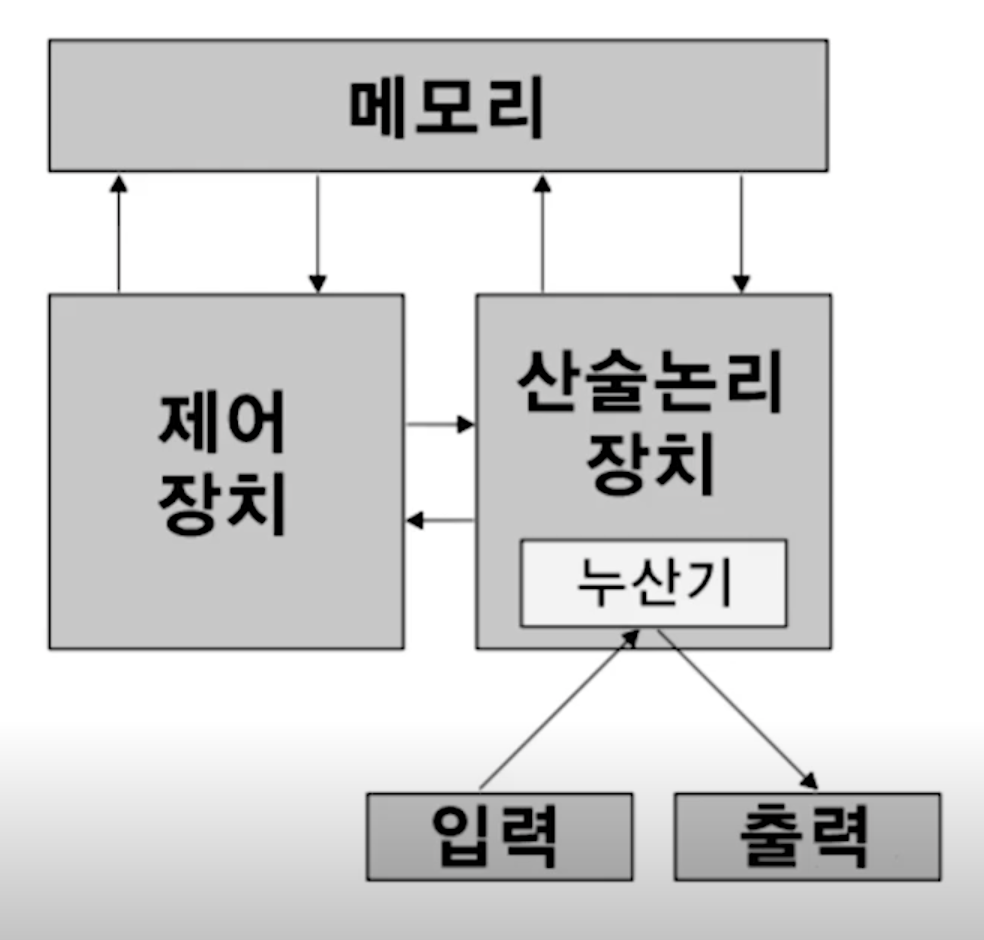
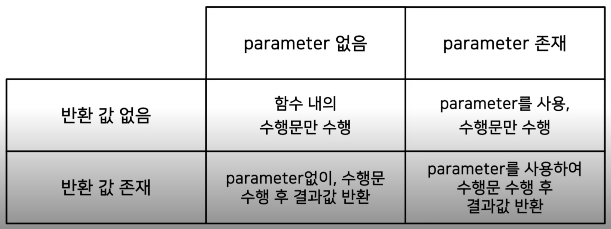
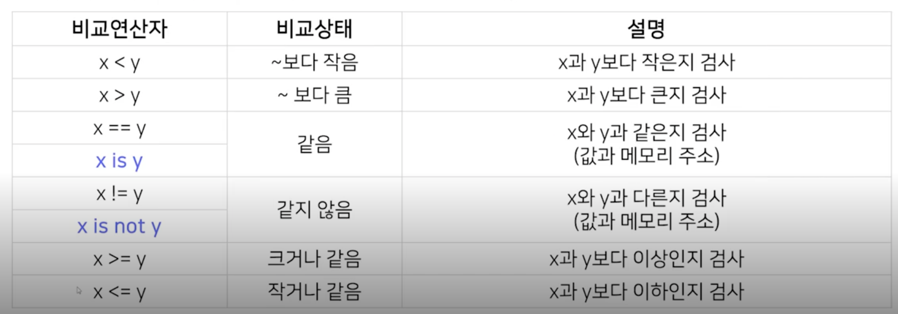

# day 2 파이썬 기초 문법

## Variables

Variable
> 가장 기초적인 프로그래밍 문법 개념
> 데이터(값)을 저장하기 위한 메모리 공간의 프로그래밍상 이름

```
professor = "Sungchul Choi"
```
- professor라는 `변수`에 "Sungchul Choi"라는 `값`을 넣으라는 의미

변수란?
- 프로그래밍에서 변수는 `값을 저장하는 장소`
- 변수는 `메모리 주소`를 가지고 있고
- 변수에 들어가는 `값`은 `메모리 주소`에 할당됨

컴퓨터의 구조 - 폰 노이만 아키텍처
- 사용자가 컴퓨터에 값을 입력하거나 프로그램을 실행할 경우 그 정보를 먼저 메모리에 저장시키고
- CPU가 순차적으로 그 정보를 해석하고 계산하여 사용자에게 결과값을 전달



선언되는 순간 특정영역에 물리적인 공간이 할당됨
변수에는 값이 할당되고 해당 값은 메모리에 저장됨
`A=8`
- "A는 8이다"가 아닌, A라는 이름을 가진 메모리 주소에 8 저장하라 임.
- 파이썬이 OS에 a라는 공간을 메모리에 잡아달라고 요청했고, 그 공간에 8이라는 값을 저장했다.

변수이름 규칙
- 알파벳, 숫자, 언더스코어(_)로 선언 가능
- 의미 있는 단어로 표기
- 대소문자 구분
- 예약어는 쓰지 않는다

Basic Operation

Primitive data types
- 파이썬이 처리할 수 있는 데이터의 유형
- 수치자료형
    - integer: 32bit의 공간을 자치(4byte = += 2^31)
    - float: 62bit
- 문자형
    - string
- 논리/불린 자료형
    - boolean

Dynamic Typing
- 코드 실행시점에 데이터의 type을 결정하는 방법

연산자(operator)와 피연산자(operand)
- 연산자: +,-,*,/,**,%
- 피연산자: 연산자에 의해 계산이 되는 숫자
- concatenate: 문자간에서의 연산
- `a = a+1` 좌변의 a는 변수, 우변의 a는 값

데이터의 형변환
- float(), int()
- 실수 -> 정수 - 내림
- 문자열 + 숫자형 -> x

컴퓨터의 반올림 오차
- 부동소수점
- 단순한 실수도 이진수로 변환하며 무한소수가 됨

컴퓨터는 실리콘이라는 재료로 만든 반도체로 구성
- 반도체는 특정 자극을 줬을 때 전기를 통할 수 있게 하는 물질
- 도체와 부도체에 반해 반도체는 전류의 흐름을 제어 가능
- 전류가 흐를 때 1, 흐르지 않을 때 0으로만 수자를 표현할 수 있음

list
- 시퀀스 자료형(여러 데이터들의 집합)

indexing
- list에 있는 값들은 주소(offset)를 가짐
    - 주소를 사용해 할당된 값을 호출

slicing
- list의 값들을 잘라서 쓰는 것
- list의 주소값을 기반으로 부분 값을 변환
- 범위를 넘어갈 경우 자동으로 최대 범위를 지정
- [시작index:끝index:step]

리스트의 연산
- 리스트의 concanation: + 
- *
- element in list
- append: 추가
- extend: 리스트 추가
- remove: 삭제
- del: 지우는거지만 메모리를 날리는 것

Python list만의 특징
- 다양한 data type이 하나의 List에 들어감
- 파이썬은 연속적인 데이터를 관리하는 구조가 다르다

리스트 메모리 저장 방식
- 해당 리스트 변수에는 리스트 주소값이 저장됨
- "="의 의미는 같다가 아닌 메모리 주소에 해당 값을 할당(연결)한다는 의미
- b = a[:] // 복사개념

패킹과 언패킹
- 패킹: 한 변수에 여러개의 데이터를 넣는 것
- 언패킹: 한 변수의 데이터를 각각의 변수로 반환

이차원 리스트
- 리스트 안에 리스트를 넣어 행렬(Matrix) 생성
- 이차원 리스트를 복사하는 방법?
    - [:]이렇게 하면 안됨
    - import copy; copy.deepcopy(복사할 리스트)

## Function and Console I/O

함수의 개요
- 어떤일을 수행하는 코드의 덩어리
- 반복적인 수행을 1회만 작성 후 호출
- 코드를 논리적인 단위로 분리
    - 코드 = 하나의 보고서, 글, 개조식
- 캡슐화: 인터페이스만 알면 타인의 코드 사용

```
def 함수이름 (parameter, ...)
    수행문 #1 (statements)
    수행문 #2 (statements)
    return <반환값>
```
- 함수를 메모리에 올림

함수 vs 함수
- 프로그래밍의 함수와 수학의 함수는 유사함
- 모두 입력 값과 출력 값으로 이루어짐
- 함수와 함수사이는 2줄씩 뛰운다

parameter vs. argument
- parameter: 함수의 입력 값
- argument: 실제 parameter에 대입된 값

함수 형태
- parameter 유무, 반환 값(return value) 유무에 다라 함수의 형태가 다름

- 예시 sorted(list_ex) vs list_ex.sort()

console in/out

콘솔창 입출력 I - input
- input()함수는 콘솔창에서 문자열을 입력 받는 함수

콘솔창 입출력 II - print
- 콤마(,) 사용할 경우 print 문이 연결됨
- 형 변환을 통해, 숫자 입력을 받을 수 있음

print formatting
- 프린트 문은 기본적인 출력 외에 출려그이 양식을 형식을 지정 가능
- %string, format 함수, fstring

old-school formatting
```
print('%s %s' %('one','two'))
print('{}{}'.format('one','two'))
print('%d %d' % (1,2))
print('{}{}'.format(1,2))
'10.2%f' //10칸 정수, 2칸 소수
```

format
```
print("{0}, {1:10.5f }".foramt("Apple", 5.243))
```

padding
- 여유 공간을 지정하여 글자배열 + 소수점 자릿수를 맞추기
```
< > 이거로 좌우 정렬 가능
{0:>10s}
```

naming
- 해당 표시할 내용을 변수로 표시하여 입력
```
print("%(name), %(price)" % {"name": "Apple", "price": 5.243})
print("{name:>10s}", {price:10.5f}".foramt(name="apple, price=5.243))
```

f-string
```
name = "Sungchul"
age = 39
print(f"hello, {name}. you are {age}")
print(f'{name:20}')
print(f'{name:>20}')
print(f'{name:*<20}')
print(f'{name:*>20}')
print(f'{name:*^20}')
number = 2.141592653589793
print(f'{number:.2f}')
```

## Conditionals and Loops

조건문이란?
- 조건에 따라 특정한 동작을 하게하는 명령어
- 조건을 나타내는 기준과, 실행해야 할 명령으로 구성
- 예약어: if, else, elif

조건 판단 방법



- is 연산자는 `memory의 주소`를 비교합니다
```
a = 100
b = 100
a is b # True

a = 300
b = 300
a is b # False
```
- 파이썬은 -5 ~ 256 까지는 정적 메모리를 가르킴
    - 과거에 자주 쓰던 숫자들
- 해당 범위를 넘어가는 숫자는 새로운 메모리 주소를 만들어 가르킴

조건 참/거짓의 구분
- 숫자형의 경우는 수학에서의 참/거짓과 동일
- 컴퓨터는 존재하면 참 없으면 거짓이라고 판단함
- if "abc"는 참, if""은 거짓

자료형| 값 | True/False
---|---|---
문자열|“python”|True
문자열|””|False
리스트|[1,2,3]|True
리스트|[]|False
숫자형|0이 아닌 숫자|True
숫자형|0	False
튜플|()|False
딕셔너리|{}|False
–|None|False

논리 키워드 사용: and, or, not
- all()
- any()

삼항 연산자
```
value = 5
is _even = True if value % 2 == 0 else False
```

반복문이란?
- 정해진 동작을 반복적으로 수행하게 하는 명령문

range: 마지막 숫자 바로 앞까지 리스트를 만들어줌

for loop
- 반복 범위를 지정하여 반복문 수행
- 반복 실행횟수를 명확히 알 때
while문
- 조건이 만족하는 동안 반복 명령문을 수행
- 반복 실행횟수가 명확하지 않을 때

반복의 제어 - break, continue
- break: 특정 조건에서 반복 종료
- continue: 특정 조건에서 남은 반복 명령 skip

반복의 제어 - else

```
for _ :

else:

i = 0
while i < 10:

else:
```

- break로 종료된 반복문은 else block이 수행되지 않음

debugging
- 코드의 오류를 발견하고 수정하는 과정
- 오류의 '원인'을 ㅇ라고 해결책을 찾아야 함
- 문법적 에러를 찾기 위한 에러 메시지 분석
    - IndentationError
    - NameError
- 논리적 에러를 찾기 위한 테스트도 중요
    - 뜻대로 실행이 안되는 코드

import trapezoid as tz
- 현재 폴더의 trapezoid가 메모리에 올라가게됨
- 파일 내의 함수를 불러올 수 있음

main 함수를 만들어서 테스트를 할 수 있음

```
def main():

if __name__ == "__ main__":
    main()
```

- 파이썬을 실행시키면 if name code를 가정 먼저 실행시킴
    - 이부분 설명이 조금 부족한듯.? 다시 찾아보기

## String and advanced function concept

문자열(string)
- 시퀀스 자료형으로 문자형 data를 메모리에 저장
- 영문자 한 글자는 1byte의 메모리 공간을 사용

1 Byte의 메모리 공간
- 이진수 한 자릿수는 1bit로 저장
    - 1 bit 는 0 또는 1
- 1byte = 8 bit = 2^8 는 256까지 저장 가능
- 컴퓨터는 문자를 집적적으로 인식을 하지 않기 때문에, 2진수를 문자를 변환하는 표준 규칙을 정함

각 타입 별로 메모리 공간을 할당 받는 크기가 다름


문자열 특징 - indexing, slicing
- 각 문자는 개별 주소(offset)을 가짐
    - 이 주소를 사용해 할당된 값을 가져오는 것이 인덱싱

 raw string
 - 특수문자 특수 기호인 ₩ escape 글자를 무시하고 그대로 출력
 - print(r"")

함수 호출 방식 개요
- 함수에서 parameter를 전달하는 방식

1. 값에 의한 호출(Call by Value)
    - 함수에 인자를 넘길 때 값만 넘김 
    - 함수 내에 인자 값 변경 시, 호출자에게 영향을 주지 않음
2. 참조에 의한 호출(Call by Reference)
    - 함수에 인자를 넘길 때 메모리 주소를 넘김
    - 함수 내에 인자 값 변경 시, 호출자의 값도 변경됨
    - 포인터 개념
3. 객체 참조에 의한 호출(Call by Object Reference)
    - 객체의 주소가 함수로 전달되는 방식
    - 전달된 객체를 참조하여 변경 시 호출자에게 영향을 주나,
    - 새로운 객체를 만들 경우 호출자에게 영향을 주지 않음
    - immutable한 object는 call by value처럼
    - mutable한 object는 call by refence처럼
        - 하지만, 인자로 넘어온 값은 변수의 reference가 아닌 변수가 담고 있는 자료(data)의 reference이다
    - [참조](https://item4.blog/2015-07-18/Some-Ambiguousness-in-Python-Tutorial-Call-by-What/)

변수의 범위(Scoping Rule)
- 지역변수: local variable: 함수내에서만 사용
- 전역변수: glocal variable: 프로그램 전체에서 사용
    - 전역 변수는 함수에서 사용 가능
    - 함수내에 전역 변수와 같은 이름으로 변수를 선언하면 새로운 지역 변수가 생김

같은 이름의 전역변수 사용 시 global 키워드 사용

```
def f():
    global s
    s = 'I love London!'
    print(s) # 'I love London!'
s = 'I love Paris!'
f()
print(s) # 'I love London!'
```

재귀함수 (recursive Function)
- 자기자신을 호출하는 함수
- 점화식과 같은 재귀적 수학 모형을 표현할 때 사용
- 재귀 종료 조건 존재, 종료 조건까지 함수호출 반복

functino type hints
```
def do_functino(var_name: var_type) -> return_type:
    pass
```
type hints의 장점
1. 사용자에게 인터페이스를 명확히 알려줄 수 있다.
2. 함수의 문서화시 parameter에 대한 정보를 명확히 알 수 있다.
3. mypt 또는 IDE, linter등을 통해 코드의 발생 가능한 오유를 사전에 확인
4. 시스템 전체적인 안정성을 확보할 수 있다.

function docstring
- 파이썬 함수에 대한 상세스펙을 사전에 작성 -> 함수 사용자의 이행도 UP
- 세개의 따옴표로 docstring 영역표시(함수명 아래) 
- python docstring generator extension -> `cmd + shift + p`하고 genereate docstring

함수 작성 가이드 라인
- 함수는 가능하면 짧게 작성할 것 (줄 수를 줄일 것)
- 함수 이름에 함수의 역할, 의도가 명확히 들어낼 것
- 보통 v_o, verb_object
- 하나의 함수는 유사한 역할을 하는 코드만 포함
- 인자로 받은 값 자체를 바꾸진 말 것 (임시변수 선언)
    - object reference로 넘어오기 때문에, 실수로 원래의 값이 변할 수 있음.

함수는 언제 만드는가?
- 공통적으로 사용되는 코드는 함수로 변환
- 복잡한 수식 -> 식별 가능한 이름의 함수로 변환
- 복잡한 조건 -> 식별 가능한 이름의 함수로 변환

how to write good code
- 코딩은 팀플

사람을 위한 코드
- 컴퓨터가 이해할 수 있는 코드는 어느 바보나 다 짤 수 있다.
- 좋은 프로그래머는 사람이 이해할 수 있는 코드를 짠다.
    - 마틴 파울러
- 코드는 하나의 보고서다

파이썬 코딩 컨벤션
- 명확한 규칙은 없음
    - 때로는 팀마다, 프로젝트마다 따로
- 중요한 건 일관성
- 읽기 좋은 코드가 좋은 코드
- 들여쓰기 tab or 4 space
    - 일반적으로 4 space
    - 중요한건 혼합만 안하면 됨.
- 한 줄은 최대 79자까지
- 연산자는 1칸 이상 안 띄움
- 주석은 항상 갱신, 불필요한 주석은 삭제
- 코드의 마지막에는 항상 한 줄 추가
- 소문자 I, 대문자 O, 대문자 I금지
- 함수명은 소문자로 구성, 필요하면 밑줄로 나눔 
- `conda install -c anaconda flake8`
    - `flake8 파일명`
최근에는 black 모듈을 활용하여 pep8 like 수준을 준수
- `conda install black`
    - `black 파일명`
    - 코드를 고쳐줌

## 피어 세션 정리
오늘은 김성빈 조교님이 참여하여 처음 인사를 나눴어요. 어제와는 달리 전체적인 강좌 시간이 늘어나고 과제가 있어 많은 시간을 보내지 않았습니다.
간단히 내일 공부할 자료를 선택하고 다음 피어 세션에서 더 많은 토론을 진행하기로 했습니다.

## 과제진행상황정리
basic_math - 완료
text processing - 완료
text processing 2 - 완료
baseball - 진행중