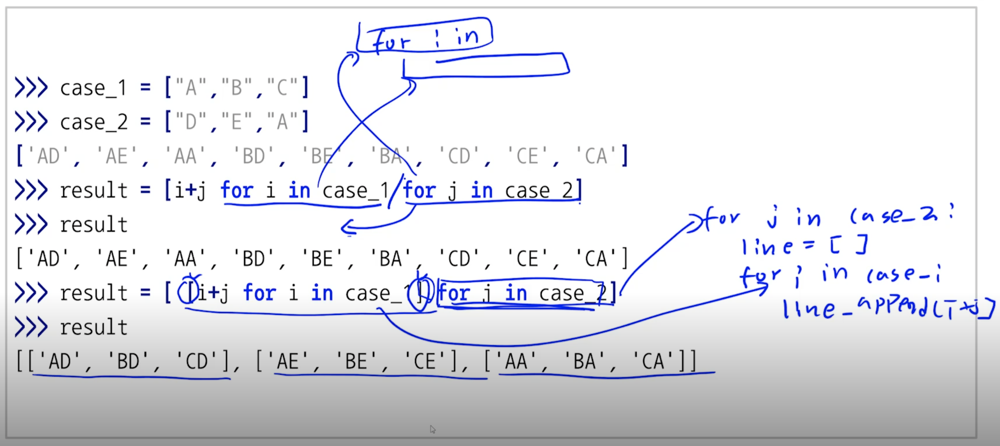
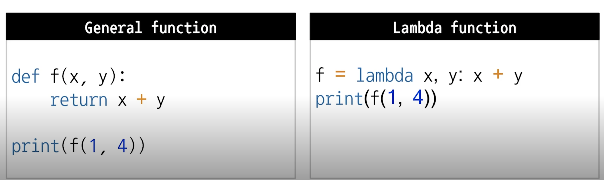
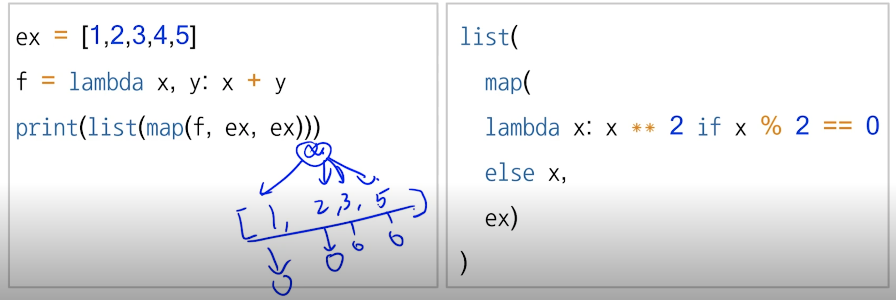
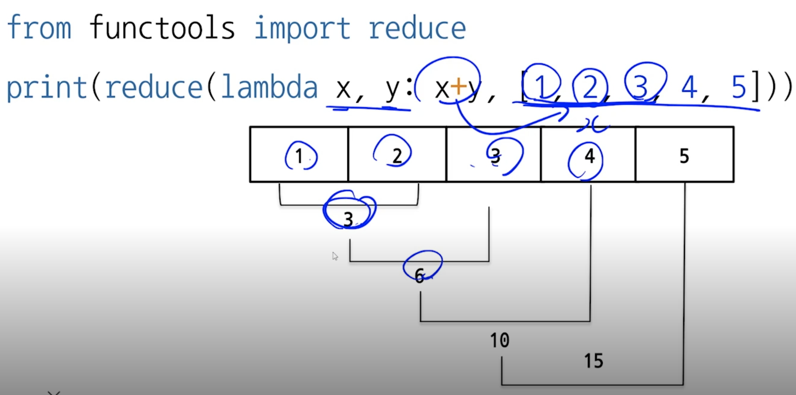
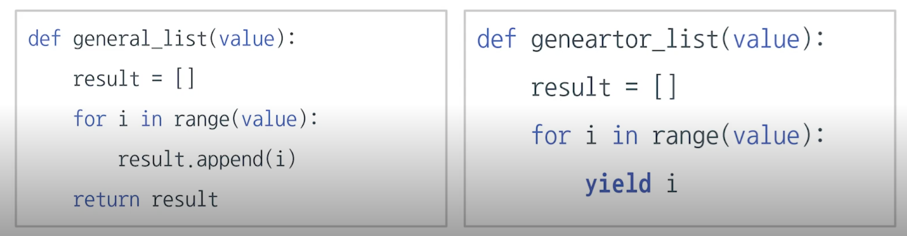

# 파이썬 기초 문법 II

## Python data structure

### 데이터 구조 생각해보기
- 전화번호부 정보, 은행 번효포 정보, 서적 정보, 창고에 쌓인 수화물의 위치를 역순으로 찾기
    - 서로 다른 형태로 저장, 효율적으로 저장이 필요

### stack
- 나중에 넣은 데이터를 먼저 반환하도록 설계
- LIFO
- data 입력 Push, 출력 pop
- deque로 구현
    - 리스트를 사용하여 구현 가능
    - push - append()
    - pop - pop()

### queue
- 먼저 넣은 데이터를 먼저 반환하도록 설계
- FIFO
- stack과 반대되는 개념
- 파이썬은 리스트를 사용하여 큐 구조 활용 가능
    - put - append()
    - get - pop(0)

### tuple
- 값의 변경이 불가능한 리스트
    - data 변환 불가능
- 리스트의 연산, 인덱싱, 슬라이싱 등 사용 가능
- 선언 시 `()` 사용
- 왜 쓸까?
    - 프로그램을 작동하는 동안 변경되지 않는 데이터의 저장
    - ex) 학번, 이름, 우편번호..
    - 사용자의 실수에 의한 에러를 사전에 방지 
- 하나 이상의 값이 들어가야 함 (, )

### set
- 값을 순서없이 저장, 중복 x
- `set()` 으로 선언
- add(), remove(), clear()
- 수학에서 활용하는 다양한 집합연산 가능
    - 합집합: s1.untion(s2) = s1 | s2
    - 교집합: s1.intersection(s2) = s1 & s2
    - 차집합: s1.difference(s2) = s1 - s2

### dict
- 데이터를 저장 할 때 구분 지을 수 있는 값을 함께 저장
    - 예) 주민등록 번호, 제품 모델 번호
- 구분을 위한 데이터 고유값: identifier 또는 key
- key값을 활용하여, data(값) 관리
- 다른 언어에서는 hash table 사용
- dict() or {}
    - dic.items() => key value pair tuple return
    - dic.keys() => key 값만 리턴
    - dic.values() => values 값만 리턴
    - element in dic.keys or element in dic.values()

### cmd에서 파일 다운로드
- `wget 파일주소`
- csv -> comma seperate value 콤마 키준으로 자른 파일
- rainbow csv extension 추천

### collections
- List, Tuple, Dict에 대한 python built-in 확장 자료 구조(모듈)
```
from collections import deque
from collections import Counter
from collections import OrderedDict
from collections import defaultdict
from collections import namedtuple
```

### deque
- stack과 queue를 지원하는 모듈
- list에 비해 효율적인=빠른 저장 방식 지원
- rotate, reverse등 linked list의 특성을 지원
    - rotate(), appendleft(), extendleft(0)
- 기존 list형태의 함수를 모두 지원

`timeit 함수()`
- jupyter 노트북에서 여러번 돌려서 평균시간 측정해주는 것

### OrderedDict
- dict과 달리, 데이터 입력한 순서대로 dict을 변환
- 이제 python3.6부터 dict도 입력한 순서를 보장하여 출력
```
from collections import OrderedDict

d = {}
d['x'] = 100
d['y'] = 200
d['z'] = 300
d['l'] = 500

for k, v in d.items():
    print(k, v)


d = OrderedDict()
d['x'] = 100
d['y'] = 200
d['z'] = 300
d['l'] = 500

for k, v in d.items():
    print(k, v)

for k, v in OrderedDict(sorted(d.items(), key=lambda t: t[0])).items():
    print(k, v)

for k, v in OrderedDict(sorted(d.items(),
                        reverse=True, key=lambda t: t[1])).items():
    print(k, v)
```


### defaultdict
```
from collections import defaultdict
def default_value():
    return 0
d = defaultdict(default_value) 
d = defaultdict(lambda: 0)
```

- dict type의 값에 기본 값을 지정, 신규값 생성시 사용하는 방법
- 하나의 지문에 각 단어들이 몇 개가 있는지 세고 싶을경우?
    - vector space model?
- 그 후, 입력 순서를 보장하는 ordereddict을 생성해서, sorted(dic.keys())하고 정렬가능
```

from collections import defaultdict
from collections import OrderedDict

d = dict()
print(d["first"])

# Reference from
# https://dongyeopblog.wordpress.com/2016/04/08/python-defaultdict-%EC%82%AC%EC%9A%A9%ED%95%98%EA%B8%B0/

d = defaultdict(object)     # Default dictionary를 생성
d = defaultdict(lambda: 1)  # Default 값을 0으로 설정합
print(d["first"])


text = """A press release is the quickest and easiest way to get free publicity. If well written, a press release can result in multiple published articles about your firm and its products. And that can mean new prospects contacting you asking you to sell to them. Talk about low-hanging fruit!
What's more, press releases are cost effective. If the release results in an article that (for instance) appears to recommend your firm or your product, that article is more likely to drive prospects to contact you than a comparable paid advertisement.
However, most press releases never accomplish that. Most press releases are just spray and pray. Nobody reads them, least of all the reporters and editors for whom they're intended. Worst case, a badly-written press release simply makes your firm look clueless and stupid.
For example, a while back I received a press release containing the following sentence: "Release 6.0 doubles the level of functionality available, providing organizations of all sizes with a fast-to-deploy, highly robust, and easy-to-use solution to better acquire, retain, and serve customers."
Translation: "The new release does more stuff." Why the extra verbiage? As I explained in the post "Why Marketers Speak Biz Blab", the BS words are simply a way to try to make something unimportant seem important. And, let's face it, a 6.0 release of a product probably isn't all that important.
As a reporter, my immediate response to that press release was that it's not important because it expended an entire sentence saying absolutely nothing. And I assumed (probably rightly) that the company's marketing team was a bunch of idiots.""".lower().split()

print(text)

word_count = {}
for word in text:
    if word in word_count.keys():
        word_count[word] += 1
    else:
        word_count[word] = 0
print(word_count)

word_count = defaultdict(object)     # Default dictionary를 생성
word_count = defaultdict(lambda: 0)  # Default 값을 0으로 설정합
for word in text:
    word_count[word] += 1
for i, v in OrderedDict(sorted(
        word_count.items(), key=lambda t: t[1], reverse=True)).items():
    print(i, v)
```

### Counter
- sequence type의 data element들의 갯수를 dict 형태로 반환 

```
from collections import Counter
c = Counter('gallahad')

- - dict type, keyword parameter 등도 처리 가능
```

```
from collections import Counter

c = Counter()                           # a new, empty counter
c = Counter('gallahad')                 # a new counter from an iterable
print(c)

c = Counter({'red': 4, 'blue': 2})      # a new counter from a mapping
print(c)
print(list(c.elements()))

c = Counter(cats=4, dogs=8)             # a new counter from keyword args
print(c)
print(list(c.elements()))

c = Counter(a=4, b=2, c=0, d=-2)
d = Counter(a=1, b=2, c=3, d=4)
c.subtract(d)  # c- d
print(c)

c = Counter(a=4, b=2, c=0, d=-2)
d = Counter(a=1, b=2, c=3, d=4)
print(c + d)
print(c & d)
print(c | d)

text = """A press release is the quickest and easiest way to get free publicity. If well written, a press release can result in multiple published articles about your firm and its products. And that can mean new prospects contacting you asking you to sell to them. Talk about low-hanging fruit!
What's more, press releases are cost effective. If the release results in an article that (for instance) appears to recommend your firm or your product, that article is more likely to drive prospects to contact you than a comparable paid advertisement.
However, most press releases never accomplish that. Most press releases are just spray and pray. Nobody reads them, least of all the reporters and editors for whom they're intended. Worst case, a badly-written press release simply makes your firm look clueless and stupid.
For example, a while back I received a press release containing the following sentence: "Release 6.0 doubles the level of functionality available, providing organizations of all sizes with a fast-to-deploy, highly robust, and easy-to-use solution to better acquire, retain, and serve customers."
Translation: "The new release does more stuff." Why the extra verbiage? As I explained in the post "Why Marketers Speak Biz Blab", the BS words are simply a way to try to make something unimportant seem important. And, let's face it, a 6.0 release of a product probably isn't all that important.
As a reporter, my immediate response to that press release was that it's not important because it expended an entire sentence saying absolutely nothing. And I assumed (probably rightly) that the company's marketing team was a bunch of idiots.""".lower().split()
print(Counter(text))
print(Counter(text)["a"])
```
- set의 연산들을 지원함
    - c + d, c & d, c | d, c - d

### namedtuple
- tuple 형태로 data 구조체를 저장하는 방법
- 클래스?
- 저장되는 data의 variable을 사전에 지정하여 저장

```
from collections import namedtuple
Point = namedtuple('Point, ['x','y'])
p = Point(x=11, y=22)
print(p[0] + p[1])
x, y = p
print(x, y)
print(p.x, p.y)
print(Point(x=11, y=22))
```

```
from collections import namedtuple

# Basic example
Point = namedtuple('Point', ['x', 'y'])
p = Point(11, y=22)
print(p[0] + p[1])

x, y = p
print(x, y)
print(p.x + p.y)
print(Point(x=11, y=22))

from collections import namedtuple
import csv
f = open("users.csv", "r")
next(f)
reader = csv.reader(f)
student_list = []
for row in reader:
    student_list.append(row)
    print(row)
print(student_list)

columns = ["user_id", "integration_id", "login_id", "password", "first_name",
            "last_name", "full_name", "sortable_name", "short_name",
            "email", "status"]
Student = namedtuple('Student', columns)
student_namedtupe_list = []
for row in student_list:
    student = Student(*row)
    student_namedtupe_list.append(student)
print(student_namedtupe_list[0])
print(student_namedtupe_list[0].full_name)
```

## Pythonic code
> 파이썬 스타일의 코딩 기법
> 파이썬 고유의 문법을 활용하여 효율적으로 코드를 표현
> 하지만, 이제는 파이썬 고유는 아님, 다른 언어에서 장점을 채용
> 고급 코드를 작성할 때 더 많이 필요
> split & join, list comprhension, enumerate & zip, lambda & map & reduce, generator, asterik

### why pythonic code?
- 남들의 코드에 대한 이해도
- 효율: for loop append보다 list가 조금 더 빠름

### split & join
- string type의 값을 '기준값'으로 나눠서 list 형태로 변환
    - string.split(" ")
- join은 합치는 것
    - "-".join(list)

### list comprehension
> 기존 list 사용하여 간단히 다른 list를 만드는 기법
- 일반적으로 for + append보다 빠름
```
result = []
for i in range(10):
    result.append(i)

result [i for i in range(10)]

case_1 = ['a', 'b', 'c']
case_2 = ['d', 'e', 'a']

result = [i + j for i in case_1 for j in case_2]
[i + j for i in case_1 for j in case_2 if not (i == j)] # filter
[i + j if not(i == j) else BEE'' for i in case_1 for j in case_2]
```
- pprint.pprint 사용하면 좀더 깔끔하게 볼 수 있음

### two dimensional vs. one dimensional


### enumerate
- enumerate: list의 element를 추출 할 때 번호를 붙여서 추출
```

{i: v.lower() for i, v in enumerate(set_text)}
```
### zip
- 두 개의 list의 값을 병렬적으로 추출

### lambda & map & reduce
> 함수 이름 없이, 함수처럼 쓸 수 있는 익명함수
> 수학의 람다 대수에서 유래



- 한줄 정도되는 return statement

### lambda
- 파이썬 3에서 권장하진 않지만 많이 쓰임
    - 어려운 문법
    - 테스트의 어려움
    - 문서화 docstring 지원 미비
    - 코드 해석의 어려움
    - 이름이 존재하지 않는 함수의 출현
    - 하지만 많이 쓰임

### map function
- 두개 이상의 list에도 적용 가능함, If filter도 가능

- return으로 generator가 만들어져서 list 또는 다른 자료구조로 감싸야하는듯
    - 파이썬 3에서는 iteration 생성
- 실행시점의 값을 생성, 메모리 효율적

### reduce function
- map functino과 달리 list에 똑같은 함수를 적용해서 통합

- 대용량의 데이터 다룰 때

### summary
- lambda, map, reduce는 간단한 코드로 다양한 기능을 제공
- 그러나 직관적이지 않아서 python3에서 권장 x
- legacy library나 다양한 머신러닝 코드에서 여전히 사용중

### iterable object
> sequence형 자료형에서 데이터를 순서대로 추출하는 object
> 내부적 구현으로 __iter__ 와 __next__가 사용됨

- iter(iterable) => 위치 반환 (처음 주소값을 가져옴)
- next(iterable) => 그 다음칸은 memory address를 가지고 있음

### generator
> iterable object를 특수한 형태로 사용해주는 함수
> element가 사용되는 시점에 메모리의 값을 반환, 그 전에는 주소값만 가지고 있음

- yield를 사용해 한번에 하나의 element만 반환
  

- yield 호출할 때, 데이터를 반환
    - 전에는 메모리에 값을 안 올리고 있음
    - 메모리적으로 효율적
    - 평소에 값은 안 갖고 있고 주소값만 갖고 있다가 "값 주세요"할 때 줌
- generator 사용 권장
    - 대용량 처리에 용이

### generator comprehension
- list comprehension과 유사한 형태로 generator형태의 list 생성
  - 생성만 해놓고 값을 안 넣어 놓음
  - [] 대신 () 사용

### why generator
- 일반적인 iterator는 generator에 반해 훨씬 큰 메모리 용량 사용

```
from sys import getsizeof

gen_ex = (n*n for n in range(500))
print(getsizeof(gen_ex))
print(getsizeof(list(gen_ex)))
gen_ex = (n*n for n in range(5000))
print(getsizeof(gen_ex))
print(getsizeof(list(gen_ex)))

list_ex = [n*n for n in range(5000)]
print(getsizeof(list_ex))
```

### when generator
- list 타입의 데이터를 반환해주는 함수는 generator로 만들어라!
    - 읽기 쉬운 장점, 중간 과정에서 loop이 중단될 수 있을 때
- 큰 데이터 처리할 때는 generator expression을 고려하라!
    - 데이터가 커도 처리의 어려움이 없음
- 파일 데이터 처리를 처리할 때도 generator를 쓰자!

### function passing arguments
> keyword arguments
> default arguments
> variable-length arguments

### keyword arguments
- 함수에 입력되의 변수명을 사용
```
def function(a, b):
    statement
function(b='hi', a='hey')
```
### default arguments
- parameter의 기본값을 사용, 입력하지 않을 경우 기본값 출력

```
def print_something_2(my_name, yourname="TEAMLAB"):
	statement
print(something_2('yo'))
```

### variable-length 가변길이 asterisk
- 개수가 정해지지 않은 변수를 함수의 parameter로 사용하는 방법
- asterisk(*) 기호 사용
- 입력된 값은 tuple type으로 사용 가능
- 맨 마지막 parameter 위치에 사용 가능
- *args 
```
def asterisk_test(a,b, *args):
    type(args) # tuple
```
### keyword variable-length
- parameter 이름을 따로 지정하지 않고 입력하는 방법
- asterisk 두개를 사용하여 함수의 parameter 표시
- 입력된 값은 dict type으로 사용
- 가변인자는 오직 한 개만 기존 가변인자 다음에 사용

```
def func(one,two, *args, **args):

```
- keyword 값으로 넣으면, 뒤에도 다 키워드로 넣어야됨

### asterisk
- 단순 곱셈, 제곱연산, 가변인자
- unpacking a container
    - tuple, dict 등 자료형에 들어가 있는 값을 unpakcing
    - 함수의 입력값, zip 등에 유용하게 사용가능
```
func(1,2, *(3,4,5,6)) # (1,2,3,4,5,6)
```

## 개인공부 및 reference 정리

### [PEP 8](https://item4.blog/2015-07-18/Some-Ambiguousness-in-Python-Tutorial-Call-by-What/)

function
- after function, up/down empty two lines each
    - make function stand out more

ClassNames
- capitalize the first letter of each word

FactoryFunctionNames()
- factory functinos return objects
    - act like class definitions
- return instances of classes
- to reflect, capitalize the first letter of each word

_non_public_properties
- private proverties

conflicting_names_
- if a name is already taken

### Iterator & generator
- [참조1](https://opensource.com/article/18/3/loop-better-deeper-look-iteration-python)
- [참조2](https://towardsdatascience.com/python-basics-iteration-and-looping-6ca63b30835c)
- [참조3](https://livetodaykono.tistory.com/25)


Iterable
- 순회가 가능한
- object capable of returning its members one by one
- Python에서는 순회가 가능한 모든 객체를 가리킵니다
- `for 변수 in `뒤에 올 수 있는 것이 모두 iterable 한 객체(iterable object)
    - python에서 지원하는 자료형(List, Tuple, Set, Dictionary)
        - `dir(object)` 에서 __iter__가 존재하면 iterable object
- iterable != iterator
    - __init__을 통해서 iterator를 만들어야함!

Iterable의 예시
- Sequence types
    - Lists, strings and tuples
    - Support efficient element access using integer indices
- Other Iterables(Non seqeunce)
    - Dictionaries, file objects, sets

For loop
```
# javascript
let numbers = [10, 12, 15, 18, 20];
for (let i = 0; i < numbers.length; i += 1) {
    console.log(numbers[i])
}

# python
numbers = [10, 12, 15, 18, 20]
for number in numbers:
    print(number)
```

Python for loop - indices를 사용하지 않는다
```
index = 0
numbers = [1, 2, 3, 4, 5]
while index < len(numbers):
    print(numbers[index], end=' ')
    index += 1

# 1 2 3 4 5

index = 0
numbers = {1, 2, 3, 4, 5}
while index < len(numbers):
    print(numbers[index])
    index += 1

# TypeError: 'set' object does not support indexing    

numbers = {1, 2, 3, 4, 5}
for number in numbers:
    print(number)
```


Iterator
- Iterator = iterable object
- An iterator is an object representing a stream of data
- `__iter__` method로 iterator를 만들 수 있습니다.
- iterator: iterator 상태를 유지하며 반활할 수 있는 마지막 값까지 원소를 필요할 때 마다 하나씩 반환하는 것
```
numbers = [10, 12, 15, 18, 20]
fruits = ("apple", "pineapple", "blueberry")
message = "I love Python ❤️"

print(iter(numbers))
print(iter(fruits))
print(iter(message))

<list_iterator object at 0x000001DBCEC33B70>
<tuple_iterator object at 0x000001DBCEC33B00>
<str_iterator object at 0x000001DBCEC33C18>
```
- `__next__`를 호출하면 for문의 동작처럼 하나씩 값을 꺼내올 수 있습니다.
    -  next() returns successive items in the stream.
```
values = [10, 20, 30]
iterator = iter(values)
print(next(iterator)) # 10
print(next(iterator)) # 20
print(next(iterator)) # 30
print(next(iterator)) # StopIteration exception
```
- iterator의 다음 item을 반환해주고, 다음 데이터가 없으면 StopIteration exception을 raise

Python for loop 의 구현
```
def custom_for_loop(iterable, action_to_do):
    iterator = iter(iterable)
    done_looping = False
    while not done_looping:
        try:
            item = next(iterator)
        except StopIteration:
            done_looping = True
        else:
            action_to_do(item)
numbers = {1, 2, 3, 4, 5}
custom_for_loop(numbers, print)
```

Iterator Protocol(규약)
- The iterator protocol is a fancy way of saying "how looping over iterables works in Python." It's essentially the definition of the way the iter and next functions work in Python. All forms of iteration in Python are powered by the iterator protocol.

- iterator.__iter__()
    - Return the iterator object itself. This is required to allow both containers (also called collections) and iterators to be used with the for and in statements.
- iterator.__next__()
    - Return the next item from the container. If there are no more items, raise the StopIteration exception.

다시 정리하면
- An iterable is something you can loop over.
- An iterator is an object representing a stream of data. It does the iterating over an iterable.

Iterable protocol & iterator
- iterable protocol
```
for n in numbers: # for loop
    print(n)
x, y, z = coordinates # multiple assignment

# star expressions
a, b, *rest = numbers
print(*numbers)

unique_numbers = set(numbers) # built-in functions
```

- iterator
    - enumerate, zip, reversed, map, filter, file objects, dictinoary
    - next(iterator)호출해보면 다음 값이 나와요

Object|Iterable?|Iterator
---|---|---
Iterable|o|?
Iterator|o|o
Generator|o|o
List|o|x

Iterator 직접 만드는 방법
```
class square_all:
    def __init__(self, numbers):
        self.numbers = iter(numbers)
    def __next__(self):
        return next(self.numbers) ** 2
    def __iter__(self):
        return self

# gernerate function
def square_all(numbers):
    for n in numbers:
        yield n**2

# generator expression
def square_all(numbers):
    return (n**2 for n in numbers)

```

Generator
> Iterator를 쉽게 생성하게 해주는 것이 generator의 역할
> python의 함수는 보통 return 후 종료가 되지만, generator는 yield(산출)한다는 특징이 있다

yield
- That yield statement probably seems magical, but it is very powerful: yield allows us to put our generator function on pause between calls from the next function. The yield statement is the thing that separates generator functions from regular functions.

Lazy evaluation 그리고 일반 함수와의 차이
- 함수의 값을 return해주고, yield 호출 후 다시 next가 호출 될 때까지 현재상태에서 머물다가, next가 호출되면 이전 상태에서 다음 연산을 수행합니다.
    - 즉, next가 호출되면 연산을 수행하고 return
- 일반함수와 generator의 가장 큰 차이점은 yield의 존재유무입니다. 일반함수의 경우 함수 내부의 모든 구문을 실행하고 마지막에 return 값 하나를 반환함으로써 함수가 종료됩니다. (즉, 한번 함수를 호출 할때마다 모든값을 포함하여 return값을 반환받는 구조입니다.) 하지만 generator의 경우 next()로 호출할 때마다 yield를 통해 iterator를 반환하고 그 시점에서 일시정지 상태로 다음 next호출을 기다립니다. (즉, 필요할 때만 메모리를 반환받아서 사용하게 됩니다.) 그렇기에 작은 메모리를 사용함으로써 효율적으로 대용량의 반복 가능한 구조를 순회할 수 있는 것이 메모리 관리에 있어서 큰 장점이 됩니다.
    - 새로운 iterator를 생성한다기보다는 yield 바로 다음에 있는 연산or값을 iterator로써 반환을 한다고 보는게 맞는 것 같습니다! ( 해당 iterator의 메모리만 반환받아서 사용하게 됩니다. )
- [참조](https://www.edwith.org/bcaitech1/forum/46122)


## 피어세션 정리

### A - Python call by object reference
- Object란
    - ob_refcnt
    - object.h

### B - PEP - 8
- PEP 8번은 style guide에 대한 글
```
# Correct
import os
import sys

# Wrong
import sys, os
```
변수는 의미있게!
상수는 대문자로 (constant)
- 대문자의 의미는 상수처럼 사용한다, 건드리지 마라
- L O I 사용 지양
내장함수랑 겹치면 변수명 뒤에 _ (underbar) 넣기

함수는 앞뒤로 두줄을 띄운다 # 각자 확인하기 쉽게
클래스 내의 메소드 정의는 1줄씩 띄어 쓴다.
- 메소드는 소문자로 _ , 클래스는 대문자
- 내장함수를 가장 먼저 써주어라
- 클래스 안에서는 한줄씩

주석은
- 왠만하면 달지 말라
- 한줄정도 ㄱㅊ, 
- 불필요한 공백 

### C - double underscore
- PEP에 근거한 convention이다

single
- leading -> private (convention)
- trailing 예약어를 함수이름으로 사용하고 싶을 때 (convention)

double
- mangling
    - __method => `from myclass import *` 이거에서 작동 안됨
    - _method => `from myclass import *` 작동됨
    - mc._Myclass__superprivate 이러면 사용가능

```
from Myclass import *
mc = Myclass
==
import Myclass
```

leading + trailing
- built in method르 쓰임, magic method

__name__
- 얘는 예외적으로 변수

git fetch + merge = pull

restore 는 백업

git reset --hard
- commit 지점 이후를 다 지워버린다

git reset -soft
- 그 상태로 돌아가는데, add 상태로 올린다.

local과 github의 구성이 달라져서
push가 오류남, git -f push 강제 push rksmd

git commit 메시지 수정
- git commit --amend

branch
- 각기 다른 기능을 여러 개발자가 동시에 
- master branch는 안정적으로
    - 다른 branch에서 개발하고 이거 완벽해하면 master branch에 merge
- 생성: git branch 이름 
- 이동: git checkout 이름
- merge방법 -> master branch로 돌아가고 => git merge 브랜치_이름
    - merge하면 github에는 develop branch가 없음
    - git branch -d develop으로 local에서 삭제 필요

git rebase
- merge 대신에 사용할수도 있음 
- 특정한 커밋 수정/삭제 가능
    - git commit --amend는 바로 직전의 코드만 숮어 가능하지만,
    - git rebase -i HEAD~3 (head를 기준으로 과거 커밋을 연다)
    - pick 대신에 하단의 키를 입력하고 나가면 수정할 수 있는 창이 나옴
    - git rebase -i 커밋의 hash (오래된 커밋도 수정 가능)
    - drop으로 커밋을 지울수도 있음


### D - unittest
- 단위테스트 - 모듈이나 개별 코드 단위로 테스트
- unittest - 단위 테스트에 필요한 library 포함

주요 개념
- testcase -> test 조직의 기본 단위
- fixture -> 실행 전 후에 실행되는 함수
    - setUp() 함수 호출전
    - tearDown() 호출 후
- assertion() -> 테스트 통과 여부 결정

1. import unittest
2. unittest.TestCase를 상속한 테스트 클래스를 작성
3. 테스트 메소드 작성
- 이름은 test_ 시작
- assert 사용
- 알파벳 순으로 실행됨

unittest.mock
- mocking: 테스트 대상 시스템의 일부를 모의 객체로 교체
- patch(): 특정 범위 내에서만 mocking이 가능하도록 해줌

### memory management in python에 대한 발표

피드백/기타 내용:
- 각자 프레젠테이션 시간 줄이기 10~15분!
- p-stage 전 논문1/구현1 도전해보자!
- 1기에 대한 부담감
- 방향성에 대한 고민
- 화이팅하자!
