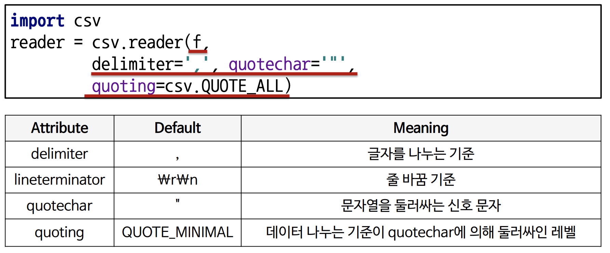

# day5 파이썬으로 데이터 다루기

## File / Exception / Log Handling
### 프로그램 사용할 때 일어나는 오류
-  주소를 입력하지 않고 배송 요청
- 저장도 안 했는데 컴퓨터 전원이 나감
- 게임 아이템 샀는데 게임에서 튕김
    - 예상치 못한 많은 일(예외)들이 생김
### Exception
> 예상 가능한 예외
> 예상이 불가능한 예외

### 예상 가능한 예외
- 발생 여부를 사전에 인지할 수 있는 예외
- 사용자의 잘못된 입력, 파일 호출 시 파일 없음
- 개발자가 반드시 명시적으로 정의 해야함
- if문을 사용하여 처리

### 예상 불가능한 예외
- 인터프리터 과정에서 발생하는 예외, 개발자 실수
- 리스트의 범위를 넘어가는 값 호출, 정수 0으로 나눔
- 수행 불가시 인터프리터가 자동 후철
- Exception Handling
    - Ex) 없는 파일 호출 -> 파일 없음을 알림
    - 게임 이상 종료 -> 게임 정보 저장
    - 프로그램 = 제품, 모든 잘못된상황에 대처가 필요

### Exception Handling
```
try:
    예외 발생 가능 코드
except <Exception Type>:
    예외 발생시 대응하는 코드
```

```
for i in range(10):
    try:
        print(10/ i) 
    except ZeroDivisionError:
        print("Not divided by 0")
```
- 위에는 built in error
    - 위에 다른 error가 들어가 있다면 exception 을 못 잡아냄(catch)
    - 못잡으면 프로그램 종료
    - 잡으면 계속 실행

### 다양한 종류의 built-in exception이 있음
```
a = [1,2,3,4,5]
for i in range(10):
    try:
        print(10/ i)
        print(a[i])
        print(v)
    except ZeroDivisionError:
        print("Not divided by 0")
    exception IndexError as e:
        print(e)
    exception Exception as e:
        print(e)
```
- 마지막 exception 구문처런 전체 에러를 잡을 수 있지만 권장하지 않음

### else 구문
```
try:
    예외 발생 가능 코드
except <Exception Type>
    예외 발생시 동작하는 코드
else:
    예외가 발생하지 않을 때 동작하는 코드
```
- 교수님은 별로 안좋아하는 방식의 구문

### finally 구문
```
try:
    예외 발생 가능 코드
except <Exception Type>:
    예외 발생시 동작하는 코드
finally:
    예외 발생 여부와 상관없이 실행됨
```
- if문은 로직 문제를 다룰 때
- exception은 사용자가 잘못 입력하거나 (잘못된거 처리)

### raise 구문
- 필요에 따라 강제로 exception을 발생
- `raise <Exceptino Type>(예외정보)`
```
while True:
    value = input("변환할 정수 값을 입력해주세요")
    for digit in value:
        if digit not in "0123456789":
            raise ValueError("숫자값을 입력하지않으셨습니다")
        print("정수값으로 변환된 숫자 -", int(value))
```
- 잘못 사용할 경우, 많은 리소스를 잡아먹는것을 방지

### assert 구문
- 특정 조건에 만족하지 않을 경우 예외 발생
```
def get_binary_nmubmer(decimal_number):
    assert isinstance(decimal_number, int)
    return bin(decimal_number)
print(get_binary_nmubmer(10))
```

### File Handling

### 파일의 종류
> 기본적인 파일 종류로 text파일과 binary 파일로 나눔
> 컴퓨터는 text 파일을 처리하기 위해 binary 파일로 변화시킴 (예: pyc파일)
> 모든 text 파일도 실제는 binary 파일
> 모든 text 파일도 실제는 binary 파일, ASCII/Unicode 문자열 집합으로 저장되어 사람이 읽을 수 있음

text 파일
- 인간도 이해할 수 있는 형태인 문자열 형식으로 저장된 파일
- 메모장으로 열어서 열리면 text file

binary file
- 컴퓨터만 이해할 수 있는 형태인 이전(법)형식으로 저장된 파일 
- 일반적으로 메모장으로 열면 내용이 깨져 보임
- 엑셀파일, 워드 파일 등등

### Python File I/O
- 파이썬은 파일 처리를 위해 'open'키워드를 사용함
```
f= open("<파일이름>", "접근 모드")
f.close()
```
파일열기모드|설명
:---:|---
r|읽기모드 - 파일을 일기만 할 때 사용
w|쓰기모드 - 파일에 내용을 쓸 때 사용
a|추가모드 - 파일의 마지막에 새로운 내용을 추가 시킬 때 사용

### 파이썬의 file Read
read() txt 파일 안에 있는 내용을 문자열로 변환    
```
f = open('i_have_readm.txt', 'r') 
contents = f.read()
print(contents)
f.close()
```
- f.open() 파일을 읽어올 수 있도록 위해 주소를 지정하는 것 - 파일이 있는곳에 주소를 연결
- contents = f.read()를 실행하여 그 파일을 읽어와서 저장
- f.close() - 열었던 파일을 닫는 것

with 구문과 함께 사용하기
```
with open("i_have_a_dream.txt", "r") as my_file:
contents = my_file.read()
print (type(contents), contents)
```
- with 구문이 indentation이 일어나는 부분은 다 적용이 됨  
- identation 영역이 종료 되면 같이 close됨 
- fclose를 안쓰는 형태 - 교수님은 잘 안쓰심

한 줄씩 읽어 List Type으로 봔환함
```
with open("i_have_a_dream.txt", "r") as my_file:
content_list = my_file.readlines() #파일 전체를 list로 반환
print(type(content_list)) #Type 확인
print(content_list) #리스트 값 출력
```
- read는 통채로 가져오는 것
- readlines - 한 줄 씩 가져와서 리스트에 저장

실행 시마다 한 줄 씩 읽어 오기
```
with open("i_have_a_dream.txt", "r") as my_file:
    i = 0
    while True:
        line = my_file.readline()
        if not line:
            break
        print (str(i) + " === " + line.replace("\n","")) #한줄씩 값 출력
        i = i + 1
```
- readline 한줄씩 읽어오면서 그 때 그 때 메모리에 올리는 것 
    - readlines - 모두 메모리에 올리는거 
- 엄청나게 용량이 커서 메모리에 한벌에 올릴 수 없을 때

단어 통계 정보 산출
```
with open("i_have_a_dream.txt", "r") as my_file:
    contents = my_file.read()
    word_list = contents.split(" ")
    #빈칸 기준으로 단어를 분리 리스트
    line_list = contents.split("\n")
    #한줄 씩 분리하여 리스트
print("Total Number of Characters :", len(contents))
print("Total Number of Words:", len(word_list))
print("Total Number of Lines :", len(line_list))
```

파이썬의 File Write
mode = 'w'
```
f = open("count_log.txt", 'w', encoding="utf8")
for i in range(1, 11):
    data = "%d번째 줄입니다.\n" % i
    f.write(data)
f.close()
```
- encoding: 문자나 글자를 컴퓨터에 저장해야되는데 어떤 방식으로 저장할꺼냐 표준에 관한 것


```
with open("count_log.txt", 'a', encoding="utf8") as f:
for i in range(1, 11):
    data = "%d번째 줄입니다.\n" % i
    f.write(data)
```
- a는 append
- 기존에 파일에 더하는 것

파이썬의 directory 다뤼
- os 모듈을 사용하여 Directory 다루기
```
import os
os.mkdir('log')

try:
    os.mkdir('abc')
except FileExistsError as e:
    print('Already created')

os.path.exists("abc") # 도 자주 사용
```
- 디렉토리가 있는지 확인하기
```
if  not  os.path.isdir('log'):
    os.mkdir('log')
```

- 소스파일 옮길 때 사용하는 것
```
import shutil

source = 'i_have_a_dream.txt'
dest = os.path.join('abc', 'sungchul.txt') # directory를 합쳐줌
```
- os마다 폴더를 구분하는 기준값이 달라서 .join을 써서 하는것을 권장

최근에는 pathlib 모듈을 사용
- path를 객체로 다룸
    - 장점: os마다 path를 통일해줌

log 파일 생성하기

Pickle
- 파이썬의 객체를 영속화하는 built-in 객체
    - 메모리에 있는거를 저장할 수 있음
    - 데이터, object 등 실행 중 정보를 저장하여 나중에 불러와서 사용
- 파이썬에 있는 객체를 파일에 저장
- dump(), load()

### Logging Handling
> 게임을 만들었는데 Hack쓰는 애들때문에 망했어..
> 어떻게 잡을 수 있을까?
> 일단은 기록부터!!

### 로그 남기기 - logging
- 프로그램이 실행되는 동안 일어나는 정보를 기록을 남기기
- 유저의 접근, 프로그램의 Exception, 특정 함수의 사용
- Console 화면에 출력, 파일에 남기기, DB에 남기기 등등
- 기록된 로그를 분석하여 의미있는 결과를 도출 할 수 있음
- 실행시점에서 남겨야 하는 기록(유저 분석을 위해), 개발시점에서 남겨야하는 기록(게임 에러를 위해)

### print vs logging
- 기록을 print로 남기는 것도 가능함
- 그러나 Console 창에만 남기는 기록은 분석시 사용불가
- 때로는 레벨별(개발, 운영)로 기록을 남길 필요도 있음
- 모듈별로 별도의 logging을 남길필요도 있음
- 이러한 기능을 체계적으로 지원하는 모듈이 필요함

### logging 모듈
- Python의 기본 log 관리 모듈
```
import logging

logging.debug("틀렸잖아!")
logging.info("확인해")
logging.warning("조심해!")
logging.error("에러났어!!!")
logging.critical ("망했다...")
```

### logging level
- 프로그램 진행 상황에 따라 다른 Level의 Log를 출력함
- 개발 시점, 운영 시점 마다 다른 Log가 남을 수 있도록 지원함
- DEBUG > INFO > WARNING > ERROR > Critical
- 개발시점 >  운영하는 시점    > 사용자 
- Log 관리시 가장 기본이 되는 설정 정보

Level | 개요 | 예시
:---:|:---:|:---:
debug |개발시 처리 기록을 남겨야하는 로그 정보를 남김 | 다음 함수로 A 를 호출함, 변수 A 를 무엇으로 변경함
info | 처리가 진행되는 동안의 정보를 알림 |서버가 시작되었음, 서버가 종료됨, 사용자 A가 프로그램에 접속함
warning | 사용자가 잘못 입력한 정보나 처리는 가능하나 원래 개발시 의도치 않는 정보가 들어왔을 때 알림| Str입력을 기대했으나, Int가 입력됨 -> Str casting으로 처리함 <br/> 함수에 argument로 이차원 리스트를 기대했으나 -> 일차원 리스트가 들어옴, 이차원으로 변환후 처리
error | 잘못된 처리로 인해 에러가 났으나, 프로그램은 동작할 수 있음을 알림| 파일에 기록을 해야하는데 파일이 없음 --> Exception 처리후 사용자에게 알림 <br/>외부서비스와 연결 불가
critical | 잘못된 처리로 데이터 손실이나 더이상 프로그램이 동작할 수 없음을 알림 |잘못된 접근으로 해당 파일이 삭제됨<br/> 사용자의 의한 강제 종료

- deafult로 파이썬이 setLevel이 warning으로 되어있음 
    - 과거에는 setLevel로 조정
    - 지금은 `logging.basicConfig(level=logging.DEBUG)` 하고 setLevel조정 
- 화면에 보여주는 것도 좋지만 파일에 하는 법
```
steam_handler = logging.FileHandler('my.log', mode='w', encoding='utf8')
logging.addHandler(steam_handler)
```

사전 세팅 방법 두 가지
1. configparser - 파일에 설정해서 알려주는 것
- 프로그램의 실행 설정을 file에 저장함
- Section, Key, Value 값의 형태로 설정된 설정 파일을 사용
- 설정파일을 Dict Type으로 호출후 사용
2. argparser - 실행시점에, 쉘에서 알려주는 것
- Console 창에서 프로그램 실행시 Setting 정보를 저장함
- 거의 모든 Console 기반 Python 프로그램 기본으로 제공
- 특수 모듈도 많이 존재하지만(TF), 일반적으로 argparse를 사용
- Command-Line Option 이라고 부름

logging.conf

나중에 딥러닝 학습 때 오랜시간 기다리면서 logging이 필요!

## Python Data Handling
> 수업에서 다루는 데이터 형태 CSV, 웹(html), XML, JSON

### CSV - comma separate values
- CSV, 필드를 쉼표(,)로 구분한 텍스트 파일
- 엑셀 양식의 데이터를 프로그램에 상관없이 쓰기 위한 데이터 형식이라고 생각하면 쉬움
- 탭(TSV), 빈칸(SSV) 등으로 구분해서 만들기도 함
- 통칭하여 character-separated values (CSV) 부름
- 엑셀에서는 “다름 이름 저장” 기능으로 사용 가능

### csv 객체로 csv 처리
- 일반적 textfile을 처리하듯 파일을 읽어온후, 한줄 한줄 씩데이터를 처리함
- Text 파일형태로 데이터 처리시 문장내에 들어가 있는 “,” 등에 대해 전처리과정이필요
- 파이썬에서는 간단히 CSV파일을 처리하기 위해 csv 객체를 제공함
- 예제데이터: korea_foot_traffic_data.csv (from http://www.data.go.kr)
    - 예제데이터는 국내 주요상권의 유동 인구 현황 정보
- 한글로 되어 있어 한글처리가 필요

### csv 객체 활용

- encoding에 신경써라 cp949(윈도우의 경우 이거일 가능성이 높음), 웬만한 데이터는 utf-8로 저장
    - quotechar은 데이터를 싸매는 기준 (애매하면 모든걸 작은 quotation으로 하는게 좋다 - ' 없을 때만)
- 사실 csv는 다른 도구로 다룸.  
    - pandas로 handling 함

### Web
- World Wide Web(WWW), 줄여서 웹이라고 부름
- 우리가 늘 쓰는 인터넷 공간의 정식 명칭
- 팀 버너스리에 의해 1989년 처음 제안되었으며, 원래는 물리학자들간 정보 교환을 위해 사용됨
- 데이터 송수신을 위한 HTTP 프로토콜 사용, 데이터를 표시하기 위해 HTML 형식을 사용

### Web은 어떻게 동작하는가?
- network에서 깊게 설명한 지식이 있음

### HTML
- 웹 상의 정보를 구조적으로 표현하기 위한 언어
- 제목, 단락, 링크 등 요소 표시를 위해 Tag를 사용
- 모든 요소들은 꺾쇠 괄호 안에 둘러 쌓여 있음
`<title> Hello, World </title>` ＃제목 요소, 값은 Hello, World
- 모든 HTML은 트리 모양의 포함관계를 가짐
- 일반적으로 웹 페이지의 HTML 소스파일은 컴퓨터가 다운로드 받은 후 웹 브라우저가 해석/표시

### 왜 웹을 알아야 하는가?
- 정보의 보고, 많은 데이터들이 웹을 통해 공유됨
    - 환율정보: https://finance.naver.com/
    - 날씨정보 : http://goo.gl/nwi8WE
    - 미국 특허정보: http://bit.ly/3pxFkjb
- HTML도 일종의 프로그램, 페이지 생성 규칙이 있음
    : 규칙을 분석하여 데이터의 추출이 가능
- 추출된 데이터를 바탕으로 하여 다양한 분석이 가능

HTML 분석 방법 - string, regex, beautifulsoup

### 정규식
- 정규 표현식, regexp 또는 regex 등으로 불림
- 복잡한 문자열 패턴을 정의하는 문자 표현 공식
- 특정한 규칙을 가진 문자열의 집합을 추출
- 주민등록 번호, 전화번호, 도서 ISBN 등 형식이 있는 문자열을 원본 문자열로부터 추출함
- HTML역시 tag를 사용한 일정한 형식이 존재하여 정규식으로 추출이 용이함
- 관련자료: http://www.nextree.co.kr/p4327/

### 정규식 기본 문법
- 문자 클래스 [ ]: [ 와 ] 사이의 문자들과 매치라는 의미
    예) [abc]  해당 글자가 a,b,c중 하나가 있다.
    “a”, “before”, “deep” , “dud”, “sunset”
- “-“를 사용 범위를 지정할 수 있음
    예) [a-zA-z] – 알파벳 전체, [0-9] – 숫자 전체

- 정규식 표현을 위해 원래 의미 X, 다른 용도로 사용되는 문자
- `. ^ $ * + ? { } [ ] \ | ( )`
- `.` - 줄바꿈 문자인 \n를 제외한 모든 문자와 매치 a[.]b
- `*` - 앞에 있는 글자를 반복해서 나올 수 있음
    tomor*ow tomorrow tomoow tomorrrrow
- `+` - 앞에 있는 글자를 최소 1회 이상 반복

- 정규식 표현을 위해 원래 의미 X, 다른 용도로 사용되는 문자
- `. ^ $ * + ? { } [ ] \ | ( )`
- {m.n} - 반복 횟수를 지정 {1,} , {0,} {1,3}
    203.252.101.40 [0-9]{1,3} \d{1,3}
- ? - 반복 횟수가 1회 01[01]?-[0-9]{4}-[0-9]{4}
- | - or (0|1){3} ^ - not

### 정규식 in 파이썬
- re 모듈을 import 하여 사용 : import re
- 함수: search – 한 개만 찾기, findall – 전체 찾기
- 추출된 패턴은 tuple로 반환됨
- 연습 - 특정 페이지에서 ID만 추출하기 https://bit.ly/3rxQFS4
- ID 패턴: [영문대소문자|숫자] 여러 개, 별표로 끝남
- "([A-Za-z0-9]+\*\*\*)“ 정규식

### XML이란 - extensible Markup Language
- 데이터의 구조와 의미를 설명하는 TAG(MarkUp)를 사용하여 표시하는 언어
- TAG와 TAG사이에 값이 표시되고, 구조적인 정보를 표현할 수 있음
- HTML과 문법이 비슷, 대표적인 데이터 저장 방식

- 정보의 구조에 대한 정보인 스키마와 DTD 등으로 정보에 대한 정보(메타정보)가 표현되며, 용도에 따라 다양한 형태로 변경가능
- XML은 컴퓨터(예: PC ↔ 스마트폰)간에 정보를 주고받기 매우 유용한 저장 방식으로 쓰이고 있음
    - 서로 다른 이종기기 간의 데이터를 주고받는 형식에 좋음

### XML Parsing in Python
- XML도 HTML과 같이 구조적 markup 언어
- 정규표현식으로 Parsing이 가능함
- 그러나 좀 더 손쉬운 도구들이 개발되어 있음
- 가장 많이 쓰이는 parser인 beautifulsoup으로 파싱

### BeautifulSoup
- HTML, XML등 Markup 언어 Scraping을 위한 대표적인 도구
- https://www.crummy.com/software/BeautifulSoup/
- lxml 과 html5lib 과 같은 Parser를 사용함
- 속도는 상대적으로 느리나 간편히 사용할 수 있음
- xlml parser
    - 뷰티풀숩에서 래핑을 한다?? -> 이건 찾아봐야 할듯 무슨말인지 감싼다는 것 같은데
- beautifulSoup 사용법은 필요할 때 찾아보기!
- lxml 파서로 , books_xml을 열겠다
- xml 데이터가 이중으로 래핑 되었있으면 .find()를 두번
    - 즉, xml데이터를 분석할 때, xml의 구조를 잘 알아야한다..

### JavaScript Object Notation
- JavaScript Object Notation
- 원래 웹 언어인 Java Script의 데이터 객체 표현 방식
- 간결성으로 기계/인간이 모두 이해하기 편함
- 데이터 용량이 적고, Code로의 전환이 쉬움
- 이로 인해 XML의 대체제로 많이 활용되고 있음
- Python의 python Dict Type과 유사(동일)

- 원래 웹 언어인 Java Script의 데이터 객체 표현 방식
- 간결성으로 기계/인간이 모두 이해하기 편함
- 데이터 용량이 적고, Code로의 전환이 쉬움
- 이로 인해 XML의 대체제로 많이 활용되고 있음

## 마스터 클래스
1. AI에 분야가 많은 것으로 알고 있는데 구체적으로 어떤 분야가 있는지 궁금합니다.
Data종류
- Text
- 이미지
- tabular
- sound
- 3D

AI 종류
- classification
- clustering
- recommendation
- Reinforce Learning
    - 정답에 당한 방향을 주고 생성
- 생성
    - 컴퓨터 스스로 뭔가를 만드는 기술

문서 분류
- 네이버: 스포츠, 교육

사이버펑크 2077
- 세상의 모든 사람이 쓰는 언어를 다 녹음
    - 3D image 생성: 입모양을 자동으로 언어에 맞춰서

과거에는 각 분야별로 잘하는 거였다면..
- 지금은 Deep learning을 잘하면, 다른 분야도 공부해서 커버가능?

2. 만약 AI를 더 공부하고 싶어서 대학원을 간다면 어떤 것을 더 준비해야 할까요?
- 선형대수, 미적분, 미적분, 통계확, 수리통계, 해석학, 선대 미적분
교수님: 수학을 잘하는 것도 중요하지만, 코딩 잘하는 사람 선호
- DS, OS, coding, excel, DB, DB-모델링

3. 수학을 배운지 오래된 학생인데 AI를 제대로 배우기 위해서는 선형대수, 미적분, 기초통계학에 대한 지식이 있어야 된다고 들었습니다. 지금부터 공부하려고 하는데 세 과목을 어느 수준으로 공부해야 앞으로 과정을 따라가기가 수월할까요?
- 적어도 논문을 읽으면서 수식이 무슨말을 하는지 감을 잡을 수 잡는 정도
- 하지만, AI application 만드는거에는 필요-x
- 석사레밸: 논문 + 구현

4. 강화학습을 활용한 자율주행이나 게임인공지능 분야에 관심이 많습니다.
    1. 강화학습이 쓰이는 분야는 어디가 있나요?
    - 싸이버펑크? RL 쓰지 않았나? 하지만 다 훈련이 안된고 출시한듯
    - offline RL - 현실의 사물을 옮겨놓고 실험
    2. AI 분야의 데이터 엔지니어를 희망하면 수학은 어느정도?
    - 연습문제? 하지만 교수님도 다 못함 ㅎㅎ(겸손하신듯)
    3. 강화학습과 딥러닝 비교시 산업별 장단점?
    - 요즘은 Deep RL 
    - 장단점: 좀 있다 설명해주실 예정
    4. 강화학슥 프로젝트 경험?
    - gps data 분석

5. AI에서 특별히 많이 쓰이는 pythonic 코드가 있을까요?
- 강의에서 나오는건 다 많이 씀
- nampedtuple은 거의 안씀

6. 데이터 사이언티스트와 머신러닝 엔지니어는 어떻게 다른지 알고 싶습니다.

- 채용공고에서는 보통
ME
ML/DL 논문 이해 -> 모델 만드는거 x
- 전체를 연동해서 파이프라인을 만드는 것
- 많은 리소스를 줄이는 것 (경량화)
    - 바로 입사 힘듦, 경험이 필요
DS
- 좀더 넓은 개념
- 일반적으로는 데이터 분석, 통계, 경영 분석
- ML/DL 모델 분석 및 만들기

큰 회사에서는 나누고, 스타트업은 다함

졸업하면 그냥 다 전반적으로 공부해보는게 좋음
- Full-stack deep learning 찾아보기

8. 교수님이 현재 부스트캠프 수강생이라면 캠프 과정을 따라가는 것 이외에 무엇을 하실지 궁금합니다.
- 주식
- IT시대 -> 모바일 시대 -> (AI /전기차) -> 자율주행 -> VR/AR
    - 세상이 바뀜
- 메타버스 디지털 트윈: 기존에 있던것을 가상세계로 옮기는 것
    - 가성세계에서 RL 접목
교수님 하시는일: 조선소 자체를 RL에 넣는 것
- Unity!로 구현해서 VR내에서 실제를 실험하는 세상

- 왜 주식 공부를 하냐?
    - 세상이 어떻게 변하는 지 알 수 있다.
    - 다음에 어떤것을 공부해야 될까 알 수 있음
- AI를 따라가는게 중요한게 아니라 어떤걸 공부해야할지! 알게됨!

9. 교수님께서 읽기 좋은 코드를 강조해 주셨는데, 읽기 좋은 코드는 꼭 간결해야 하나요?
- 좋은 보고서가 갈림
- 보고서간 loosely coupled
- 좋은 변수명이 시작

10. AI 서비스를 만들기 위해 필요한 엔지니어링 기술을 배우고 싶습니다. 빅데이터 처리에 스파크를 쓰는 것처럼, 배우면 좋을 기술 스택이 있을까요?
- top tier 회사에서는 사용함
    - 구조 및 불러오는 방법 알면 좋음

11. AI 관련 서비스를 만들 때 Django/Flask가 주로 사용되나요? 또한 DB는 어떤 것을 사용하는지 궁금합니다.
- 보통 회사에서 일부분을 개발하게 됨
- 모델만 만드는게 중요한게, django/flsask로 웹에 구현하는 게 필요! 기초 소양임!

12. 미래에 AutoML이 발전한다면 모델링도 AutoML이 해결해줄 것이라 예상하시나요? AutoML이 발전함에 따라 AI 엔지니어의 수요가 점점 줄 것 같은데 AI 엔지니어로서 어떻게 대비해야 할까요?
- 전체 파이프라인을 연결해주는 ㄴ으력
- 서비스를 만드는 능력
- AI------AI
-    ---data service-----

12만 전자가 되면 백수로 전향하실건가요?
- 그럴리 없음 ㅋㅋ

AI를 공부하고 관련 직종에 취직하기 위해서는 아무래도 대학원 석사과정을 밟는 것이 거의 필수적인가요??
- 필수인 것 같음..
- 확률이 확실히 올라감..

학부 졸업생인데요, AI 엔지니어를 하기 위해서는 부스트캠프 마치고 대학원도 생각해보는게 좋을까요? 웹 개발 경험이 있는데, 하고싶은건 백엔드와 AI 개발을 같이 하는 경험을 하고 싶지만, 대학원이 필요하다면 어떻게 해야할지 고민이 됩니다ㅠㅠ
- 박사는 권장 안함
- 석사는 권장함

대학원에 진학할때 랩실을 고르는 기준에 어떤것이 중요할까요? ex) 학교 이름, 교수님 논문 내역 등등
- 재밌게 다닐 수 있는지 (분위기)

카카오 Vs 네이버
- 카카오는 지금을 보고
- 네이버는 미래를 본다
    - 제페토 찾아보셈

석사를 하는데에 필요한 비용등 고려해서 이러한 캠프를 찾고 혼자 공부하는데 아무래도 석사랑 차이가 많이 날까요?
- 비슷함, 네트워크 차이

프로젝트의 결과물을 글 영상으로 남겨라

클라우드는 기술이 아니라 도구임
- 기본적으로 가추시길..

백엔드와 AI와 기술의 결합은 쉽게 생각이 되는데, 프런트엔드와 결합은 어떤식으로 존재할까요?
    - 지금은 모름 (느림)

## 피어 세션 정리

### 피어 세션 발표
A - daily pythonic code

wild card *
zip
- *로 
    - comma가 없다는 것은 iterator로 

