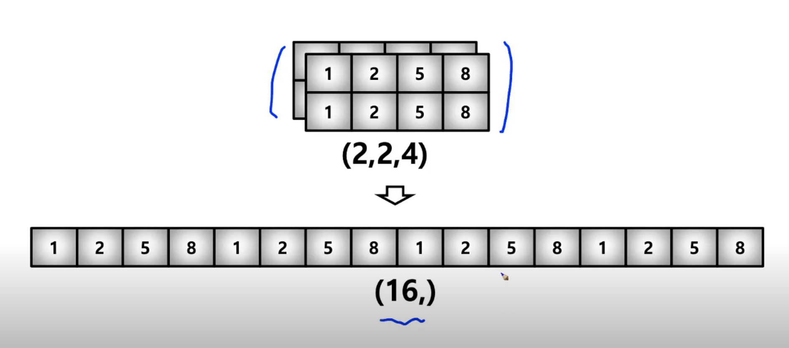

# day 6 Numpy / 벡터 / 행렬

## Numerical Python - numpy part I
> 어떻게 행렬과 매트릭스를 코드로 표현할 것인가?

### 코드로 방정식 표현하기
coefficient_matrix = [[2,2,1], [2,-1,2], [1,-1,2]]
constant_vector = [9,6,5]
- 다양한 Matrix 계산을 어떻게 만들것인가?
    - ex) dot product, norm
        - list를 사용하면 위에 것을 다 구현해야함..
- 굉장히 큰 Matrix에 대한 표현
    - List는 각각의 sequence형 자료형에 대해서 주소를 연결하기 때문에.. 비효율적
    - data가 큰 Matrix에 처리에 비효율적
- 처리 속도 문제 - python은 interpreter 언어

### numpy
- Numerical Python
- 파이썬의 고성능 과학 계산용 패키지
    - 이학/공학, 증권, 
- Matrix와 Vector와 같은 Array 연산의 사실상의 표준
    - 선형대수의 거의 모든 개념에 대해서 사용

### Numpy의 특징
-일반 List에 비해 빠르고, 메모리 효율적
- 반복문 없이 데이터 배열에 대한 처리를 지원함
- 선형대수와 관련된 다양한 기능을 제공함
- C, C++, 포트란 등의 언어와 통합 가능

### numpy install
```
conda create -n upstage python=3.8
conda activate upstage
conda install numpy
conda install jupyter
```

### ndarray
> numpy dimensional array
```
import numpy as np
```
- numpy의 호출 방법

### array creation
```
test_array = np.array([1, 4, 5, 8], float)
print(test_array)
type(test_array[3])
```  
- numpy는 np.array 함수를 활용 배열을 생성함
    - ndarray 객체
- numpy는 하나의 데이터 type만 배열에 넣을 수 있음 (dtype)
- List와 가장 큰 차이점 -> dynamic typing not supproted
- C의 Array를 사용하여 배열을 생성함
- **shift + tab**

- https://jakevdp.github.io/blog/2014/05/09/why-python-is-slow/

```
a = [1,2,3,4,5]
b = [5,4,3,2,1]
a[0] is b[-1] # True

a = np.array(a)
b = np.array(b)
a[0] is b[-1] # False
```

- shape: numpy array의 dimension 구성을 반환함
- dtype: numpy array의 데이터 type을 반환함
```
test_array = np.array([1, 4, 5, "8"], float) # String Type의 데이터를 입력해도
print(test_array)
print(type(test_array[3])) # Float Type으로 자동 형변환을 실시
print(test_array.dtype) # Array(배열) 전체의 데이터 Type을 반환함
print(test_array.shape) # Array(배열) 의 shape을 반환함
```

```
a = [[1,2,3], [4,5,6], [4,5,6]]
np.array(a.shape) # (3,3)
```
- 64bit는 하나의 데이터가 8 byte공간을 잡고 있다
- dimension이 늘어날 때마다 Rank가 하나씩 늘어남
 
 ### array shape
 - array의 RANK에 따라 불리는 이름이 있음
 
 Rank|Name|Example
 ---|---|---
 0|scalar|7
 1|vector|[10,10]
 2|matrix|[[10,10], [15,15]]
 3|3-tensor|[[[1,5,9],[2,6,10]], [[3,7,11], [4,8,12]] ]
 n|n-tensor|
- third of tensor, n of tensor

### array shape (vector)
- shape: array의 크기, 형태 등에 대한 정보 
```
np.array([1,4,5,"8"], float)
# array([1., 4., 5., 8.])
```
- ndarray의 shape (type: tuple) (4,)

### array shape (matrix)
```
matrix = [[1,2,5,8], [1,2,5,8], [1,2,5,8]]
np.array(matrix, int).shape
# (3,4)
```


### array shape (3rd_order_tensor)

- 하나씩 밀림
- ndim - number of dimensions (RANK의 갯수를 의미)
- size - data(element)의 개수
    - 4*3*4 = 48

### Array dtype
- ndarray의 single element가 가지는 data type
- 각 element가 차지하는 Memory의 크기가 결정됨
- dtype= np.float32, np.float64, np.int8 ...
- c data type과 compatible


### Array nbytes
- nbytes - ndarray object의 메모리 크기를 반환


## Numerical Python - numpy part II
> Handling shape

### reshape
- reshape: Array의 shape의 크기를 변경함, element의 갯수는 동일
    - size의 갯수는 변화지 않음


- data의 순서는 그대로
- test_matrix 자체는 바뀌지 않음

### flatten
- flatten: 다차원 array를 1차원 array로 변환
    - reshape의 기능 하나를 따로 떼어낸 느낌?


### indexing & slicing
### indexing for numpy array
- list와 달리 이차원 배열에서 [0,0] 표기법을 제공함
- matrix일 경우 앞은 row 뒤는 column을 의미함

### slicing for numpy array
- list와 달리 행과 열 부분을 나눠서 slicing이 가능함
- matrix의 부분 집합을 추출할 때 유용함

- [1:3] -> 2-D로 나옴
- [1:2, :2] -> 2-D로 나옴
- a[:, -1] -> 1-D로 나옴
- test_example[1] -> 1-D로 나옴 # 1 row의 1열 ~2열
- test_exampe[1:3] -> 2-D로 나옴 # 1 row ~ 2 row의 전체
- a[:-1]
- 10~12분대 ? 실습해서 다시 이해하기

 
 ### creation function
 > array을 생성하는 함수

 ### arrange
 > array의 범위를 지정하여, 값의 list를 생성하는 명령어
    - `np.arrrange(0, 5, 0.5)` # floating point도 표시 가능

### ones, zeros and empty
- np.zeros(shape, dtype, order)
- empty: shape만 주어지고 비어있는 ndarray 생성
    - memory initialization이 되지 않음. 그 공간에 값이 남아있는 것을 그대로 노출
    - garbage collection을 하는 순간 memory를 Release하는데 그 곳에 이전의 값이 남아있음
### something_like
> 기존 ndarray의 shape크기 만큼 1,0 또는 empty array를 반환
```
test_matrix = np.arrange(30).reshape(5,6)
np.ones_like(test_matrix)
np.zeros_like(test_matrix)
np.empty_like(test_matrix)
```
- shape은 tuple 값 ex) (5,)

### identity
> 단위 행렬(i 행렬)을 생성함
```
np.identity(n=3, dtype=np.int8)
np.identity(5)
```

### eye
> 대각선이 1인 행렬, k값의 시작 index의 변경이 가능


### diag
> 대각 행렬의 값을 추출함


### random sampling
> 데이터 분포에 따른 sampling으로 array를 생성
- np.random.uniform(0,1,10).reshape(2,5) # 균등분포, (시작값,끝값, 데이터갯수)
    - 모수값을 넣어주는데 배워야 이해할 수 있음
- np.random.normal(0,1,10).reshape(2,5) # 정규분포

### operation functions
> element간의 연산을 할 때 쓰임

### sum
> ndarray의 element들 간의 합을 구함, list의 sum 기능과 동일
- `test_array.sum(dtype=np.float)`

### axis
> 모든 operation function을 실행할 때 기준이 되는 dimension 축


- 하나의 Rank가 추가될 때마다, 새로운 rank가 axis0이되고 기존의 rank의 axis가 하나씩 증가한다는 것
- 26~27분대 다시 보고 제대로 이해하기

### mean & std
> ndarray의 element들 간의 평균 또는 표준 편차를 반환
- 인자값 (axis=0...)
### mathematical functions
> 그 외에도 다양한 수학 연산자를 제공함 (np.something 호출)

### concatenate
> numpy array를 합치는(붙이는) 함수


```
b = np.array([5,6])
# b.reshape(-1,2)
b = b[np.newaxis, :]
np.concatenate((a,b.T), axis=1)
```
- np.newaxis 하나의 축을 추가해줄때..? 

### Operations b/t arrays 
> numpy는 array간의 기본적인 사칙 연산을 지원함

### Element-wise operations
> Array간 shape이 같을 때 일어나는 연산
> 같은 위치의 값들끼리 곱해짐
- dot product 아님!!

### dot product
> Matrix의 기본 연산, dot 함수 사용 


### transpose
> transpose 또는 T attribute 사용


### boradcasting
> shape이 다른 배열 간 연산을 지원하는 기능
> Scalar - vector 외에도 vector - matrix 간의 연산도 지원

- `+, -, *, /, //, **`


### numpy performance #1
> timeit: jupyter 환경에서 코드의 퍼포먼스를 체크하는 함수
```
def sclar_vector_product(scalar, vector): 
    result = []
    for value in vector: 
    result.append(scalar * value)
    return result 

iternation_max = 100000000

vector = list(range(iternation_max)) 
scalar = 2

%timeit sclar_vector_product(scalar, vector) # for loop을 이용한 성능 %timeit [scalar * value for value in range(iternation_max)] # list comprehension을 이용한 성능
%timeit np.arange(iternation_max) * scalar # numpy를 이용한 성능
```
- < foor loop < list comprehnsion < numpy
- 100,000,000 번의 loop이 돌 때, 약 4배 이상의 성능 차이를 보임
- Numpy는 C로 구현 되어 있어, 성능을 확보하는 대신 파이썬의 가장 큰 특징인 dynamic typing을 포기함
- 대용량 계산에서는 가장 흔히 사용됨
- concatenate 처럼 계산이 아닌, 할당에서는 연산 속도의 이점이 없음

## Numerical Python - numpy part III

### Comparisons
> numpy array들 끼리의 비교

### All & Any
> Array의 데이터 전부(and) 또는 일부(or)가 조건에 만족 여부 반환
- broadcasting되서 boolean array가 나옴
```
a = np.arrange(10)
a < 4
np.all(a < 4)
np.any(a < 4) 
```

### comparison operation #1
> numpy는 배열의 크기가 동일할 때 element간 비교의 결과를 Boolean type으로 반환


### comparison operation #2


### np.where

- tuple로 값을 return함

### argmax & argmin
> array내 최대값 또는 최소값의 index를 반환함

- argsort는 순서대로 index를 뽑아줌
- argsort()[::-1] 거꾸로도 가능
    - argsort내에서도 할 수 있음

### boolean & fancy index

### boolean index
> 특정 조건에 따른 값을 배열 형태로 추출
> comparison operation 함수들도 모두 사용 가능
- 둘의 shape이 동일해야함.
```
condition = test_array < 3
test_array[condition]
```

### fancy index
> numpy는 array를 index value로 사용해서 값 추출
```
a = np.array([2, 4, 6, 8], flaot)
b = np.array([0, 0, 1, 3, 2], int)
a[b]
a.take(b) # 위와 같은 것
```
boolean index 와의 차이
- boolean대신 index쓰는 것
- shape이 같지 않아도 됨
    - 단, index의 범위를 벗어나서는 안됨
![fancy_matrix_example][../../images/fancy_matrix_example.png]

### numpy data I/O

### loadtxt & savetxt
> text type의 데이터를 읽고 저장하는 기능
![loadtxt_savetxt][../../images/loadtxt_savetxt.png]

## 벡터가 뭐에요? 행렬이 뭐에요?
- 해당 섹션은 수업자료 PDF에 필기를 진행하였습니다.

## 피어세션

### 피어세션 발표 정리

A - KNN algorithm (K nearest neighbors)
- K개의 가까운 이웃들과 분류에 쓰이는 알고리즘
    - 직관적임에 불과하고 성능이 좋음
    - Hyperpaprameter: K, 몇개의 이웃
    - K 짝수를 지양
- Parameter tuning

B - Closure 사용 이유
- closure 함수가 아닐 경우
    - nampespace안의 __closure__가 비어있음

C - python Configuration
- 파이썬에서 설정값 관리
    - 빌트인 데이터구조
        - github에 올릴 때 보안 이슈 
    - 동적 로딩
        - 설정 파일 경로 동적으로 등록, 임포트 가능한 위치에 있을 필요 없음
    - 외부파일
        - 외부 파일을 통한 설정 -> .gitignore에 명시
    - 시스템 환경 변수
        - 셸 스크립트를 사용 해야함, 노출 위험 적음
- configparser
- argparser
    - 콘솔창에서 프로그램 실행

D - logging
- 유래: 유럽에서 통나무를 물에 실어서 보내서 기록
- logging vs print
    - logging은 좀 더 자세하게 정보를 주고, 파일로 저장 가능

### 피어 세션 내용
각자 발표를 진행하였고 내일부터는 논문 읽기를 시작 하기로 하였습니다. 실질적으로 논문을 읽는게 처음이라 걱정이 되지만, 어차피 넘어야 할 산이라고 생각하여 열심히 해봐야겠습니다.
