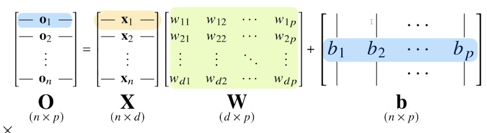

# day 8 Pandas I / 딥러닝 학습방법 이해하기

## pandas I
> 구조화된 데이터의 처리를 지원하는 Python 라이브러리
> Python계의 엑셀!

### pandas
- 구조화된 데이터의 처리를 지원하는 Python 라이브러리
- panel data -> pandas 
    - 금융쪽 개발자가 만듦
    - R에 있는 data 구조체와 유사
- 고성능 array 계산라이브러리인 numpy와 통합하여, 강력한 “스프레드시트” 처리기능을 제공
- 인덱싱, 연산용 함수, 전처리 함수 등을 제공함
- 데이터 처리 및 통계분석을 위해 사용

- 앞으로 다룰 데이터는 matrix 행렬 데이터, 엑셀 sheet 데이터
- DL, Image, Sound, Text
- Pandas는 Tabular(테이블형) data를 다루는데 최적화가 되있는 도구


### 데이터 로딩
```
import pandas as pd #라이브러리 호출

# data_url = 'https://archive.ics.uci.edu/ml/machine-learning-databases/housing/housing.data' #Data URL
data_url = './housing.data' #Data URL
df_data = pd.read_csv(data_url, sep='\s+', header = None) #csv 타입 데이터 로드, separate는 빈공간으로 지정하고, Column은 없음

df_data.head() #처음 다섯줄 출력

df_data.columns = [
    'CRIM','ZN', 'INDUS', 'CHAS', 'NOX', 'RM', 'AGE', 'DIS', 'RAD', 'TAX', 'PTRATIO' ,'B', 'LSTAT', 'MEDV'] 
# Column Header 이름 지정

df_data.head()

df_data.values
```

### pandas의 구성


### Series
> column vector를 표현하는 object


- data를 접근하는 indexing을 문자로 지정할 수 있음


- `example_obj.astype(float)`
    - type 변경
- `example_obj.values`: 값 리스트만
- `example_obj.index`: index 리스트만
- `example_obj.name`: 잘 안씀 (series name 지정)
- `example_obj.index.name`: 잘 안씀 (index name 지정)

- index를 값을 기준으로 series 생성
    - data를 넘어가는 index NaN로 표시

### dataframe memory

- series를 모아서 data frame(table)을 만듦 = 기본 2차원
    - 기본적으로 CSV, excel형 데이터를 부름

### dataframe 생성


- `df.first_name` or `df["first_name"]` - column 선택 - series 추출

### dataframe indexing
- `df.loc[1]` loc - index location
    - `df.loc[:3]`
        - 3이라는 이름의 index까지
        - index의 이름을 쓰는것!
    - `df.loc[:, ["last_name", "first_name"]]`
- `df['age'].iloc[1:]` iloc - index position
- loc은 index 이름, iloc은 index number

### dataframe handling
```
df.age > 40
df.debt = df.age > 40
df
values = Series(data=["M", "F", "F"], index=[0, 1, 3])
values
df["sex"] = values
df

```
`df.T` - transpose
`df.values` - 값 출력
`df.to_csv()` - csv 변환
`df.index`
`del df['debt']` - column 삭제
`df.drop('debt', axis=1)` - axis1 - column 기준 drop(df 원본 변환 x)
 
 `pop = {"Nevada": {2001: 2.4, 2002: 2.9}, "Ohio": {2000: 1.5, 2001: 1.7, 2002: 3.6}}`
 - 앞에 dict는 column, 안은 index값

## pandas II

### Selection with column names
- df['account'].head(3) : 한개의 column 선택시
- df[['account, 'street', 'state]].head(3) : 1개 이상의 column 선택
엑셀 파일 읽어오는 모듈
- `!conda install --y xlrd` 
df['account'] vs. - df[['account']]
- series 형태         dataframe 형태 

- index data가 'a', 'b', 'c'면 위의 코드로 동작 x
- fandy index, boolean index 가능!!

### index 변경
```
df.index = df['account']
del df['account']
df.head()
```

### basic, loc, iloc selection


### reindex
```
df.index = list(range(0,15))
# df.reset_index(drop=True)

# df.reset_index(inplace= True, drop=True)
```
- `inplace = True`하면 값이 변경됨
    - 보통 자기 자신이 변하게 잘 안함

### data drop
`df.drop(1)` 
- index number로 drop
    - drop 도 실제 데이터에 변환을 하는 건 아님! (inplace = True해야함)
`df.drop('city', axis=1)` # df.drop(['city', 'state'], axis=1)
- axis 지정으로 축을 기준으로 dop -> column 중에 'city' 
`df.drop('city', axis=1, inplace=True)`

### dataframe operations

- 모든 연산은 index(column 값)를 기준으로 연산
- series에서는 indexr값에 중복을 허용


### series + dataframe


### lambda, map, apply

### map for series
- pandas의 series type의 데이터에도 map 함수 사용가능
- function 대신 dict, sequence형자료등으로 대체 가능


### replace function
- map 함수의 기능중 데이터 변환 기능만 담당
- 데이터 변환시 많이 사용하는 함수


- `!wget URL`
    - 다운로드 받는 코드

### apply for dataframe
- map과 달리, series 전체(column)에 해당 함수를 적용
- 입력 값이 series 데이터로 입력 받아 handling 가능


- `df_info.sum()` = `df_info.apply(sum)`
- 내장 연산 함수를 사용할 때도 똑같은 효과를 얻을 수 있음
- mean, std, sum 등 사용 가능 
```
def f(x):
    return Series([x.min(), x.max()], index=['min', 'max'])
df_info.apply(f)
```
- scalar 값 이외에 series값의 반환도 가능함

### applymap for dataframe
- sereis 단위가 아닌 element 단위로 함수를 적용함
    - 모든 단위
- series 단위에 apply를 적용시킬 때와 같은 효과
    - column 단위


**apply는 column 단위로 적용된다는 것을 기억해두면 좋을듯**

### pandas built-in functions

### describe
- Numeric type 데이터의 요약 정보를 보여줌


### unique
- series data의 유일한 값을 list로 반환함

### sum
- 기본적인 column 또는 row 값의 연산을 지원
- sub, mean, min, max, count, median, mad ,var 등
- `df.sum(axis=0)` column 별, `df.sum(axis=1)` row 별
    - 축을 기준으로 해서!

### isnull
- column 또는 row의 값의 NaN (null) 값의 index를 반환함
- `df.isnull()`
- `df.isnull().sum`
    - 얼마나 비어져있는지 확인 가능

### sort_values
- column 값을 기준으로 데이터를 sorting
`df.sort_values(["age", "earn"], ascending=True).head(10)`
    - index값이 섞이는 거 주의!

### Correlation & Covariance
- 상관계수와 공분산을 구하는 함수
- corr, cov, corrwith
- `df.age.corr(df.earn)`
- `df.age.cov(df.earn)`
- `df.corrwith(df.earn)`
- `df.corr()`
    - 모든 column들 간의 상관관계
- 필요할 때 찾아보자!

`df.isnull().sum() / len(df)`
- null 비율


`pd.options.display.max_row = 2000`
- 를 사용하여 한번에 출력되는 수를 조정할 수 있다!

`df["sex_code"] = df["sex"].replace({"male": 1, "female": 0})`
- 숫자로 바꿔서 correlation을 확인 가능!

`df.corrwith(df.earn)`
- 하나의 column에 관해 각 correlation을 보고 싶을 때

`df.sex.value_counts(sort=True) / len(df)`

## 딥러닝 학습방법 이해하기
- 해당 섹션은 수업자료 PDF에 필기를 진행하였습니다.

### 리뷰
데이터를 선형모델로 해석하는 방법(경사하강법)
- 주어진 데이터에 정답에 해당하는 y와 선형모델의 결과인 y-hat의 차이의 l2 norm의 기대값을 최소화하는 vector를 찾는 학습을 했음
    - 단순한 문제는 괜찮지만, 분류 문제 및 좀 더 복잡한 것에 적합하지 않음

### 신경망으로 수식을 해석해보자

비선형 모델인 신경망(neural network)
- 실제 수식적으로 분해해보면 선형모델이 안에 숨겨져 있고, 그 선형 모델과 비선형 함수의 결합으로 이루어져 있음



- 전체 데이터 행렬 X
- X의 데이터 행렬 포인트를 출력으로 뱉어주는 가중치 행렬 W
    - 다른 데이터 공간으로 보내주는 W
- WX 두개의 곱을 통해서 선형모델을 표현
- B - y 절편
    - 각 행에 대해서 모두 같은 값을 더해준다.
- XW + B = O - 출력
- 출력 베터의 차원은 d에서 p로 바뀌게 됩니다.


- 화살표가 W 가중치

분류 문제
- 주어진 문제가 어떤 클래스에 해당하는지 분류하는 문제!


### 소프트맥스 연산
- 분류 문제를 풀 때 필요한 연산자
- 모델의 출력을 확률로 해석할 수 있게 변환해주는 연산
    - 분류 문제를 풀 때, 선형모델과 소프트맥스 함수를 결합하여 예측합니다
    - 확률 벡터로 변환
        - 주어진 데이터가 특정 클래스에 속할 확률이 얼마인지 계산
- exponential 함수 

- 만약 너무 큰 vector가 들어오면 overflow가 들어올 수 있어서..  - np.max를 해줌

소프트맥스는 학습을 할 때는 필요하지만..

추론을 할 때는
- 출력값에서 가장 최대값을 가진 주소만 1로 출력하는 one-hot vector를 사용
    - 굳이 softmax 사용할 필요 없음
    - one_hot(softmax(o)) - X
    - one_hot(o) - O

forwardpropagation
- x라는 입력을 받아서, 최종 출력까지 보낼 떄, 선형 모델과 활성함수를 반복적으로 적용하는 연산 

backpropagation
- 경사하강법을 적용을 해서 각각의 가중치 행렬들을 학습을 시킬 때 각각의 가중치에 대한 gradient vector를 계산해야 경사하강법을 적용할 수 있다 

## 피어세션 
논문 마다 contribution 이 있음
- 이 논문을 써서 어떻게 기여할지 - **contribution**
    1. 개념 - 연구분야에 새로운 갠며을 찾아서 이렇게 기여 하겠다
    2. 실험 - 있는 것으로 결과 분석 
    3. 방법 - 문제가 있는데, 나는 이렇게 풀었다 하는 방법론
    - 표가 많은 것은.. 실험을 해봤는데..?
        - 비 연관적인 수식도 있을 수 있음
    - 방법론 쪽으로 contribution! 
- Speical thanks to 찬형

NLP 꿀자료


내가 ..5시 발표ㅠ


