# DAY 9 Pandas II / 확률론

## pandas part II - 1
수학에서 머물러있지 않고, 직접 코드를 짜서 해봐야한다

### Groupby
- SQL groupby 명령어와 같음
- split -> apply -> combine
- 과정을 거쳐 연산함
!(group_by_example)[../../images/group_by_example.png]

!(group_by_example1)[../../images/group_by_example1.png]
- excel의 pivot table

- 한 개 이상의 column을 묶을수도 있음!
 !(group_by_example2)[../../images/group_by_example2.png]

### Hierarchical index
- Groupby 명령의 결과물도 결국은 dataframe
- 두 개의 column으로 groupby를 할 경우, index가 두개 생성
`h_index = df.groupby(['Team', "Year]]['Points'].sum()`
- index1, index2
!(h_index)[../../images/h_index.png]

### Hierarchical index - unstack()
- group으로 묶여진 데이터를 matrix 형태로 전환해줌
```
h_index.unstack()
h_index.unstack().stack()
h_index.reset_index()
```

### Hierarchical index - swaplevel
- index level을 변경할 수 있음
!(h_index_swaplevel)[../../images/h_index_swaplevel.png]
- level을 기준으로 sort 가능
- value를 기준으로도 가능 `h_index.sort_values()`
    - h_index의 type은 series 데이터

### Hierarchical index - operations
- index level을 기준으로 기본 연산 수행 가능 
    - series에 쓸 수 있는 것들?
!(h_index_operations)[../../images/h_index_operations.png]

### groupby - grouped
- groupby에 의해 split된 상태를 추출 가능함
!(grouped_example)[../../images/grouped_example.png]

- 특정 key값을 가진 그룹의 정보만 추출 가능
!(grouped_example2)[../../images/grouped_example2.png]

- 추출된 group 정보에는 세 가지 유형의 apply가 가능
- Aggregation: 요약된 통계정보를 추출해 줌
- Transformation: 해당 정보를 변환해줌
- Filterataion: 특정 정보를 제거하여 보여주는 필터링 기능

### groupby - aggreation
- `grouped.agg(sum)` 
- `grouped.agg(np.mean)`
- `grouped['Points'].agg([np.sum, np.mean, np.std])`
- `grouped.describe().T`

### Groupby - transformation
- Aggregation과 달리 key값 별로 요약된 정보가 아님
- 개별 데이터의 변환을 지원함
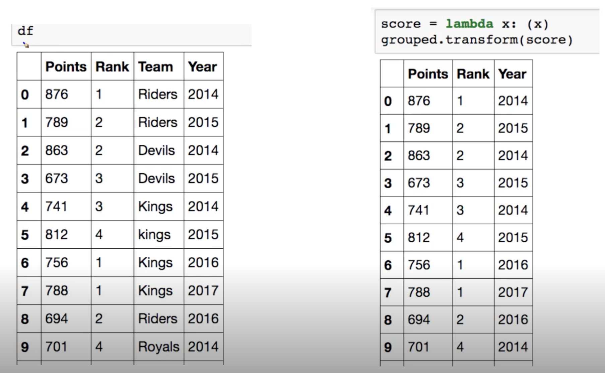
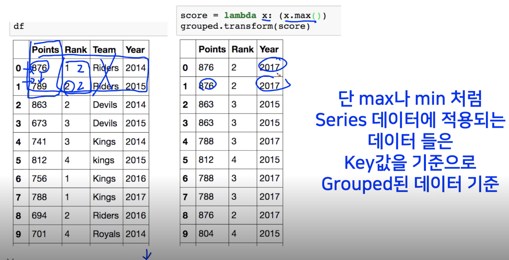
- grouped된 상태에서 column별로 모든값에 동일한 연산이 적용
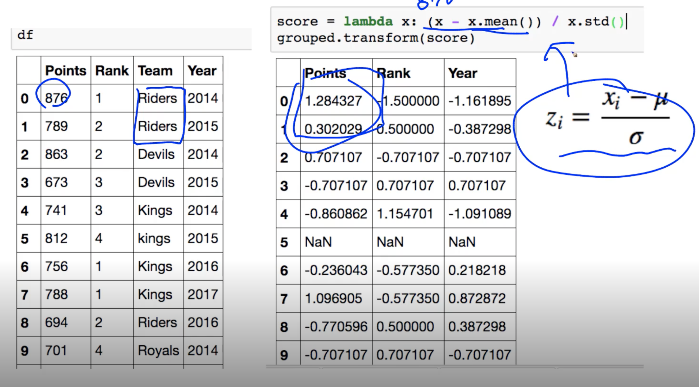
- 실제 데이터 변환에 많이 쓰임 (해당 강의에서는 다루지 않음)

### Groupby - filter
> 특정 조건으로 데이터를 검색할 때 사용
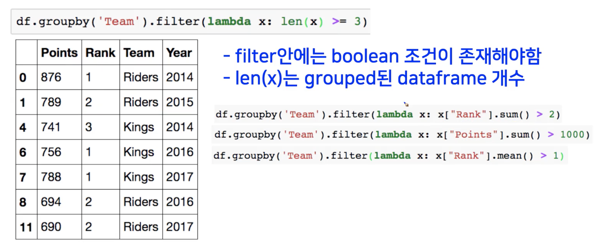

## pandas part II - 2

### Data
- 시간과 데이터 종류가 정리된 통화량 데이터 (실습에 사용된 데이터)

```
import dateutil

df_phone["date"] = df_phone['date'].apply(dateutil.parser.parse, dayfirst=True)
df_phone.dtypes
```
- object라고 type이 적혀있다면 string형태로 되있다는 것
    - 날짜 데이터 형식으로 바꿔주는게 필요!
```
df_phone.groupby('month')['duration'].mean()
df_phone.groupby('month')['duration'].sum()
```

- 실습 파일로 예제 다시 확인하기!

### Pivot Table과 Crosstab

### Pivot Table
- 우리가 excel에서 ㅂ도너 그것
- Index 축은 groupby와 동일함
    - 하지만 더 쉽게 사용 가능
- Column에 추가로 labeling 값을 추가하여, value에 numeric type 값을 aggregation 하는 형태
- 예시코드 확인 필수!

### Crosstab
- 특허 두 칼럼에 교차 빈도, 비율, 덧셈 등을 구할 때 사용
- Pivot table의 특수한 형태
- User-Item Rating Matrix 등을 만들 때 사용가능함

- 예시코드 확인 필수!

### Merge & Concat

### Merge
> SQL에서 많이 사용하는 Merge와 같은 기능
> 두 개의 데이터를 하나로 합침
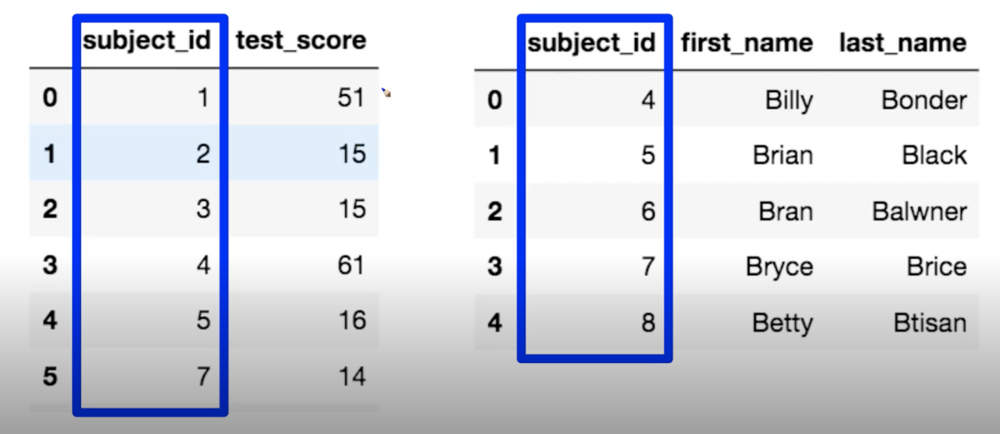
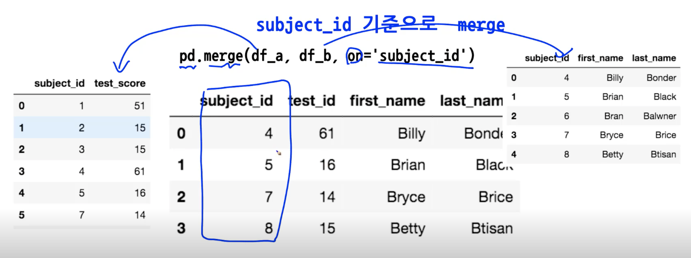

두 dataframe이 column 이름이 다를 때
- `pd.merge(df_a, df_b, left_on='subject_id', right_on='subject_id')`

### join method & data
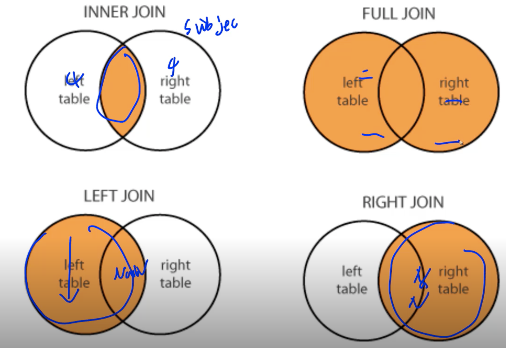
- 다행히 sql에 있는 join이랑 개념이 같아서.. syntax만 알고 가면 될듯!
- `pd.merge(df_a, df_b, on="usbject_id", how="right"`
- `pd.merge(df_a, df_b, on="usbject_id", how="left"`
- `pd.merge(df_a, df_b, on="usbject_id", how="inner"`
- `pd.merge(df_a, df_b, on="usbject_id", how="outer"`

### index based join
- `pd.merge(df_a, df_b, right_index=True, left_index=True)`

### concat
> 같은 형태의 데이터를 붙이는 연산작업
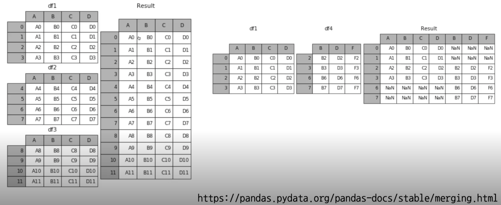
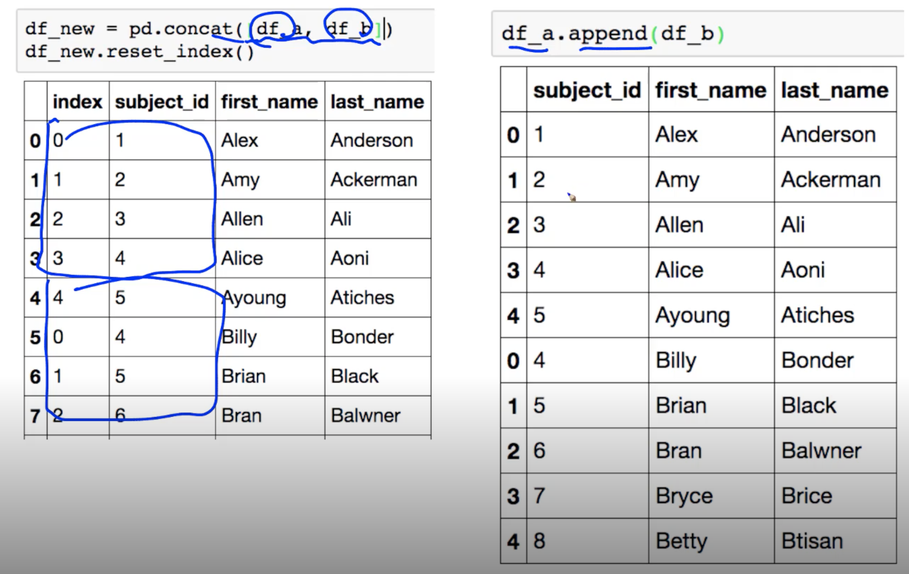
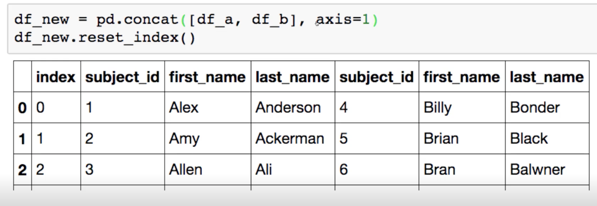

- 예시 코드로 학습 다시 하기! (20분대~ )

### Persistence

### Database connection
> Data loading시 db connection 기능을 제공함
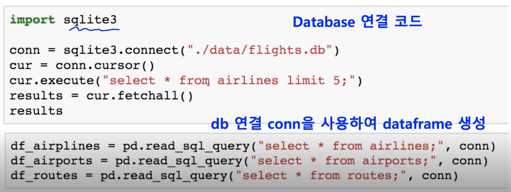

### XLS persistence
> Dataframe의 엑셀 추출 코드 
> Xls 엔진으로 openpyxls 또는 XlsxWrite 사용
```
writer = pd.ExcelWriter('./data/df_routes.xlsx', engine='xlsxwriter')
df_routes.to_excep(writer, sheet_name="sheet1")
```

## 확률론 맛보기

### 딥러닝에서 확률론이 왜 필요한가요?
- 딥러닝은 확률론 기반의 기계학습 이론에 바탕을 두고 있습니다
- 기계학습에서 사용되는 손실함수(lossfunction)들의 작동원리는 데이터 공간을 통계적으로 해석해서 유도하게 됩니다
    - 이렇게 유도한 하게 된 손실함수를 가지고 기계학습 또는 딥러닝 모형들을 학습시킴
    - 원리를 이용해 원하는 목표 달성
- 회귀 분석에서 손실함수로 사용되는 L2-노름은 예측오차의 분산을 가장 최소화하는 방향으로 학습하도록 유도합니다.
- 분류 문제에서 사용되는 교차엔트로피(cross-entropy)는 모델 예측의 불확실성을 최소화하는 방향으로 학습하도록 유도합니다.
    - 다음 강의에서 소개 예정
- 분산 및 불확실성을 최소화하기 위해서는 측정하는 방법으 ㄹ알아야합니다.
    - 두 대상을 측정하는 방법을 통계학에서 제공하기 떄문에 기계학습을 이해하려면 확률론의 기본 개념을 알아야 합니다.

### 확률분포는 데이터의 초상화
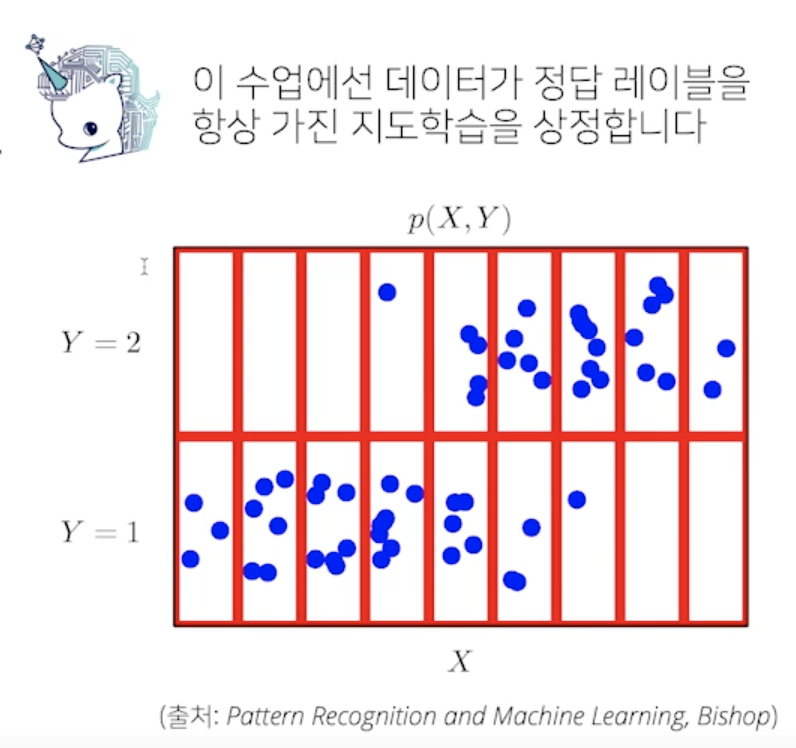
- 데이터공간을 X × Y라 표기하고 D는 데이터공간에서 데이터를 추출하는 분포입니다
    - 실제 데이터를 갖고 이 확률 분포를 아는 것을 불가능 => 기계학습을 통해 얻음
- 데이터는 확률변수로 데이터공간 상의 관측가능한 데이터 (x, y) ∈ X × Y
- 파란색 점들이 데이터 공간상에서 관측한 데이터
    - 이 데이터를 추출할 때 확률변수를 사용

### 이산확률변수 vs 연속확률변수
- 확률변수는 확률분포 D에 따라 이산형(discrete)과 연속형(continuous) 확률변수로 구분하게 됩니다.
    - 데이터 공간 X × Y로 정해지는 것이 아닌 확률분포 D에 의해 결정됨
        - 실수라고 무조건 continuous, discrete이 아님
        - -0.5, 0.5 두개의 경우의 수 중 골라라 - discrete
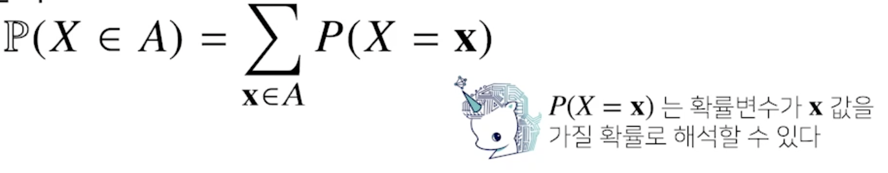
- 이산형 확률변수는 확률변수가 가질 수 있는 경우의 수를 모두 고려하여 확률 더해서 모델링한다.
    - P(X = x)는 확률변수가 x값을 가질 확률
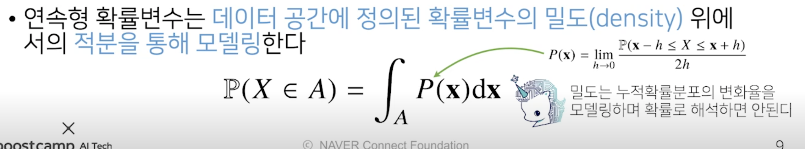
- 연속형 확률변수는 데이터 공간에 정의된 확률변수의 밀도(density) 위에서의 적분을 통해 모델링
    - 연속확률변수에서는 확률변수가 x가 될 확률을 구하는 것이 불가능
        - A상에서 P(x)라는 함수를 적분하는 형태로 확률을 모델링
            - P(x)는 누적확률분포의 변화율을 모델링: 밀도함수
                - 확률로 해석하면 안되고, 누적확률분포의 변화율로 밀도로 해석 해야함
- 이산확률변수, 연속확률변수 둘 다 아닌 변수도 있음!

**확률분포에 따라 데이터를 모델링하는데 차이가 있다**
- 어떤식으로 데이터에 접근하느냐에 따라서 데이터 분포에 성질이 달라지게 되고..
    - 분포의 종류에 따라서 확률분포로 모델링하는것이 달라지게 된다
- 전체 데이터 X,Y가 주어진 상태에서 분포를 정할 수 있는데 이 분포를 결합분포(joint distribution)라고 함

- 연속적인 모양의 확률분포를 위의 그림처럼 빨간 줄로 나누어 이산확률분포처럼 생각할 수 있음
    - 각각의 칸에 대해서, 갯수를 세서.. 주어진 데이터의 원래 확률 분포 D를 모델링할 수 있음
        - 주어진 모양 P에따라 적절하게 선택하여 원래 D를 모델링
            - 기존의 결합분포를 어떻게 해석하느냐에 따라 달린듯

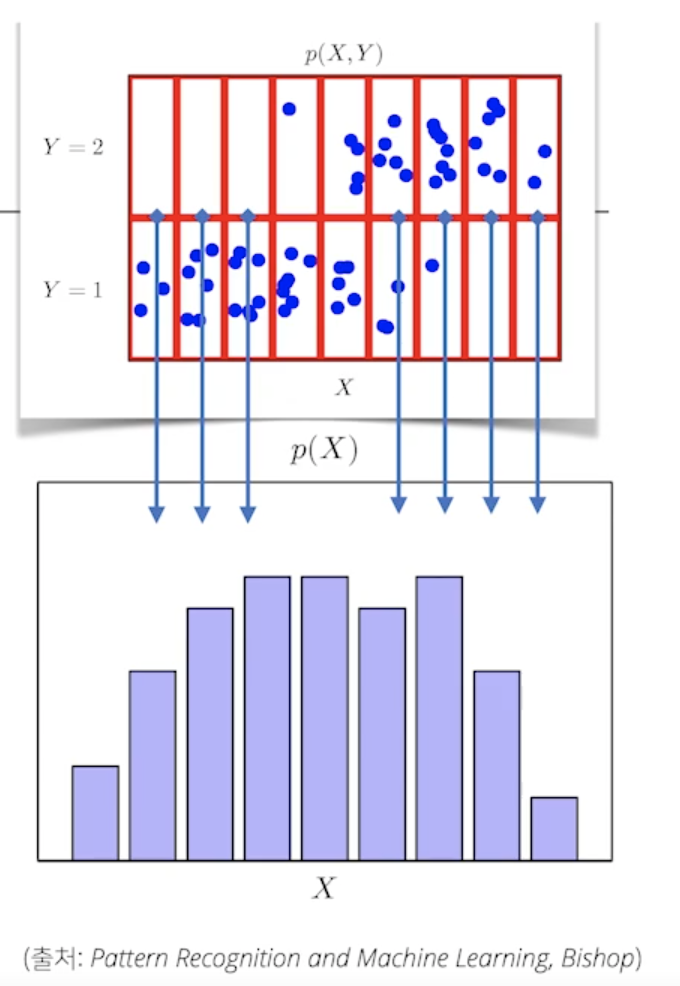
- P(x)는 입력 x에 대한 주변확률분포(marginal_distribution)로 y에 대한 정보를 주진 않습니다

- x에 대한 정보 추출, (y에 대해서 구할수도 있음)
- 조건부확률분포(conditional_distribution) P(x|y)는 데이터 공간에서 입력 x와 출력 y 사이의 관계를 모델링 합니다.
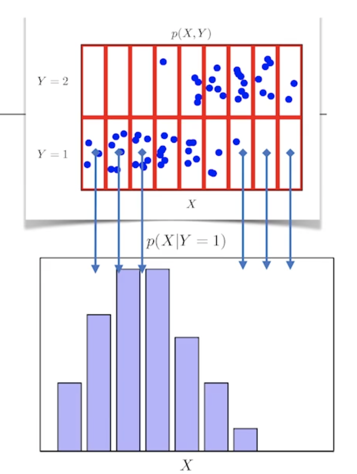
    - y 가 주어진 상황에서 x를 구하는 것 (예: y=1인 경우만 확률분포를 구한 것)
    - 특정 크래스가 주어진 조건에서 데이터의 확률분포로 보여줍니다
- 확률분포로 데이터의 초상화를 그리는 것

### 조건부확률과 기계학습
- 조건부확률 P(y|x)는 입력변수 x에 대해 정답이 y일 확률을 의미합니다
    - 연속확분포의 경우 P(y|x)는 확률이 아니고 밀도로 해석한다는 것을 주의하자
- 로지스틱 회귀에서 사용했던 선형모델과 소프트맥스 함수의 결합은 **데이터에서 추출된 패턴을 기반으로 확률을 해석**하는데 사용합니다.
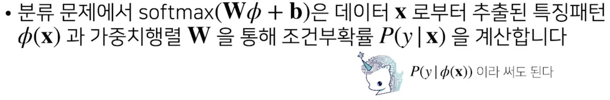

- logistic regression에서 사용 했던 선형 모델과 softmax 함수의 결합을 통해서 데이터 x에서 추출된 패턴을 기반으로 확률을 해석하는데 사용할 수 있습니다.
    - 분류문제에서 softmax내에 vector를 넣기전에, 구해진 패턴에서 선형모델을 통해 확률 벡털르 구할 수 있다고 저번에? 설명함
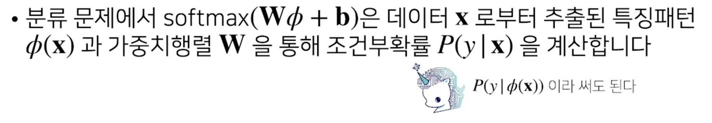

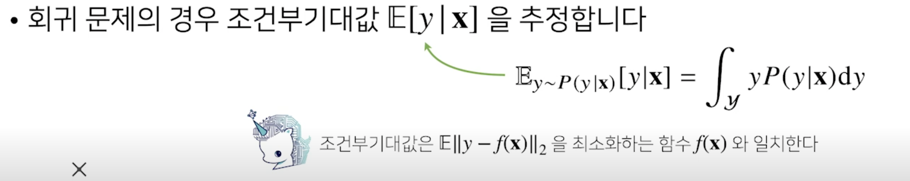
    - 연속 확률 변수를 다루기 때문에 확률로 표현하기 어렵기 때문에, 밀도함수로 해석해야함
    - 조건부 기대값으로 정답을 추론하는 예측모델
- 왜 조건부 기대값을 사용하지?
    - 조건부 기대값은 n2norm을 최소화하는 함수랑 일치하기 때문

### 기대값이 뭔가요?
- 확률분포가 주어지면 데이터를 분석하는 데 사용 가능한 여러 종류의 통계적 범함수를 계산할 수 있습니다
- 기대값(expectation)은 데이터를 대표하는 통계량이면서 동시에 확률분포를 통해 다른 통계적 범함수를 계산하는데 사용됩니다.
    - 동시에 모델링하고자 하는 확률분포에서 계산해보고 싶은 다른 통계적 범함수를 계싼하는데 이용되는 도구라고 보면 될듯?
    - 기대값은 평균이랑 동일한 개념
    - 기계학습에서 사용하는 경우에는 더 폭넓게 사용하게됨 : 단순히 평균을 구하는 개념이 아닌 목적으로하는 주어진 함수가 있을 때 그 함수에 기댓값을 계싼하는것을 통해서 데이터를 해석할 때 여러방면에 사용 가능
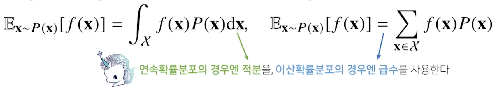
- 연속확률분포에서는 주어진 함수의 기대값을 계산할 때, 주어진 함수에 확률밀도함수를 곱한후에 적분
- 이산확률분포에서는 주어진 함수에서 확률질량함수를 곱해주고 summation(급수)를 해서 기대값을 정의
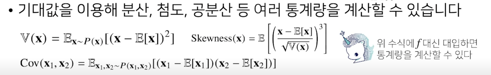

**연속확률변수냐 이산확률변수냐에 따라서 적분 또는 **
- 연속확률변수에서는 밀도함수를 곱
- 이산확률변수에서는 질량함수를 곱


### 몬테카를로 샘플링
- 기계학습의 많은 문제들을 확률분포를 명시적으로 모를 때가 대부분이다
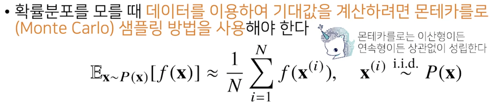
- 확률분포를 모를 때, 샘플링 방법을 알고 있다면, 적분이나 급수대신에 기대값을 계산할 수 있음
    - 해당값이 기대값에 근사!
    - 독립적으로 샘플링을 해줘야 몬테카를로가 작동한다
- 확률분포를 몰라도, 샘플링만 가능하다면 기대값을 얻을 수 있다
- 몬테카를로 샘플링은 독립추출만 보장된다면 대수의 법칙(law of large number)에 의해 수렴성을 보장한다
    - 몬테카를로 샘플링은 기계학습에서 매우 다양하게 응용되는 방법입니다

### 몬테카를로 예제: 적분 계산하기
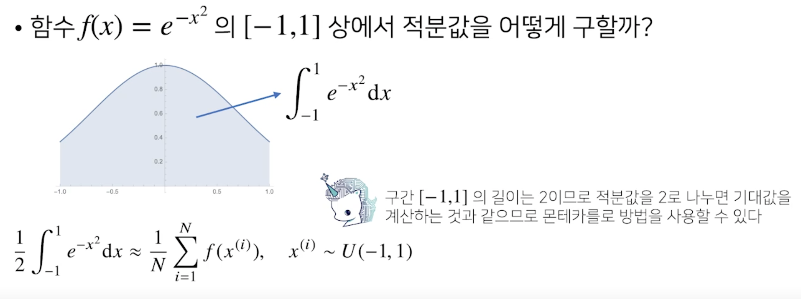
- -1부터 1 까지의 균등분포, 확률분포로 바꾸기 위해 - 구간의 길이가 2인 2로 나누면.. 기대값을 게산하는 것과 동일


## 피어세션
원래는 논문읽기 발표로 계획했지만.. 수학 공부의 필요성을 느껴 다시 수업에 관한 발표로 전환하기로 했다.

## 개인공부
day010 노트에 함께 정리 진행
- day9과 day10의 수업에 연관성이 있어 함께 공부하며 정리