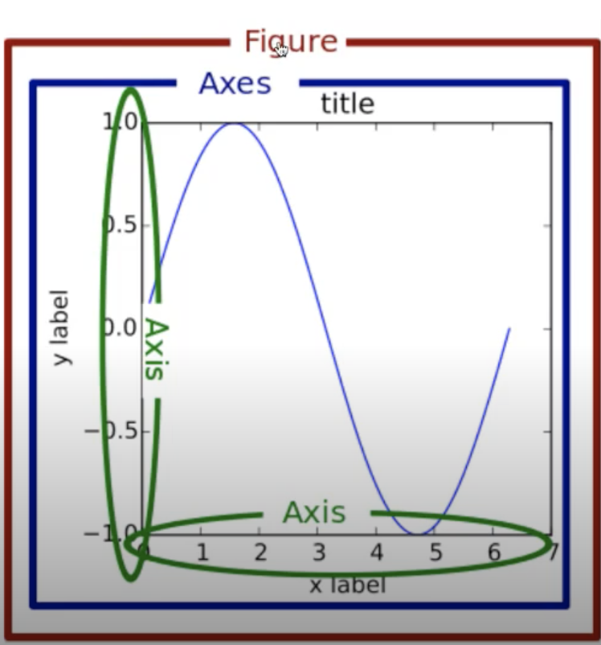
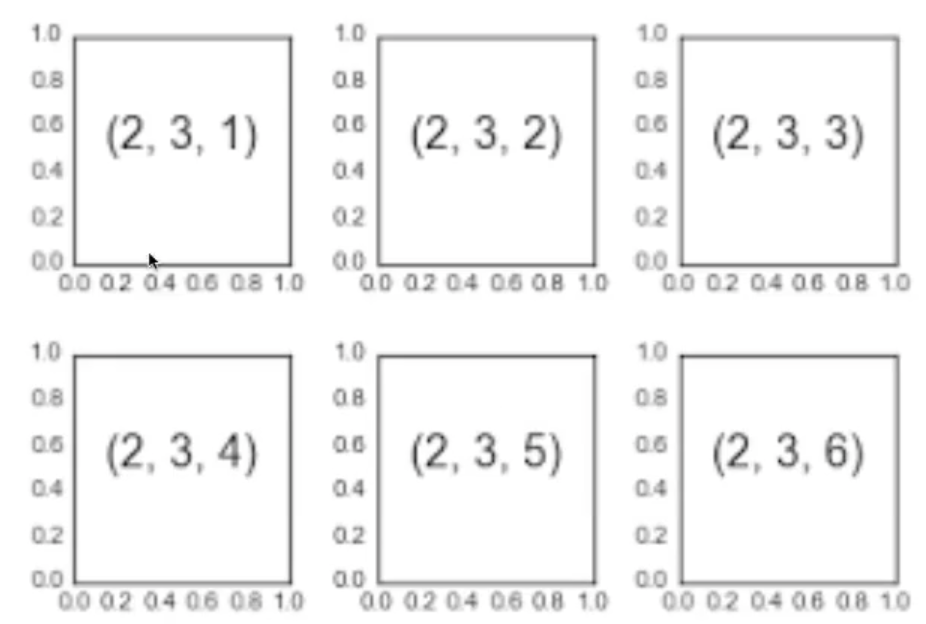
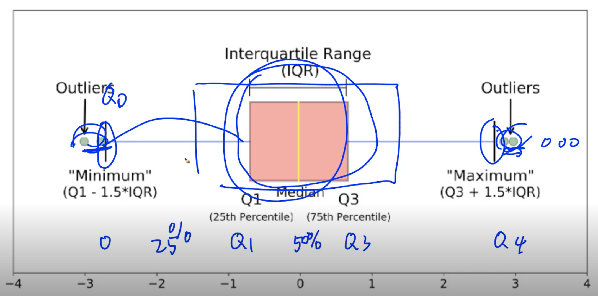
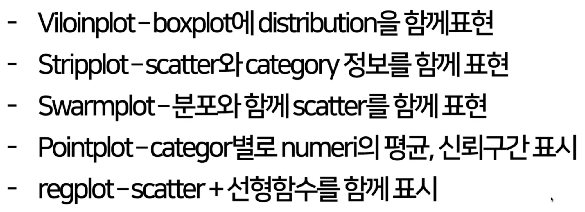

# DAY 10 시각화 / 통계학

## 시각화 도구

### matplotlib overview
- pyplot 객체를 사용하여 데이터를 표시
    - pyplot 그림 그리는 판떼기
- pyplot 객체에 글래프들을 쌓은 다음 flush

```
import matplotlib.pyplot as plt

X = range(100)
Y = [value**2 for value in X]
plt.plot(X,Y)
plt.show() # flush
```
- pyplot이라는 객체에 내용을 쌓아 올린 후 flush하는 것
- 최대 단점 argument를 kwargs받음
- 고정된 argument가 없어서 alt+tab으로 확인 어려움
- graph는 원래 figure 객체에 생성됨
- pyplot 객체 사용시, 기본 figure에 그래프가 그려짐

### Figure & Axes
- Matplotlib는 Figure 안에 Axes로 구성
- Figure 위에 여러개의 Axes를 생성

- X,Y의 값의 순서를 고려해야한다 
    - range(1,100) - O
    - [random.randint(1, 100) for _ in range(100)] - X

```
fig = plt.figure() # figrue 반환
fig.set_size_inches(10,5) # 크기 지정
ax_1 = fig.add_subplot(1,2,1)  # 두 개의 plot 생성 (row, column, 첫번째)
ax_2 = fig.add+subplot(1,2,2)  # 두 개의 Plot 생성 (row, column, 두번째)

ax_1.plot(X_1, Y_1, c='b')
ax_2.plot(X_2, Y_2, c='g')
plt.show() # show & finish
```

### subplots
- subplot의 순서를 grid로 작성


### set color
- color 속성을 사용
- float: 흑백, rgb color, predefined color 사용

```
plt.plot(X_1, Y_1, c='#eeefff')
plt.plot(X_2, Y_2, c='r')

plt.show()
```
- matplotlib 공식문서보고 찾아봐야함 

### set linestyle
- ls 또는 linestyle 속성 사용
```
plt.plot(X_1, Y_1, c='#eeefff', linestyle='dashed')
plt.plot(X_2, Y_2, c='r', ls='dotted')
plt.show()
```

### set title
- pyplot title함수 사용, figure의 subplot별 입력 가능
```
plt.plot(X_1, Y_1, c='#eeefff', linestyle='dashed')
plt.plot(X_2, Y_2, c='r', ls='dotted')

plt.title("Two lines")
plt.show()
```

### set title
- latex타입의 표현도 가능(수식 표현 가능)
```
plt.title('$y = \\frac{ax+b}{test}$')
plt.show()
```

### set legend
- legend 함수로 범례를 표시함, loc 위치등 속성 지원
```
plt.plot(X_1, Y_1, c='#eeefff', linestyle='dashed', label='line_1')
plt.plot(X_2, Y_2, c='r', ls='dotted', label='line_1')
plt.legend(shadow=True, fancybox=True, loc='lower right')
```

### set grid & xylim
- Graph 보조선을 긋는 grid와 xy축 범위 한계를 지정
```
plt.grid(True, lw=0.4, ls='--', c='.90')
plt.xlim(-100, 200)
plt.ylim(-200, 200)
```
- `plt.style.use('ggplot')` 추천
- xlim, ylim 범위 지정
- savepig('파일명', c= 'a') - show 전에 호출

## matplotlib graph

### scatter
- scatter 함수 사용, marker:scatter 모양지정
```
data_1 = np.random.rand(512, 2)
data_2 = np.random.rand(512, 2)

plt.scatter(data_1[:, 0], data_1[:, 1], c="b", marker="x")
plt.scatter(data_2[:, 0], data_2[:, 1], c="r", marker="o") # (X-data, Y-data, color, marker)
plt.show()
```

- s:데이터의 크기를 지정, 데이터의 크기 비교가능
```
N = 50
x = np.random.rand(N)
y = np.random.rand(N)
colors = np.random.rand(N)
area = np.pi * (15 * np.random.rand(N)) ** 2
plt.scatter(x, y, s=area, c=colors, alpha=0.5)
plt.show()
```

### bar chart
- bar 함수 사용
```
data = [[5.0, 25.0, 50.0, 20.0], [4.0, 23.0, 51.0, 17], [6.0, 22.0, 52.0, 19]]

X = np.arange(0, 8, 2)

plt.bar(X + 0.00, data[0], color="b", width=0.50)
plt.bar(X + 0.50, data[1], color="g", width=0.50)
plt.bar(X + 1.0, data[2], color="r", width=0.50)
plt.xticks(X + 0.50, ("A", "B", "C", "D"))
plt.show()


color_list = ["b", "g", "r"]
data_label = ["A", "B", "C"]
X = np.arange(data.shape[1])

data = np.array([[5.0, 5.0, 5.0, 5.0], [4.0, 23.0, 51.0, 17], [6.0, 22.0, 52.0, 19]])

for i in range(3):
    plt.bar(
        X,
        data[i],
        bottom=np.sum(data[:i], axis=0),
        color=color_list[i],
        label=data_label[i],
    )
plt.legend()
plt.show()
```

### histogram
- 분포차트
```
X = np.random.normal(0,100,1000)
plt.hist(X, bins=10)
plt.show()
```
- bins 몇개의 꺽쇠를 만들 것인가

### boxplot

- 좌우에 점 값이 많을수록 데이터가 많이 튀는구나..


## seaborn
> statistical data visualization
- matplotlib를 더 쉽게 다루기 위해 지원해주는 도구

### seaborn
- 기존 matplotlib에 기본 설정을 추가
- 복잡한 그래프를 간단하게 만들 수 있는 wrapper
- 간단한 코드 + 예쁜 결과
- seaborn tutorial이 너무 잘 되있어서 보고 하는 것을 추천

### seaborn - basic plots
- matplotlib와 같은 기본적인 plot
- 손쉬운 설정으로 데이터 산출
- lineplot, scatterplot, countplot 등
- basic plot / multiplot
    - basic plot: lineplot, scatterplot, countplot 등

- 3분이후 강의 예시 따라감
- `sns.lineplot`으로 그래플르 그리면, 평균값으로 가운데 라인을 그려주고 주변에 분포를 나타냄
- `sns.scatterplot`
- `sns.regplot`
    - 그냥 다.. 꼭 찾아봐라 굳이 말 
    - 교수님: 데이터분석에서 visualization못하면 데이터 분석 못한다고 생각
        - 데이터를 다룰꺼면, 좋은 그림으로 표현할 줄 알아야함
- `sns.countplot`
    - 카테고리 데이터를 위해 사용
- `sns.barplot`
- `sns.distplot`

### seaborn - prpedefined plots

- violinplot
    - boxplot이랑 동일한 형태, kde(분포)까지 같이 볼 수 있음
- swamplot
    - 데이터의 분포를 개수로 볼 수 있음
    - 교수님은 데이터 적을 때 이거, 하지만 보통은 violinplot 많이씀
- sns.catplot의 경우 kind에 값을 넣어서
- sns.FacetGrid
    - category 데이터를 결합분포로 볼 때 자주 쓰임

## 마스터 클래스

1. AI 관련해서 추천 해주실만한 책이 있나요? (수학)
- dive into deep learning **추천**
    - 수식이랑 코딩이랑 같이 소개
- PRML등 다른 책들은 코딩에 관련해서 부족
- 한글책: 밑바닥부터 시작하는 딥러닝

2. AI를 공부하면서 수학의 중요성을 느낍니다. 확률론, 통계확, 선형대수 공부를 어떤식으로 공부하는 것이 좋을까요?
- 개인적으로 수학이랑 코딩이랑 같이 공부하는 것을 추천
    - 수학 자체를 공부하는 것은 .. 연구자..
    - 현업으로는.. 코딩+수학 같이 공부하는게 맞음

3. 강화학습 같은 경우 목적함수 설정이 어렵다고 알고 잇습니다. 간단한 테스크가 아닌 복잡한 테스크의 목적함수는 수학자를 통해서 뚝딱 나오는건지 아니면 거듭된 수정을 통해 나오는건지 궁금합니다.

4. 강의에서 배운 수학뿐만 아니라 AI에는 많은 수학이 쓰이는 것으로 알고 있습니다.여러 모델들의 수학적 원리를 다 이해하고 있어야 하는건지 그리고 이러한 수학적 수식이 실제로 일을 할 때 어떻게 쓰이는지 궁금합니다.
수학적 원리 이해?
- 다 이해 안해도 괜찮습니다. 다 이해하는 사람이 많지 않음. 그 때 그 때 공부하고 질문하고 이해하고 넘어감
- 물론 기본 기초는 알고 있어야 함! 어디서 출발해야할지
- dive into deeplearning appendix에 있는거는 다 이해해야 시작할 수 있음.
    - 영어에서 A,B,C,D,E,F,G는 알아야함
수식이 실제로 어떻게 쓰이는 것
- 코딩할 때 수식부터 시작함. 논문에서 수식을 구현할 때, 이해를 해야함
- 수학적 수식과 논문의 수식이 어덯게 매칭이 되는지

5. 추천시스템 및 AI 금융 트레이딩에 관심이 있는데, 알아야할 선행 지식이 있을까요?
- 추천시스템 광범위함
- 선형대수 필요
- bandit- 베이시안
- 트레이딩에서는 확률적으로 어떻게 접근할 것인지..

6. ML/DL 리서치가 아닌 엔지니어가 수학을 어느정도 알아야 할까요?
- 필요한 정도까지?
- 업무에 따라 다름
- 지인들중에 수학을 잘하고 좋아함 (수학자처럼 말고.. 계속해서 모르는 거를 채워가는 training이 필요)
    - 필요한거를 공부할 수 있는 기초 체력
- 필요한 수학을 공부하면서 되는데, 필요한 수학을 이해할 수 있는 기초 (물어봤을 때 정답을 알 수 있는 기초)
    - 이번 강의를 반복적으로 들어서 이해하면 기초가 쌓임

7. 강화학습이 현업에서 적용되고 있나요?
- 현업에서 적용되고 있다
    - 카카오 얘기는 회사 얘기라 말할 수 없고
    - 교통관련 시스템 통제, 추천 시스템 만들 때 강화학습 사용
        - 굉장히 오랫동안 강화학습을 해서.. 
- 현업에서 쓴다 = 효과를 내고 있다
- 로보틱스나 H/W에서는 어려울 수 있지만, S/W에서는 heuristic으로 풀 수 있는 경우 현업에서 사용됨

8. 교수님이 부스트캠프 수강생이라면 어떤 공부를 중점적으로 하실 것 같으신가요?
- 교수님이 공부하면서 아쉬웠던건 코드랑 수학을 매치하면서 공부할 수 있는 책이 없었음
    - 코드만 하면.. 문제를 획기적으로 해결이 힘듦. 획기적으로 = 수학으로
        - 코드만하면 남의 아이디어만 따라가서 해결하게 됨
    - 엔지니어: 수식 -> 코드
    - 리서처: 수식 -> 코드 : 코드 -> 수식

9. 수학이 많이 어렵습니다. 많은 이론을 설명해주시지만 예제나 예시가 부족하여 이해하기 어렵습니다. 강의 내용을 자세히 볼 수 있는 책이나 강의가 있을까요?
- 수학 자체를 공부하고 싶다면 pattern recognition and machine learning (하지만 쉬운 책은 아님)
- (수학자를 키우려는게 아니라..) 이번 강의는 필요한 수학을 소개하고 공부할 소재를 제시하는 느낌
    - 
- 수업내의 keyword를 찾아서 검색 공부

인공지능 관련으로 공부하고 취직하기 위해서는 대학원이 아무래도 필수일까요?? 만약 그렇다면, 대학원 취직을 위해서 갖추어야할 조건이 무엇일까요?? 대학원에 입학하기 위해선 어떤 준비를 해야할까요??
- 필수는 아니라고 생각함. 그치만 도움은 많이 된다. (대학학생: 모르는게 많았는데 질문할 사람이 없었고 대학원에서 많이 해결할 수 있었다)
    - 부스트캠프내에 있는 지식을 다 안다면 합격할듯
    - 머신러닝 기초에 관련된 기초

딥러닝에선 기존 변수를 결합해 파생변수를 만드는 것 (피처엔지니어링)이 결과에 도움이 되나요? 기존 변수를 1. 선형결합하거나 2. 나누거나 곱해 새로운 변수를 만드는 것이 모델에 어떤 영향을 주는지 궁금합니다. (2번의 예: 거리와 시간 데이터를 가지고 속력 변수를 추가할 때)
- 많은 경우에 피처를 직접 만들어서 성능 개선에 .. 도움이 되지는..(노력대비)
    - 피처엔지니어링: 이 변수를 더 추가하거나.. 더 빠르게?, 하지만, 엔지니어의 의도에 따라 넣는 것은 중요하다
- 데이터에 기반해서 튜닝 했을 때 
    - 이 데이터가 정말 도움이 되는가? 

이번 통계학 수업 이해가 쉽지 않은데 이해의 기반이 될 책 추천을 해주실 수 있을까요??
- PRML, 통계학도감

인공지능 대학원에 가려면 수학 공부 비중을 어느 정도로 잡고 준비해야할까요?
- 이 수업 통과하면 됨

시계열 데이터를 다룰 때 데이터의 시기(t)에 의해 모델이 오버피팅 될 수 있을 것 같은데, 어떻게 해야 현재의 예측을 잘 해낼 수 있을까요? 사회과학에서 과거부터 지금까지 변수들 간의 관계가 시기에 따라 바뀌어 왔을 때 과거데이터를 통째로 학습시키면 너무 과거에 피팅되지 않을까요?
- 모델에 따라 다름.


음성이나 이미지같은 특수한 비정형 도메인이 아닌 가장 일반적인 table 데이터에서 딥러닝은 tree기반 모델이나 regression 모델에 비해 어떤 장점을 가지나요?
- 테이블 데이터에서 학습이 잘될 때
    - table 데이터가 크고 넓을 때
    - 일반적으로 tree기반으로 먼저 테스트 하긴 함

딥러닝을 확률론적으로 접근하는 것과 백프로게이션을 통해서 딥러닝을 하는것과 다른 관점인가요?? 제가 생각하기엔 백프로게이션을 통해 학습을 하는 점에서는 확률과 통계학이 사용되지 않는 것 같아서요. 확률과 통계는 다른 관점에서 접근하는것인가요?
- 단일 데이터 (back propagation)
    - back propagation에서 얻은 값을 일부 데이터에 적용할 때.. 
- 많은 데이터를 갖고 (전체적으로 일반화가 되게 )
    - 전체 데이터를 다 쓰는게 아닌 minibatch sgd로 local minimum 방지
- 교수님: 여러 공구박스를 주고 이런게 있어 원하는걸 빼다 써라

계속 말씀하시는 엔지니어링은 어떤 것을 말씀하시는걸까요?
- 리서처(교수님)는: 이론적으로 이쁘게 아름답게 푸는 방법을 생각함
- 엔지니어: 저 문제를 가장 효율적으로 푸는 방법을 찾음
- ex) 컵 두개를, 컵 하나 컵 하나를 세우는 것
    - 리서처: 이론적으로 푸는 태도
    - 엔지니어: heuristic 직관에 의해 푸는 것
- 이론 + 엔지니어링

논문 수식 구현하는 것도 다이브인투딥러닝 보고 수학 수식을 코드 구현해보는걸로 충분할까요?
- 굉장히 큰 도움이 됩니다!
    - 교과서에 나올만한 논문들을 수식으로 구현한 것들
- 최근 5년에 있었던 논문 (80%정도 커버 가능)
    - 완전 새로운 것들을 아닐지도

이번 수학강의를 검색하거나 찾아보면서 이해할수 있을 정도라면 논문에 나오는 수학도 찾아보면서 이해할 수 있을까요? 
- 수학 공부도 운동이랑 비슷함
- 검색해서 가능 

aws(아마존웹서비스)에서 제공하는 ml툴이 완성도있게 나온걸로 알고 있습니다. aws에서 제공하는 ai 서비스를 개발하는 것과 // 아마존에서 제공하는 ai 서비스를 활용하여 다른서비스를 개발하는 것의 차이점은 무엇일까요? 후자라면 ai엔지니어라는 역할이 과연 필요한가요?
- 실제 서비스 개발 ai엔지니어를 해본 사람이 답변하기가 더 좋을듯

ai math에서 r.v 말고 random process를 쓰는 경우도있나요? 있다면 수식전개과정이나 쓰는경우를 설명해주세요!!
- 지금 수업에서는 random process는 쓰지 않았는데
    - gaussian process나 neural process?
- 메이저한 부분은 아니었기 때문에 다루지 않았음 PRML에서 보시는거 추천
- 요즘 딥러닝에서 메이저하게 쓰이는 개념은 아님

강의 너무 잘 들었습니다! 아직 기초도 부족한 상태인데, 특정 분야(경량화, NLP, 이미지, 추천시스템 등등)을 목표하고 공부하는게 좋을까요?
- 교수님 추천: 기초를 다 알고 뭔가를 공부하기 보다는, 한 분야로. 그리고 이거 공부하다가 아 이 기초가 필요하구나 하고 알아보게됨
- 한 분야를 공부하고 나면 다른 분야도 수월

표본분산을 구할 때 N-1로 나눠주는 부분에 대해서 어느정도까지의 이해가 필요할까요?
- 어려운 개념은 아니고..

Causal Learning 이 분야는 수학이 어느정도 필요할까요? 대학원 수준의 확률론이 필요할까요??
- 네 필요합니다. 수학적 백그라운드가 많이 요구되는 분야라.. 수학적인 백그라운드를 갖추고 추천합니다
- 연구자를 꿈꾼다면 대학원 수준의 확률론이 필요

### peer session
- evaluation matrix


### 개인공부
수업에서 필요한 지식을 키워드로 뽑아서 정리
 
[손실함수](https://needjarvis.tistory.com/567)
L2- norm 
예측 오차의 분산 
[cross-entropy](https://hyunw.kim/blog/2017/10/14/Entropy.html)
데이터를 추출하는 분포
확률변수
이산확률변수
- 모델링(더해서)
연속확률변수
- 모델링(적분) 호가률변수의 밀도
- 누적확률분의 변화율 x
결합분포
주변확률분포
조건부확률분포
연속확률분포
- 밀도로 해석
조건부기대값
기대값
통계적 범함수
분산,첨도, 공분산
몬테카를로(확률분포를 모를때 기대값을 계산하기ㅣ 위해)
대수의법칙

2장
모수?
- 모수적 방법론
- 비ㅣ모수 방법론
확률분포 종류
평균
분산
표본평균
표본분산
표집분포(통계량의 확률분포)
중심극한정리
최대가능도 추정법 
[가능도(likelihood)](https://dlearner.tistory.com/43)
로그가능도
[쿨백-라이블러 발산](https://hyunw.kim/blog/2017/10/27/KL_divergence.html)


https://dlearner.tistory.com/43