# 딥러닝 기초

## 베이즈 통계학 맛보기
> 모델에 모수를 추정하는
> 데이터가 새로 추가 될 때 정보를 업데이트 하는 방식에 대한 이론적 기반

### 조건부 확률이란?
> A와 B라는 사건의 교집합
- B가 일어난 상황을 분모로 넣고 그 사건 B가 일어난 상황에서 A가 일어날 상활

### 베이즈 정리를 통한 정보의 갱신
데이터를 관찰할 때마다, hypothesis나 모델의 parameter, theta를 점점 업데이트 하는 형태로 사후확률을 계산을 통해 모델의 정확도 예측력 향상 가능

## 딥러닝 기본 용어 설명 - Historical Review
### Introduction
> 한 사람이 다루기에는 너무 많다
- What mae you a good deep learner?
    - Implementation skills
    - Math Skills 
    - Knowing a lot of recent Papers
        - 꼭 알아야하는 (과거)논문을 다룰 예쩡

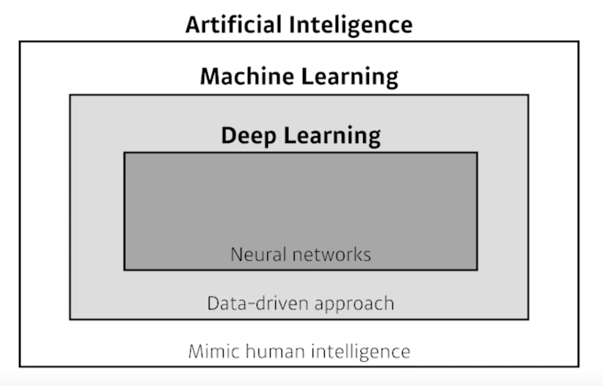
- 우리는 neural networks를 활용해서 데이터를 통해 무언가를 학습하는 분야에 알아볼 예정

- Key Components of Deep Learning
    - The **data** taht the model can learn from
    - The ***model** how to transform the data
    - The **loss** function that quantifies the badness of the model
    - The **algorithm** to adjust the parameters to minimize the loss
- 새로운 논문을 볼 때 이 4가지 항목에 비추어서 연구를 바라보게 되면 이 연구가 기존 연구에 비해 어떤 장점이 있고, 어떤 contribution이 있는지 보기 수월해짐

### Data
- 풀고자 하는 문제에 dependent
    - classification
    - semantic segmentation
        - 각 이미지의 픽셀별로 분류
    - detection
        - 이미지안에 물체에 대한 bounding box를 찾는 것
    - Post Estimation
        - 이미지의 3차원 skeleton info를 알아내는 것
    - Visual QnA
        - 이미지와 문장을 주어줬을 때, 답을 구하는 것

### Model
- 이미지, 문장 또는 단어가 주어졌을 때, 이러한 단어를 내가 직접적으로 알고 싶어하는 class label 또는 문장에 대한 sentimental analysis로 바꿔주는 것
- ex) AlexNet, GoogLeNet, ResNet, DenseNet, LSTM, Deep AutoEncoderfs, GAN ...
- 어떤 같은 데이터가 주어졌더라도, **model**의 성질에 따라서 좋은 결과가 나올 수 있고 안 좋은 결과가 나올 수 있음
- 결과를 잘 뱉어주기 위한 technique이 들어감

### Loss
> The loss function is a proxy of what we want to achieve
- 모델과 데이터가 정해져있을 때 이 모델을 어떻게 학습할지
    - 우리는 DL을 다루기 때문에 model은 neural network 형태
        - 각 weight와 parameter를 어떻게 업데이트할지
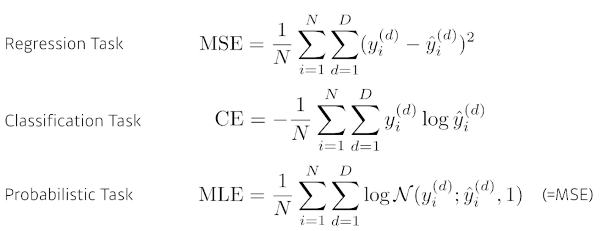
- proxy 근사치
- loss가 줄어준다고 원하는 값을 얻는다는 보장은 없음
    - ex) 데이터에 outlier가 많은 경우.. MSE를 사용하면 학습에 방해가 될 수 있음. norm1을 대신 사용할수도
        - 무조건 이럴 땐 이렇다라고 정의는 없는듯.. 알아서 잘 딱 깔끔하게 센스있게 

### Optimization Algorithm
> data, model, loss functon이 정해져있을 때... network를 좀 더 빠르게
- SGD를 배웠지만, 앞으로 그 변형인 momentum, NAG, adagrad등 특성을 이해하는게 중요!
- 학습이 오히려 안되게하는 효과를 추가할수도 있음
    - 이유: loss function을 무작정 줄이는게 목표가 아닌 model이 학습하지 않은 데이터에서 잘 동작하는 것이 목적
    - Dropout, Early stopping, k-fold validation, Weight decay, Batch normalization, Mixup, Ensemble, Baysian Optimization

### Historical Review
> Denny Britz - 딥러닝에 있어서 가장 중요한 아이디어

### 2012 - AlexNet
- CNN
    - 224 by 224 이미지가 들어왔을 때, 이것을 분류하는 것이 목적
- deep learning을 이용해 처음 1등함
    - 실제 성능이 발휘하기 시작

### 2012 - DQN
- 이세돌 vs. 알파고 (강화학습)
- Q-learning
- deep-mind

### 2014 - Encoder / Decoder
- NMT(Natural Machine Trnaslation)를 풀기 위함
    - 구글 번역
- 다른 언어로 되있는 문장이 주어졌을 때, 우리가 원하는 다른 언어의 단어의 연속 뱉어주는 것
- Encoder: 단어의 sequence가 주어졌을 때, 어떤 vector로 encoding하고 이 vector가 다른 언어

### 2014 - Adam Optimizer
> adaptive momentum
- 왜 아담을 그냥 사용할까?
    - 아담이 결과를 잘 나와서(왠만하면 잘된다)
    - 논문에서 왜 다른 optimzer를 쓰고.. 왜 다른 learning rate을 썼는지 논문에 안 나와있음
    - 구글의 경우는 CPU, GPU도 몇천개로 많고 실험을 많이 할 수 있지만, 일반인 그렇게 못하기 때문에 무난하게 Adam optimizer를 사용

### 2015 - Generative Adversarial Network
> 이미지 또는 텍스트를 어떻게 만들어 낼 수 있을지
- 네트워크가 generator와 discriminator 두 개를 만들어서 학습
- `Finally, we would like to thank Les Trois Brasseurs for stmulating our creativity`
    - 술이 너무 맛이 없어서 연구를 생각했는데 그 때 GAN이 떠오른 것

### 2015 - Residual Networks(ResNet)
- 이 연구 덕분에 deep learning이 가능해졌다고 봐도 무방
- deep learning: network를 깊게 쌓은 것
    - 네트워크를 너무 깊게 쌓으면 학습이 잘 안되는 게 알려져 있었음
        - 학습이 안된다는 것 = test했을 때 성능이 좋지 않다 (training이 안된다는 것이 아님)
- ResNet 더 깊게 샇아도 성능이 좋게 만듦
- 네트워크가 깊게 쌓을 수 있도록 함

### 2017 - Transformer
> Attention is All You Need
- 매우 중요
- recurrent NN 보다 어떤 장점이 있고 왜 이게 좋은 성능을 낼 수 있는지 얘기할 예쩡

### 2018 - BERT (fine-tuned NLP models)
> Bidirectional Encoder Representations from Transformers
- language model
- 큰 말뭉치를 활용하여 pre-traing을 하는 것
- 진짜 풀고자하는 소수의 데이터에 fine-tuning을 하는 것

### 2019 - BIG Language Models
- BERT의 끝판왕 느낌
- language model
- 약간의 fine tuning을 통해 문장을 만들거나, 표를 만들거나, programming을 만들 수 있음
- 특징: 많은 parameter로 되어 있음 -> BIG Language

### 2020 - Self Supervised Learning
> SimCLR: a simple framework for contrastive learning of visual representations
- 한정된 학습데이터를 주었을 때, 모델 또는 loss function을 바꿔가면서 여러가지 modificatino으로 좋은 결과를 내는게 기존의 방법이었다면...
- 학습 데이터 외에 label을 모르는 unsupervised data를 활용하겠다는 것
- visual representation을 어떻게 컴퓨터가 잘 이해할 수 있는 vector로 바꿀지
    - 분류 문제를 더 잘 풀기 위함
- self-supervised-data-sampling: 데이터 셋을 오히려 만들어내는 것도 있음
    - 학습 데이터를 주어진 도메인 지식 또는 시뮬레이터를 통해서 더 만들어서..

## PyTorch 시작하기
> 딥러닝을 할 때 코드는 처음부터 다 짠다? - x
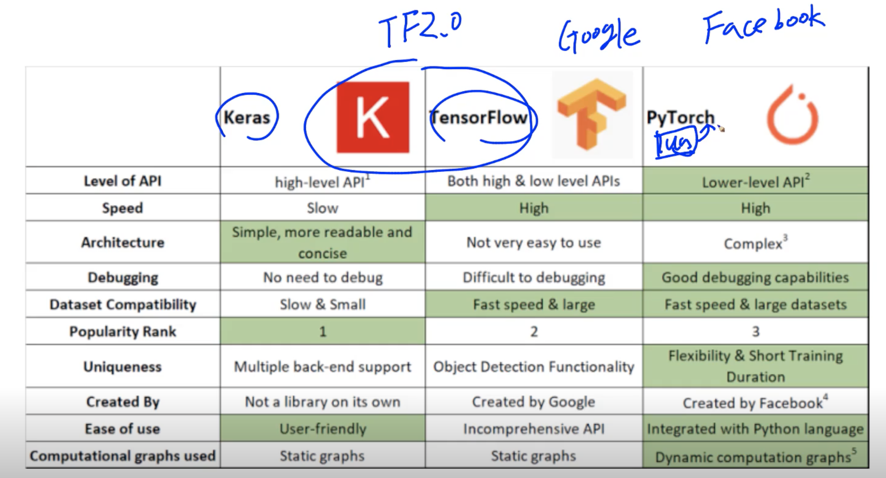
- tensorflow는 low-level로 나오고
- pytorch, Keras는 high-level로 나옴
- Keras는 tensorflow를 좀 더 쉽게 사용하기 위해 만듦
- 예전 tensorflow는 defined and run이었음

### PyTorch
> Numpy + AutoGrad + Function
- Numpy 구조를 가지는 Tensor 객체로 array 표현
- 자동미분을 지원하는 DL 연산을 지원
- 다양한 형태의 DL을 지원하는 함수와 모델을 지원함
- 밑에 reference 해보기

- numpy의 array가 torch tensor로 대응이 된다
- `cmd + shift + p` ssh connect to host
- numpy에서는 axis, Pytorch에서는 dim
- numpy에서는 reshape, pytorch에서는 view
- squeeze: rank 하나를 줄이는 것
- unsqueeze(dim=): rank를 늘리는 것 
- `torch.tensor(2.0, requires_grad=True)`
    - requires_grad: gradient 할껀가 저애주는것

- 딥러닝을 배우는 최종적인 목표.. 논문을 읽고 구현할 수 있는 능력
    - pytorch가 밑바닥에서 어떻게 돌아가는지 알아야함
- optimizer.zero_grad() 해줘야함
- loss.backward() 미분
- optimizer.step() 업데이트	

- 자동 미분에 대해 알아야함

**처음 보는 torch 함수는 코드를 따고 들어가서 코드가 어덯게 생겼는지 code level로 확인!**
- torch.nn.linear 소스 코드..
    - 그 안에 또 Parameter class 소스 코드..
        - tensor를 상속하니 미분이 가능하겠군 (requires_grad=True)


## 뉴럴 네트워크 - MLP

### Neural Networks
> Neural networks are computing systems vaguely inspired by the biological neural networks that constitute animal brains
> Neural networks are function approximators that stack affine transformations followed by nonlinear transformations
-  역전파? 뇌에서 이러나는건 아님
- 새를 모방한 기계(1897)
    - Write Brothers(1903), F-22 Raptor: 날고 싶다고 굳이 새를 닮을 필요는 없음
- 요즘 NN이 뇌를 모방했기 때문에 잘된다는 것보다 그 자체에 모델만 놓고 분석하는게 옳다고 생각
- 함수를 근사하는 모델로 보는 것

### Linear Neural Networks
 
- 입력이 1차원이고 출력이 1차원일 때, 두 개를 연결하는 모델을 찾는 것
    - N개의 데이터를 잘 표현할 수 있는 모델을 찾는 것
    - line의 slope, 절편 - 두 개의 parameter를 찾는 문제
- w와 b를 찾는 것
- loss: yi(i번째 데이터의 출력값), yi-hat(xi를 집어넣을 때 현재 모델에서 나오는 출력값)
    - 출력값과 나의 데이터의 차이를 줄이는 것
    - loss함수의 값을 가장 적게하는 w와 b를 조정하는 것
- backpropatation을 사용해서 w와 b를 찾아나감
    - 최종단의 loss function 값을 전체 파라미터로 다 미분 하는 것
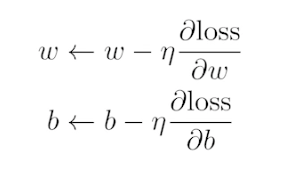    
- gradient descent
    - 각 backpropagation에서 나온 값으로 파라미터를 업데이트 하는 것
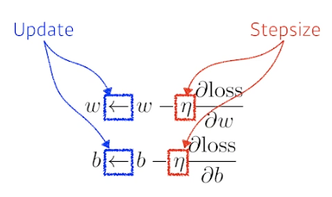
- step size가 중요
    - 적절한 사이즈를 잡아야함
    - 다음주 adpative learning이 step size를 자동으로 바꿔주는 learning

- 행렬을 사용하여 n차원에서 m차원으로 
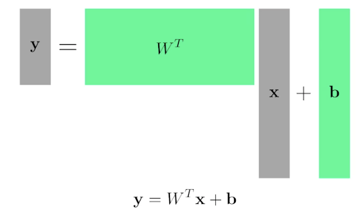
- one way of interpreting a matrix to regard it as a mapping between two vector spaces
    - 행렬을 찾는다: 서로 다른 차원 사이의 선형 변환을 찾는 것
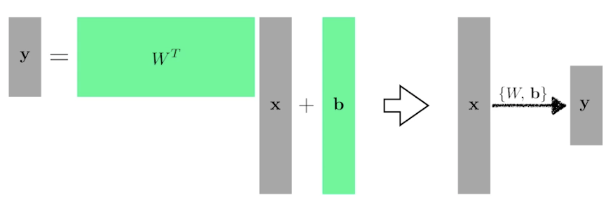
    - W라는 weight,와 b라는 bias로 x라는 입력에서 y라는 출력으로 보내겠다

### beyond Linear Neural Networks
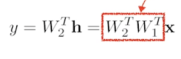
- activation function을 넣지 않으면 그냥 행렬 두개의 곱임..
- 곡선을 나타낼 수 없음

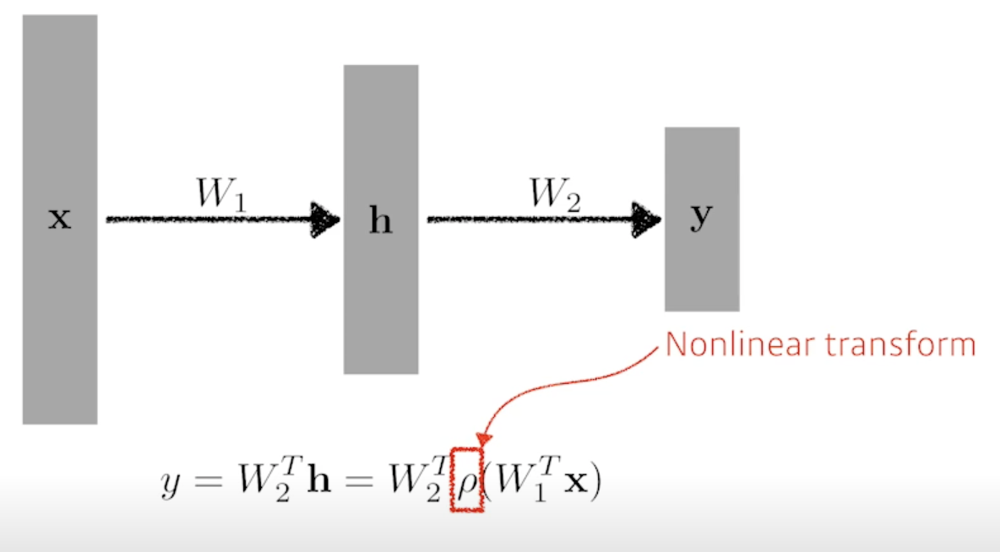
- activation functions의 사용
    - 비선형함수로의 변환
- 네트워크가 표현할 수 있는 표현력을 극대화하기 위해서는..
- 선형결합 반복이 아니라 뒤에 activation function을 곱해서.. nonlinear transform을 거치는 것
- 활성함수의 적용으로 nonlinear한 함수가 되어 더 좋은 예측 가능

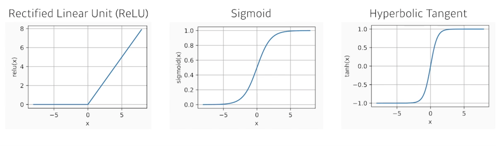
- 왜 NN이 잘되냐?
    - hidden layer가 하나인 네트워크로 대부분의 continuous function을 표현할 수 있다
    - '표현력이 크다' - 하지만 어떻게 찾는지는 모른다
    
### Multi-Layer Perception
1. 입력이 주어지고 
2. 그 입력을 nonlinear transform을 거쳐서 나오는 hidden vector가 나오고
3. hidden layer에서 nonlinear에 들어가거나 들어가지 않은 결과

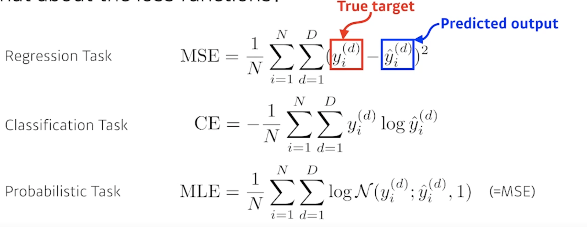
- loss function
    - 입력이 주어졌을 때 해당 출력값과 데이터셋에서 나오는 target data 사이의 제곱을 줄이는 것
- MSE (Regression task)
    - error가 엄청 클 경우 학습이 안될 수 있음
    - loss function을 상황에 맞게 해야함
- CE: 그 차원에 해당하는 값만 높인다는 것 (Classification task)
    - 다른 값보다 가장 큰 값만 고려를 함(accuracy 관점에서는 다른 값보다만 높으면 됨)
    - 왜 해당 loss function이 분류 문제를 잘 푸는지.. 생각해야함
- MLE (Probabilitistic Task)
    - 내 모델의 output이 단순 숫자가 아닌 확률일 때

## 데이터셋 다루기
- network.py에 Model class
    - 모델을 모듈화하여 나눔
    - 모듈화를 잘 해야.. 코드를 loose coupled하게!
    - 코드보고 구조 이해해보기!

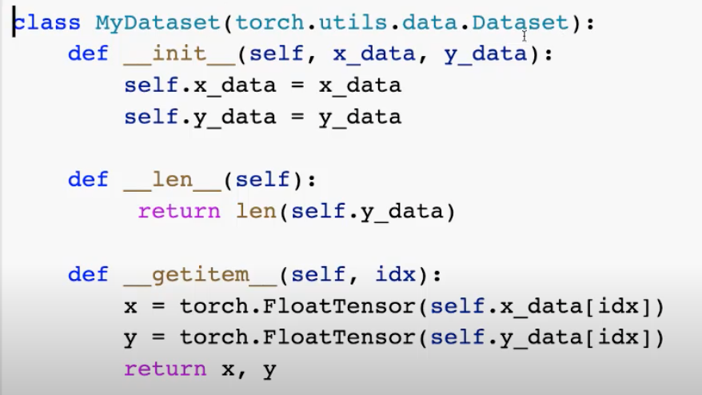
- 기본적인 dataset의 구성
    - 뭘 만들더라도
        1. dataset이 있고
        2. dataloader를 만들어서
        3. iterator시켜서 데이터를 가져온다
- image는 PIL
    - image를 vector로 바꿔야함
        - `np.array(img.getdata())`
- os.getcwd()를 현재 위치 확인	

- MNIST 코드
    - __init__
    - transform은 data르 tensor로 변환 시켜주는 코드
    - self.train = train값

- `!wget`
- `!gunzip`

notMNIST파일 large_tar를 

## 과제 분석 mlp.ipynb
- `torch.nn.Linear(in_features: int, out_features: int, bias: bool = True)`
    - y=xA^T+b의 선형 레이어
- `def init_param`
    - `nn.init` Return the recommended gain value for the given nonlinearity function.
        - `nn.init.zeros_`: Fills the input Tensor with the scalar value 0.
        - `nn.init.kaiming_normal_`: Fills the input Tensor with values according to the method described in Delving deep into rectifiers
            - Delving deep into rectifiers: 이거는 논문?? ㅋㅋㅋ 아니.. ㅂㄷㅂㄷ
- `def forward(self,x)`
    - forward path
    - x: input, linear1에 넣고, relu하고 ,lieanr2에 넣고 return
- `y_torch.detach()`:Returns a new Tensor, detached from the current graph
    -  내용물(content)은 같지만 require_grad가 다른 새로운 Tensor를 가져옵니다?
- `M.named_parameters`:Returns an iterator over module parameters, yielding both the name of the parameter as well as the parameter itself
- `def func_eval:`
    - `no_grad`: 기록을 추적하는 것을 방지
    - dataset의 정확도를 evaluate해주는 함수

- Train = True (train set 을 가져온다)
- Train = False (Test set을 가져온다)


## 개인공부

## [PyTorch로 시작하는 딥 러닝 입문](https://wikidocs.net/57168)
### PyTorch 구성
1. torch
- 메인 네임스페이스입니다. 텐서 등의 다양한 수학 함수가 포함되어져 있으며 Numpy와 유사한 구조를 가집니다.
2. torch.autograd
- 자동 미분을 위한 함수들이 포함되어져 있습니다. 자동 미분의 on/off를 제어하는 콘텍스트 매니저(enable_grad/no_grad)나 자체 미분 가능 함수를 정의할 때 사용하는 기반 클래스인 'Function' 등이 포함되어져 있습니다.

3. torch.nn
- 신경망을 구축하기 위한 다양한 데이터 구조나 레이어 등이 정의되어져 있습니다. 예를 들어 RNN, LSTM과 같은 레이어, ReLU와 같은 활성화 함수, MSELoss와 같은 손실 함수들이 있습니다.

4. torch.optim
- 확률적 경사 하강법(Stochastic Gradient Descent, SGD)를 중심으로 한 파라미터 최적화 알고리즘이 구현되어져 있습니다.

5. torch.utils.data
- SGD의 반복 연산을 실행할 때 사용하는 미니 배치용 유틸리티 함수가 포함되어져 있습니다.

6. torch.onnx
- ONNX(Open Neural Network Exchange)의 포맷으로 모델을 익스포트(export)할 때 사용합니다. ONNX는 서로 다른 딥 러닝 프레임워크 간에 모델을 공유할 때 사용하는 포맷입니다.


### batch size
> 훈련 데이터의 개수가 굉장히 많을 때, 컴퓨터가 한 번에 들고가서 처리할 양을 배치 크기(batch size)라고 합니다.
훈련 데이터 하나의 크기를 256이라고 해봅시다. [3, 1, 2, 5, ...] 이런 숫자들의 나열이 256의 길이로 있다고 상상하면됩니다. 다시 말해 **훈련 데이터 하나** = 벡터의 차원은 256입니다. 만약 이런 **훈련 데이터의 개수가 3000개**라고 한다면, 현재 **전체 훈련 데이터의 크기는 3,000 × 256**입니다. 행렬이니까 2D 텐서네요. 3,000개를 1개씩 꺼내서 처리하는 것도 가능하지만 컴퓨터는 훈련 데이터를 하나씩 처리하는 것보다 보통 덩어리로 처리합니다. **3,000개에서 64개씩 꺼내서 처리한다고 한다면 이 때 batch size를 64**라고 합니다. 그렇다면 컴퓨터가 한 번에 처리하는 2D 텐서의 크기는 (batch size × dim) = 64 × 256입니다.

### 파이도치 텐서 선언하기
1-D
```
import torch

t = torch.FloatTensor([0., 1., 2., 3., 4., 5., 6.])
print(t.dim())  # rank. 즉, 차원
print(t.shape)  # shape
print(t.size()) # shape
```

2-D
```
t = torch.FloatTensor([[1., 2., 3.],
                       [4., 5., 6.],
                       [7., 8., 9.],
                       [10., 11., 12.]
                      ])
print(t)
```

### broadcasting
- numpy랑 비슷

### Matrix Multiplication Vs. Multiplication
```
m1 = torch.FloatTensor([[1, 2], [3, 4]])
m2 = torch.FloatTensor([[1], [2]])
print('Shape of Matrix 1: ', m1.shape) # 2 x 2
print('Shape of Matrix 2: ', m2.shape) # 2 x 1
print(m1.matmul(m2)) # 2 x 1

m1 = torch.FloatTensor([[1, 2], [3, 4]])
m2 = torch.FloatTensor([[1], [2]])
print('Shape of Matrix 1: ', m1.shape) # 2 x 2
print('Shape of Matrix 2: ', m2.shape) # 2 x 1
print(m1 * m2) # 2 x 2
print(m1.mul(m2))
```

- t.mean(), t.sum()
- t.max(), t.max(dim=0)
    - `print(t.max()) # Returns one value: max`
    - `print(t.max(dim=0)) # Returns two values: max and argmax`

### View - 원소의 수를 유지하면서 텐서의 크기 변경.
- pytorch의 reshape과 같은 역할

- 3D to 2D
```
print(ft.view([-1, 3])) # ft라는 텐서를 (?, 3)의 크기로 변경
print(ft.view([-1, 3]).shape)
```
- -1은 첫번째 차원은 사용자가 몰라서 파이토치에게 맡김, 3은 두번째 차원

- view는 기본적으로 변경 전과 변경 후의 텐서 안의 원소의 개수가 유지되어야 합니다.
- 파이토치의 view는 사이즈가 -1로 설정되면 다른 차원으로부터 해당 값을 유추합니다.

```
ft = torch.FloatTensor([[0], [1], [2]])
print(ft)
print(ft.shape)
print(ft.squeeze())
print(ft.squeeze().shape)
```
- squeeze() 차원이 1인 경우에는 해당 차원을 제거

```
ft = torch.Tensor([0, 1, 2])
print(ft.shape)

print(ft.unsqueeze(0)) # 인덱스가 0부터 시작하므로 0은 첫번째 차원을 의미한다.
print(ft.unsqueeze(0).shape)

print(ft.unsqueeze(1))
print(ft.unsqueeze(1).shape)

print(ft.unsqueeze(-1))
print(ft.unsqueeze(-1).shape)
```
- unsqueeze() 특정 위치에 1인 차원을 추가

- typecasting 가능, concanate 가능
    - `torch.cat([x,y], dim = 0)`
    - `torch.cat([x,y], dim = 1)`
- stacking 가능
    - `print(torch.stack([x, y, z]))`  
        - `print(torch.cat([x.unsqueeze(0), y.unsqueeze(0), z.unsqueeze(0)], dim=0))`
        - 실질적으로 위와 같이 돌아감

- ones_like, zeros_like
```
x = torch.FloatTensor([[0, 1, 2], [2, 1, 0]])
print(x)
print(torch.ones_like(x)) # 입력 텐서와 크기를 동일하게 하면서 값을 1로 채우기
print(torch.zeros_like(x)) # 입력 텐서와 크기를 동일하게 하면서 값을 0으로 채우기
```

###  In-place Operation (덮어쓰기 연산)
```
x = torch.FloatTensor([[1, 2], [3, 4]])
print(x.mul(2.)) # 곱하기 2를 수행한 결과를 출력
print(x) # 기존의 값 출력

print(x.mul_(2.))  # 곱하기 2를 수행한 결과를 변수 x에 값을 저장하면서 결과를 출력
print(x) # 기존의 값 출력
```
