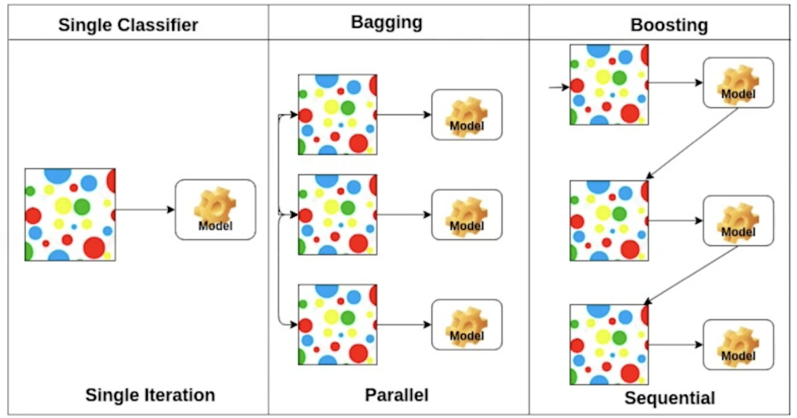

# day 12 최적화

## Optimization

### Introduction
- Gradient Descent
    - First-order iterative optimization algorithm for finding a local minimum of a differentiable function

### Important Conecpts in Optimization
- Generalization
- Under-fitting vs. over-fitting
- Cross validation
- Bias-variance tradeoff
- Bootstrapping
- Bagging and boosting

### Generalization
- How well the learned model will behave on unseen date.

- 일반환 성능을 높인다
    - 일반화: training error 와 test error의 차이
        - 학습을 하면 training error는 줄어들지만.. test에 사용되는 결과값의 error는 성능이 떨어진다(error가 커진다)
        - 하지만, 학습 데이터의 성능이 좋지 않으면 generalization의 성능이 좋다고 말할 수 없다. 왜냐하면 generalization은 training error와 test error의 차이기 때문
    - generalization 성능이 좋다 = network의 성능이 학습데이터와 비슷하게 나올 것을 보장한다. 

### Underfitting vs. Overfitting

- overfitting: 학습데이터에서 잘 동작하지만, 테스트데이터에서 동작이 잘 하지 않는 현상
    - 하지만, 이렇게 결과가 나오는게 원하는 결과 일수도 있음..
- underfitting: 네트워크가 훈련을 조금 시켜서 학습 데이터도 잘 동작 하지 않는 것
- balanced: 가장 좋은 것

### Cross-validation
- Cross-validation is a model validation technique for assessing how the model will generalize to an independent (test) data set.

- k-fold cv:학습데이터를 보통 k개로 나누고(test data는 따로), k-1개로 학습하고 1개로 validation하는 것. (1,2,3,4 - 5) (1,2,3,5 - 4) ...
    - parameter: 최적해서 찾고 싶은 것
    - hyper-parameter: learning rate, loss function
        - cross validation을 하면서 최적의 hyper-parameter를 찾음
- test data는 절대 사용되면 안됨 -> cheating
- 학습에서는 train data와 validation data만 사용될 수 있음

### Bias and Variance

- 사격에서 같은곳에 찍히면 좋은 것 (전체적으로 bias만 옮기면 되기 때문에)
- low variance: 내가 입력을 넣었을 때, 출력이 얼마나 일관적으로 나오는지를 말함
- high variance: 비슷한 입력에, 출력이 달라지는 것
- low bias: target에 근사한 결과가 나오는 것
- high bias: mean값과 먼 값이 나오는 것

### Bias and Variance Tradeoff
- cost를 minimize하는 것은 bias, variance, noise로
    - 학습 데이터에 noise가 있다면, bias를 줄이면 variance가 늘어나고, variance를 줄이면 bias가 늘어난다

### Bootstrapping
> Bootstrapping is any test or metric that uses random sampling with replacement.
- 고정된 학습 데이터의 일부분을 random samlping해서 학습하고 여러 모델 또는 metric을 만들어서 하겠다

### Bagging Vs. Boosting
> Bagging (Boostrapping aggregating)
> - Multiple models are being trained with bootstrapping
> - ex) Base classifiers are fitted on random subset where individual predictions are aggregated
- Boostrapping을 하고, 그 여러 모델을 통한 output들의 평균을 내는 것
    - 데이터를 한번에 train 시켜서 한 개의 모델을 쓰는 것보다, N개의 모델을 만들어서 평균을 내서 쓰는 것이 좋은 성능을 쓸 때가 더 효율이 좋을 때가 많음(앙상블?)
> Boosting
> - It focuses on those specific training samples that are hard to classify
> - A strong model is built by combining weak learners in sequence where each learner learns from the mistakes of the previous weak learner
- 80개의 학습데이터가 잘 훈련이 되는 모델(나머지 20개는 잘 안됨)과, 나머지 20개에 대해 잘 동작하는 모델을 만듦 
    - 여러개의 모델을 만들어서 합치는 것
    - weak learner들을 합쳐서 strong learner를 만듦

### Gradient Descent Methods
> Stochastic gradient descent
> - Update with the gradient computed from a single sample
- 하나의 sample을 통해서 gradient를 update하는 것

> Mini-batch gradient descent
> - Update with the gradient computed from a subset of data
- 전체 데이터의 여러 sample을 사용해서 gradient를 update하는 것

> Batch gradient descent
> - Update with the gradient computed from the whole data
- 10만개 data를 다 사용해서 gradient를 update하는 것

### Batch-size Matters
> It has been observed in practice that when using a larger batch there is a degradation in the quality of the model, as measured by its ability to generalize.
> We present numerical evidence that supports the view that large batch methods tend to converge to sharp minimizers of the training and testing functions. In constrast, small-batch methods consistently converge to flat minimizers... this is due to the inherent noice in the gradient estimation.
- sharp minimize보다 flat minimize에 도착하는 것이 좋다
- testing function의 minimum보다 traing functino의 minimum에 도착하는 것

- batch size를 줄이면 generalization의 성능이 좋아진다

### Gradient Descent Methods [참조](http://shuuki4.github.io/deep%20learning/2016/05/20/Gradient-Descent-Algorithm-Overview.html)
> automatic differntiation을 골라야함
> Stochastic gradient descent, Momentum, Nesterov, accelerated gradient, Adagrad, Adadelta, RMSprop, Adam

### (Stochastic) Gradient Descent

- 문제점: learning rate, step-size를 정하는게 어려움

### Momentum

- 더 빨리 학습하기 위함
- 관성: 한번 gradient의 방향이 정해지면, 약간 그 기존의 관성을 이어가는 것
- momentum과 현재의 gradient를 합침
- 장점: 기존의 momentum을 유지하기 때문에, gradient가 왔다갔다해도 어느정도 잘 학습 되는듯? 

### Nesterov Accerated Gradient

- 한번 가보고, 그곳에서 gradient를 계산한 것을 가지고 계싼을 함

- local minimum에 좀더 빠르게 converge

### Adagrad
> Adagrad adpts the learning rate, performing larger updates for infrequent and smaller updates for frequent parameters

- 적게 변한 parameter에 대해 좀더 힘을 실어주는 것
- 너무 트레이닝이 많이되서 G가 무한대로 가게되면, 0에 수렴하여 더이상 W가 update(학습)가 안되는 문제

### Adadelta
> Adadelta extends Adagrad to reduce its monotonically decreasing the learning rate by restrcting the acculation window

- 현재 timestamp t에서 윈도우사이즈에 대한 기록만 보겠다
- 문제점: gt자체가 이미 큰 parameter이기 때문에... window사이즈가 100이면 이미 너무 큼
    - exponential moving average를 통해 해소
- learning rate이 없고, 바꿀 수 있는게 많이 없기때문에 잘 사용되지 않음

### RMSprop
> RMSprop is an unpublsihed, adaptive learning rate method proposed by Geoff Hinton in his lecture

- 뭐 해보니깐 잘 되더라..

### Adam
> Adaptive Moment Estimation leverages both past gradients and squared gradients

- 앞서 말한 내용의 여럿을 같이 사용
- hyperprameter: beta1, beta2, 에타, 에십론
    - 이 4개의 파라미터를 조정하는게 중요

### Regularization
> 앞에서 말한 generalization이 잘되게 규제를 거는 것(학습에 반대되도록 규제를 거는것)
> Early stopping, Parameter norm penalty, Data augmentation, Noise robustness, Label smoothing, Dropout, Batch normalization
- 학습 데이터에만 잘 동작되도록 하는 것이 아닌, 테스트 데이터에도 잘 동작하도록 하는 것

### Early stopping
> 학습을 일찍 멈추는 것

- training을 할 데이터로 loss를 평가해보고, 그 loss가 커질 가능성이 있을 때 멈추는 것

### Parameter norm penalty
> It adds smoothness to the function space
> Parameter가 너무 크지 않게 하는 것

### Data augmentation
> more data are always welcomed
> However, in most cases, training data are given in advance
> In such cases, we need data agumentation

- data가 무한히 많으면 왠만하면 잘됨

- data의 label이 바뀌지 않는 선에서 데이터를 조정하여 더 많은 데이터를 생성하는 것

### Noise robustness
> Add random noises inputs or weights

- 입력 데이터, weight에 noise를 넣으면 성능이 더 잘 나온다

### Label smoothing
> Mix-up constructs agumented training examples by mixing both input and output of two randomly selected trainig data
> CutMix constructs augmented training examples by mixing inputs with cut and paste and outputs with soft labels of two randomly selected training data

- data 두 개를 뽑아서, 두 개를 섞어 주는 것

- label도 섞고 이미지도 섞고
- cutout은 이미지를 자르는 것
- Mixup은 이미즈를 섞는 것(blending)
- Cutmix는 이미지를 특정영역에 강아지 또는 고양이를 넣는 것
- 분류 문제를 풀 때 이미지 데이터가 부족하다면, 위의 방법을 통해 학습을 진행하는 것도 좋을듯
    - 코드도 간단하고 드린 노력대비 효과가 좋음

### Dropout
> In each forward pass, randomly set some neurons to zero

- nn의 weight을 중간중간 0으로 바꾸는 것
- dropout ratio = 50 # 한 50%를 dropout하는 것
 
### Batch normalization
> Batch normalizatino compute the empirical mean and variance independetly for each dimension (layes) and normalize
> Accerating Deep Network Training by Reducing Internal Covariate Shift

- 내가 적용하고자 하는 layer의 statistics를 정규화 시키는 것
    - nn 각각의 layer의 parameter를 값을 mean 또는 0로 만드는 것
- 효과: Internal covariate Shift를 줄여서 잘 학습이 된다?
    - 많은 논문이 동의를 하지 않음
> Threre are different variances of normalizations

**왜 bn이 잘 되느냐 해석하는 것보다는간단한 분류 문제에 bn을 활용하는게 좋다**
- 좋은 도구로써 사용해라

## Further Questions(Optimization)
### 올바르게(?) cross-validation을 하기 위해서는 어떻 방법들이 존재할까요?

### Time series의 경우 일반적인 k-fold cv를 사용해도 될까요?

## CNN 첫걸음

### Convlolution 연산 이해하기
- 지금까지 배운 다층신경망(MLP)은 각 뉴런들이 선형모델과 활성함수로 모두 연결된 (fully connected) 구조였습니다
    - 주어진 입력 vector에 가중치 행 W를 통해서.. 행렬곱을 통해 hidden vector를 구한 것

- Convolution 연산은 커널을 입력벡터 상에서 움직여가면서 선형모델과 합성함수가 적용되는 구조
    - 커널: 고정된 가중치 행렬을 옮겨가면서..
- MLP처럼 가중치 행렬이 i에 따라 바뀌는 것이 아닌, 고정된 커널을 입력 vector상에서 움직여가며 적용
    - 공통된 커널을 사용해서 연산!
- 특징: parameter 값을 줄일 수 있음

- Convlution 연산의 수학적인 의미는 신호(signal)를 커널을 이용해 국소적으로 증폭 또는 감소시켜서 정보를 추출 또는 필터링 하는 것

- g: 신호, f: 커널
- 실제로 -말고 +를 사용
    - cnn의 연산은 convolution이 아닌 cross-correlation연산ㅇ을 사용한다

- 커널은 정의역 내에서 움직여도 변하지 않고(translation invariant) 주어진 신호에 국소적(local)으로 적용합니다
    - 예시 gif에서 움직이는 빨간색 커널!
    - 커널(translation invariatnt), 신호(국소적-locality가 있다)
    - 실질적 그림에서 파란색이었더너 시그널을 검은색의 결과로 정보를 확산 또는 추출

### 영상처리에서 Convolution
- 예시) 커널에 종류에 따라 영상처리가 바뀜

### 다양한 차원에서의 Convolution
- Convolution 연산은 1차원뿐만 아니라 다양한 차원에서 계산이 가능합니다

- 1D:image, 2D:흑백영상, 3D:칼라영상
- i,j.k값이 바뀌더라도 커널의 값은 고정!
    - 다시한번 핵심 convolution은 위치가 바껴도 kernel이 바뀌지 않는다

### 2차원 Convolution 연산 이해하기

- 커널을 x방향과 y방향으로 이동하며 연산
- convolution의 위치에 해당하는 p 와 q.
- i와 j가 고정되있는 상태에서 p와 q를 각각 움직이며 연산
    - element-wise 연산

- 3차원부터는 행렬이 아닌 텐서라고 함
    - 채널이 여러개인 2차원 입력의 경웅 2차원 convolution을 채널 개수만큼 적용한다고 생각하면 됩니다.  

- 채널이 여러개인 2차원 입력의 경우 2차원 Convolution을 채널 개수만큼 적용한다고 생각하면 됩니다. 텐서를 직융ㄴ면체 블록으로 이해하면 좀 더 이해하기 쉽습니다

### Convolution 연산의 역전파 이해하기

## 개인공부
- 내일 발표를 위해 nn.linear, nn.Sequential 공부중
    - F.linear
    - nn.Parameter

## 퀴즈 피드백
1번 continuous를 못보고.. 혼자 엄청 고민하다가..
5번 아.. Y2,2 만 계산하고 y3,3을 깜빡... (빨리내고 쉬고싶어서.. ㅠㅠ)

## 피어세션 발표
A
- torch.nn.Module
    - module의 recursive한 부분? 신기한듯

D. 
- Forward함수를 굳이 붙이지 않아도 Model()로 호출이 된다
    - 그러면 제가 발표했던 부분의 loss()가 tensor를 반환하는 이유도 설명이 됐네요
- Dropout
    - 랜덤하게 몇개를 버려서 학습
- BN
    - batch들의 묶을음 normalization

저희조는 역시나 매일 발표를 하는 게 더 좋다고 결론을 내렸습니다.
내일도 발표준비~

