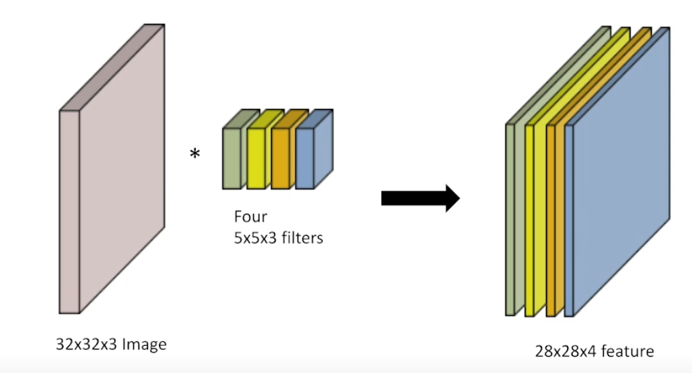
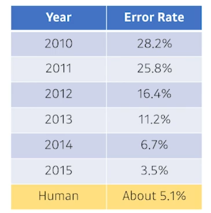
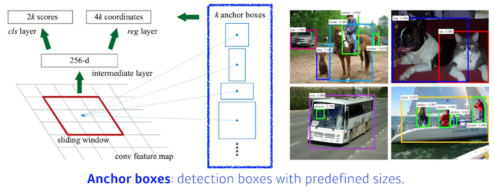

# Convolutional Neural Networks

## CNN - Convolution은 무엇인가?

### Convolution

- I가 전체 이미지
- K가 적용하려는 filter

- 적절한 위치에 도장을 찍는 느낌

### RGB Image Convolution

- input 채널과 output convolution의 채널을 알면 conlution의 feature의 크기 계산가능

### Stack of Convolutions
- 위의 계산은 Sung kim님 강의에서 들었떤 내용인듯

### Convolutional Neural Networks
> CNN consists of convolution layer, pooling layer, and fully connected layer
> - Convolution and pooling layers: feature extraction
> - Fully connected layer: decision making (e.g., classification)

- 최근에는 fully connected Layer를 없애거나 최소화 시키는 추세
    - parameter의 숫자를 줄이기 위해
    - 같은 모델을 만들어도 deep하게 (convolution layer를 많이) 동시에 parameter를 줄이는 데 집중
- 모델을 볼 때 layer에 몇개의 parameter로 이루어져있고, 전체 parameter의 숫자가 몇개인지 감을 갖고 있는 것이 중요

### Convolution Arithmetic(of GoogleNet)

### Stride
![stride][../../images/stride.png]
- 넓게 걷는다
- stride1= 1:커널을 매 픽셀마다 하나 찍고, 하나 옮기는 것
- convolution filter를 얼마나 dense하게, sparse하게 찍을지

### Padding

- input = 32*32 => output != 32*32

### Stride? Padding
- convolutional filter의 크기에 따라(+ stride) 적절한 padding값을 적용하여 원하는 출력값을 구할 수 이씨음

### Convolution Arithmetic

- 3 * 3* 128 * 64 = 73,728
    - padding과 stride는 parameter수와 무관
- 이 계산이 중요함! 추후에 모양만 봐도 단위 기반으로 감이 와야함

### Exercise

- first layer에서 넘어갈 때: 11 * 11 * 3 * 48 * 2 ~ 35k
- second layer: 5* 5* 48 * 128 * 2 ~ 307k
- dense layer에서 갑자기 많아짐
    - convolution operator가 각각의 커널이 모든 위치에 동일하게 적용되기 때문
- nn의 성능을 높이려면 parameter를 줄이는 것이 중요
    - 앞단의 convolution layer를 Deep 하게, 뒷단의 fully connected는 줄이는 것이 trend

### 1*1 convolution

- 1 by 1에서 영역을 보는 것이 아님 (한 pixel만보고 채널방향으로 줄이는 것)
- Why?
    - Dimension reduction
    - Dimension(채널)
    - 예시에서는 128의 채널을 32로 줄이는 것
    - To reduce the number of parametrs while increasing the depth

## Modern CNN - 1x1 convolution의 중요성
> ILSVRC에서 해마다 1등을 했던 네트워크를 중심으로 볼 예정
> 진짜 modern한 CNN은 추후에 다룰 듯?
> 각각 parameter의 숫자, network의 depth에 유의하며 봐야함
> - depth는 깊게, parameter는 적게

### ILSVRC
> ImageNet Large-Scale Visual Recognition Challenge
> - Classification / Detection / Localization / Segmentation
> - 1,000 different categories
> - Over 1 million images
> - Training set: 456,567 images

- 2010에는 아마 dl 안썼는듯?
- 점점 좋아지는 것을 볼 수 있음

### AlexNet

- 네트워크가 두 개로 나뉘어져 있음 (당시 GPU가 부족했기 때문에)
- 11 by 11은 parameter의 숫자 관점에서 좋은 선택이 아님
    - 채널이 1이라고 생각해고.. 121개의 parameter가 필요하기 때문
- 5개의 convolution_layers과 3개의 dense_layers로 이루어져 있음
    - 총 8단의 layers로 이루어져 있음
- Key ideas(성공 이유)
    - Rectified Linear Unit (ReLU) activation - nonlinear
        - Preserves properties of linear models
        - Easy to optimize with gradient descent
        - good generalization
        - **Overcome the vanishing gradient problem**
            - sigmoid, tanh에서 0을 지나 커지는 값은 gradient가 0에 가까움: vanishing gradient problem
    - GPU Implementation (2 GPUs)
    - Local response normalization, Overlapping pooling
        - Lrn: 어떤 입력공간에서 response가 많이 나오는 몇개를 죽이는 것: sparce한 activity나오게.. 지금은 많이 안씀
    - Data augmentation
    - Dropout
- 지금보면 당연했던 것들을 사용 (2011에는 당연하지 않았음)
    - 과거에 잘되는 기준을 잡아준 것

### VGGNet
> Increasing depth with 3 by 3 convolution filters
> 1 by 1 convolution for fully connected layers
> dropout (p=0.5)
> VGG16, VGG19

- 3 by 3 convolution만 사용
- Why 3 by 3 convolution?
    - 하나의 convolution filter로 찍었을 때, 고려되는 input의 크기가 커진다
    - receptive field: 하나의 convolution feature map의 값을 얻기 위해서 고려할 수 있는 입력의 spacial dimension

- 3 by 3이 두번이면 5 by 5가 됨
    - 3 by 3 두번이 5 by 5 하나 사용하는 거랑 recptive field가 같음
    - 거의 1.5배 늘어남
    - 같은 receptive field얻는 관점에서.. 3 by 3 두개가 나음
- 뒤에 나오는 대부분의 논문에서 **convolutinal filter가 7 byte**를 벗어나지 않음

### GoogLeNet
- 1by1 convolution은 dimension(channel)을 줄이는데 효과가 있다
    - spacial dimension(width,height)가 아니라 channel(depth방향)쪽
    - 중간 중간 1 by 1 convolution을 잘 활용하면 parameter숫자를 줄일 수 있음

- 비슷하게 보이는 네트워크의 반복이 보임 
    - network in network 구조: 네트워크안에 네트워크가 있는 모양
- it combined NiN with inception blocks

- Inception blocks
    - 하나의 입력이 들어왔을 때 여러개로 퍼졌다고 합쳐니는 것
    - 3 by 3 또는 5 by 5 convolution을 하기전에 1 by 1 convolution을 하는게 키포인트!
- What are the benefits of the inception block
    - Reduce the number of parameter(main benefit)
    - 여러개의 response들을 concatate하는 효과도 있음 
- How?
    - How the number of parameters is computed
    - 1 by 1 convolution can be seen as channel-wise dimension reduction (채널 방향으로 dimention을 주링는 효과)
 

- 여기서 spacial dimension은 중요하지 않음 -> parameter의 숫자와 노상관
    - 왜 상관없는지? 각각의 spacial 위치에 더해지는 convolution filter가 동일하기 때문
        - 계산 횟수는 input output parameter와 별개
- 1 by 1 convolution enables about 30% reduce of the number of parameters!

### Quiz
- which CNN architecture has the least number of parameters
    1. AlexNet(8-layers) - 60M
    2. VGGNet (19-layers) - 110M
    3. GoogLeNet (22-layers) - 4M

### ResNet
> Deeper neural networks are hard to train
> - Overfitting is usually caused by an excessive number of parameters
> - But, not in this case

- prameter가 많을 때 문제
1. overfitting
    - training error가 줄어드는데 test error가 커지는 것
    - 여기서는 overfitting은 아님 (traiing error랑 test error랑 둘 다 같이 줄어들어서)
    - training error가 작음에도 불고하고, test error가 큰 것 그래서 학습이 안되는 것
    - 예시에서 56 layer가 학습을 아무리 잘 시켜도 20-layer보다 traing error가 높은 것
    - 네트워크가 커짐에 따라 학습을 못시키는 것

> Add an identity map (skip connection)

- skip connection
    - 입력이 나오면 x를 더해주는 것 (실질적으로 차이만 학습하는?)
    - identity map을 사용하니깐 실질적으로 34-layer가 18-layer보다 학습을 더 잘하게 됨
    - network를 더 deep하게 쌓을 수 있는 가능성을 열어줌

> Add an identity map after nonlinear activations
- projected shortcut은 1 by 1 conv로 channel depth를 맞춰주는 것
    - 보통 simple shortcut 그냥 사용함

> Batch normalization after convolution
- batch norm을 언제 넣어야할지에 대한 논의가 있음

> Bottleneck architecture

- 3 by 3 하기전에 input channel을 줄이고(parameter를 줄임), 3 by 3후에 input channel 늘려 차원을 맞춤

### Densenet
> DenseNet uses concatenation instead of addition

- channel이 점점 커짐
    - conversion feature map도 커지기 때문에 parameter도 커짐
        - parameter가 증가하는 것은 우리가 워낳는 것이 아님
    - 해결책: 중간에 한번씩 채널을 줄이는 것 with 1 by 1 Conv
> Dense Block
> - Each layer concatenates the feature maps of all preceding layers
> - The number of channels increases geometrically
> Trainsition Block
> - BatchNorm -> 1 by 1 Conv -> 2 by 2 AvgPooling
> - Dimension reduction

### Summary
> Key takeways
> - VGG: repeated 3 by 3 blocks
>   - 3x3 Convolution을 이용하여 Receptive field는 유지하면서 더 깊은 네트워크를 구성
> - GoogLeNet: 1 by 1 convolution
>   -  채널 수를 줄여서 parameter를 줄임
> - ResNet: skil-connection
>   - 네트워크를 더 깊게 쌓을 수 있게함
> - DenseNet: concatenation
>   - 네트워크를 쌓으면서 더 좋은 성능을 냄

## Computer Vision Applications

### Semantic Segmentation
- 각 이미지마다 picel로 분류하는 것
    - 이미지의 모든 pixel이 어떤 label에 속하는지 보는 것
    - ex) 사진 하나에 Person, bicycle, background
- 자율주행에 활용됨
    - 화면의 object가 인도인지, 찻길인지 다 판별해야되기 때문

### Fully Convolutional Network

- dense layer를 없애는 것
    - convolutionalization
- 위의 두 개는 output을 제외하고는 똑같음(parameter가 일치)

- why use?
    - input dimension에 independent
> Transforming fully connected layers into convolution layers enables a classification net to output a heat meap
    - input 이미지에서 fully connected layers를 사용하게 되면, 단순히 분류만 하던 것을 Semantic Segmentation이 가능하게 또는 heat map으로 나타내게 됨
    
> While FCN can run with inputs of any size(special dimensions), the output deimensions are typically reduced by subsmapling
> So we need a way to connect the coarse output ot the dense pixels
    - coarse output(서로 떨어져있는 image) or special dimension(드문 드문 떨어져 있는 output)을 원래의 dense picture로 바궈줘야함 (upsample)

### Deconvolution (conv transpose)

- convolution 역연산
- deconvoltuion
    - 엄밀히 말하면 convolution의 역은 아님 (하지만 그렇게 생각하면 계산(parameter의 숫자로서는)이 편함)
    - 복원은 불가

### Detection
> 이전 문제와 다르게 bounding box를 찾는 것

### R-CNN

- inefficient
- +실제로는 bounding box를 어떻게 옮기면 좋은지 하는 방법도 들어감

### SPPNet

- 아이디어가 다 똑같지만, cnn을 한번만 돌리는 것
    - 네트워크를 한벌 돌려서, 얻어지는 convolutional feature map위에서 우리가 얻어지는 bouding box의 patch를 뜯어오는것?

### Fast R-CNN

- SPPNet과 비슷. 뒷단 neural network(ROI)를 통해서 bouding box regression과 classificatino을 했다

### Faster R-CNN

- 이미지를 통해서 bounding box를 뽑아내는 Region proposal도 학습으로 하자
    - 내가 candidates를 뽑는 것도 network롤 학습하자

### Region Proposal Network

- 이미지가 특정 영역(패치)가 bounding box로서 의미가 있는지 즉, 이 안에 물체가 있을지 없는지를 찾아주는 것
- anchor boxes: 미리 정해놓은 bounding box의 크기
    - template을 미리 고정

- fcn이 사용되고
    - 해당 영역이 들어 있느지 없는지 
- 9:9개중 region를 미리 정해놓고
- 4:four_bounding_box_param: bounding box를 얼마나 키우고 줄일지
- 2: 해당 박스가 쓸모있는지 없는지

### YOLO

- 그냥 이미지 한장에서 딱 output이 나와서 빠름
    - rpn이 있고 따로 분류했지만, 여기서는 그렇게 안함

- b개의 bouding box를 찾게 되고, 그 박스가 쓸모있는지 확인

- 그 동시에 각 셀이 어떤 클래스인지 확인

- 두 개의 정보를 취합

## CNN - 강아지 종류 분류하기
> U-stage는 warming up. 지금 다 이해하려고 하지 말길
- stanford dogs breed dataset

## 개인공부
[receptive_field](https://m.blog.naver.com/PostView.nhn?blogId=sogangori&logNo=220952339643&proxyReferer=https:%2F%2Fwww.google.com%2F)
[receptive_field2](https://cs231n.github.io/convolutional-networks/#conv)
- 아마 내일 발표할 자료1
[https://www.philgineer.com/2021/02/cnn-5.html](https://www.philgineer.com/2021/02/cnn-5.html)

## peer session

### 피어 세션 발표 정리
A - K-fold cross validation
- degree: 하이퍼파라미터의 차수(개수)
    - 하이퍼 파라미터가 늘어나면 score가 늘어나면서 score가 증가하지만(표현력이 풍부해진다)
        - 성능은 점점 떨어지게 됨
        - 측정을 못한다 -> H/W문제일수도..
        - 데이터셋이 많으면 걱정없음
            - 즉 데이터셋에 맞춰서 hyper parameter를 설정해야한다
- data augmentation의 한계도 있다?
    - 그래서 갖고있는 dataset을 어떻게 잘 잘라서 효율있게 사용할지..

- k-fold CV
    - 여러시도에서 평균을내서 가장 train 잘 된것으로 마지막 검증
    - 각 시도는 hyperparameter가 다른?

B - CV on Time series data (Nested cross validation)
- cross validation: tune hypter parameter
- time series는 미래를 예측해야함(연대기적인)
    - 항상 trainset다음에 그 다음을 예측
    - k-fold와 다르게 한번씩 테스트를 5번
- population-informed
    - A와 B, C, D의 데이터를 다 train해서 결과를 예측
- Regular는 다른사람 데이터 없이 자신의 것만

C - Tensor
- .requires_grad 속성: bool 
    - True: 해당 tensor에서 이뤄지는 모든 연산들을 추적
        - true여야 backward를 진행할 수 있다
        - 추적한 연산 기록으로부터 .backward() 진행
    - default가 False구나
- backward를 호출하면 x.grad라는 것이 생김
    - backward전에는 x.grad 값이 없음
- mean()
- output의 경우 parameter값이 아니므로, backpropagation 값이 필요 없음 -> 즉 requires_grad = False
- zero_grad()
    - 아담 optimizer가 어떤 파라미터에 대해 grad할지 알고 있음
        - 실제 parameter안에도 requires grad= True가 있기때문에..

- With torch.no_grad()
    - requires_grad가 True면 해당 tensor의 연산을 모두 추적
    - 해당 함수로 추적방지
- depatch()
    - 연결이 끊어짐 -> requires_grad가 false가 되는 것
    - tensor의 copy
        - copy의 의미가?? shallow copy 방지?
            - copy의 말은? - id가 같다는 것을 copy
                - data 의 공유의 
            - deep copy 해주는거?
- 하지만 데이터를 공유함 이거를 방지하려면 .clone()

D - batch normalization
- Covariate shift
    - 공변량: 변수들이 공통적으로 함께 공유하고 있는 변량
- batch normalization을 통해 learning rate가 높아져도.. 훈련이 잘 되는듯?
    - 학습속도가 빨라짐 (learning rate이 작으면 느리기 때문에 이를 크게해도 잘 훈련이 되게 해주기 때문)
- batch norm을 regularization으로 쓰는 걸 비추. 속도 향상 시키는데 이용하라고 추천

E - Convlution 종류
- 충분한 conetextual 
- Dilated Convolution
    - Real-time segmentation에서 주로 사용
    - 여러 컨볼루션이나 큰 커널 컨볼루션을 사용할 여유가 없을 때
- Transposed Convolution (Deconvolution)
    - 이미지 해상도 높이는 용도
- Seperable Convolution
    - 3 by 3 -> 3 by 1 + 1 by 3
    - 문제점은 몯느 커널을 두 개의 작은 커널로 분리할 수는 없음
        - 상훈: 항상 좋은것은 아님, 작은 단위 이미지로 
- Grouped Convolution
    - 입력 값의 채널들을 여러 그룹으로 나누어 독립적으로 컨볼루션 연산 수행
    - 병렬 처리에 유리
    - 너무 많은 그룹으로 분할하면 오히려 성능이 떨어질 수 이씨음
- Pointwise Convolution 
    - Channel Reduction시 사용
    - 연산속도 대폭 향상, 데이터가 압축되면서 소실되는 문제도 발생
- Depthwise Convolution
    - 공간 방향의 컨볼루션만 진행
    - 각 단일 채널에 대해서만 수행되는 필터 사용
- Depthwise Seperable Convolution
    - Depthwise + Pointwise
- Deformable Convolution
    - 기존은 일정한 패턴을 가정하고 있기떄문에 좀 더 다른 offset을 가지고 
