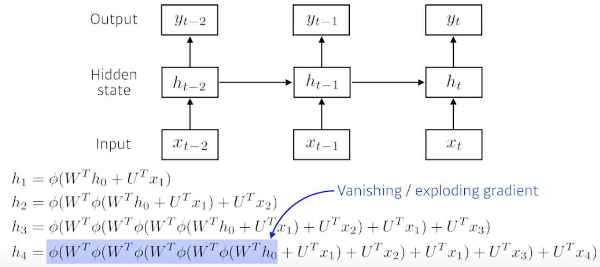
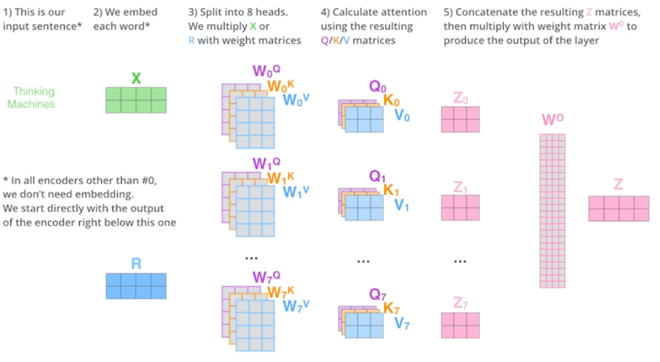

# Recurrent Neural Networks

## RNN 첫걸음
> 시계열 데이터, sequence data

### 시퀀스 데이터 이해하기
> 소리, 문자열, 주가 등의 데이터를 시퀀스(sequence) 데이터로 분류합니다.
> 시퀀스 데이터는 독립동등분포(i.i.d) 가정을 잘 위배하기 때문에 순서를 바꾸거나 과거정보에 손실이 발생하면 데이터의 확률분포도 바뀌게 됩니다
- 과거 정보 또는 앞뒤 맥락 없이 미래를 예측하거나 문장을 완성하는 건 불가능하다
- 개가 사람을 물었다
- 사람이 개를 물었다 - 의미가 바뀌고, 빈도도 적음
- 순차적으로 들어오는 정보를 어떻게 다룰지 고민해야함

### 시퀀스 데이터를 어떻게 다루나요?
> 이전 시퀀스의 정보를 가지고 앞으로 발생할 데이터의 확률분포를 다루기 위해 조건부확률을 이용할수 있습니다.

- 위 조건부확률은 과거의 모든 정보를 사용하지만 시퀀스 데이터를 분석할 때 모든 과거 정보들이 필요한 것은 아닙니다
    - 주가 예측시, 창립되었던 년도부터가 아닌 5년에서 최근 정보로 예측
> 시퀀스 데이터를 다루기 위해선 길이가 가변적인 데이터를 다룰 수 있는 모델이 필요합니다
- Xt 예측, Xt+1 예측

- tao를 정해야하고, tao도 바뀔 수 있음

- 직전의 정보와 잠재변수만 갖고 모델링
    - 잠재변수를 어떻게 인코딩? - RNN

### Recurrent Neural Network 이해하기
> 가장 기본적인 RNN 모형은 MLP와 유사한 모양입니다

- Xt -> Ht -> Ot
    - 현재 시점 데이터 t만 들어오기 때문에 이 모델은 과거의 정보를 다룰 수 없음

> RNN은 이전 순서의 잠재변수와 현재의 입력을 활용하여 모델링합니다

    - Wx1:입력 데이터에서
    - WH: 이전 시점의 잠재변수에서
    - W2: 새로만들어진 잠재변수를 
        - 3개의 가중치 행렬은 t에 따라 변하는게 아님
        - t에따라 변하는 것은 잠재변수와 입력 데이터

> RNN의 역전파는 잠재변수의 연결그래프에 따라 순차적으로 계산합니다

- BPTT(Backpropagation Through Time) Xt까지 예측이 일어난 다음에 맨 과거부터 타고 흘러와서 
    - 잠재변수에서 들어오는 gradient vector와 출력에서 들어오는 gradient vector
        - 이 gradient vector를 입력에 전달! 이것을 반복해서 학습이 됨

### BPTT를 좀 더 살펴봅시다
> BPTT 를 통해 RNN의 가중치행렬의 미분을 계산해보면 아래와 같은 비분의 곱으로 이루어진 항이 계산됩니다.

- sequence 길이가 길어질수록 이 항은 불안정해지기 쉽습니다
    - 모든 t시점에서 적용하면 불안정해기 쉬움

### 기울기 소실의 해결책
> 시퀀스 길이가 길어지는 경우 BPTT를 통한 역전파 알고리즘이 계산이 불안정해지므로 길이를 끊는 것이 필요합니다
- gradient가 0으로 줄어드는 문제
    - 미래 시점에 갈수록 gradient가 살아있고 과거시점에서 0으로 사라지면.. 과거정보 유실
        - 문맥적으로 이전 시점이 필요한 text분석 또는 긴 sequence분석에 문제가 생김
- 해결책: truncated BPTT
    - BPTT의 모든 시점을 계산하는 것이 아닌 일부를 끊고 
    - Ht는 Ot에서만 gradient를 받음
    - 특정 block에서 끊고 gradient를 받는 것

> 이런 문제들 때문에 Vanilla RNN 은 길이가 긴 시퀀스를 처리하는데 문제가 있습니다

- 오늘 배운 RNN으로 모델을 만들지 않음

## Sequential Models - RNN
> 그 전까지는 이미지에 대한 것, MLP는 벡터를 다른 벡터로 바꾸는 것, CNN는 이미지를 원하는 형태로 (classification: 원하는 class의 개수로, detection: 출력값이 각각의 영역에 있는 bounding box를 찾는 것, semantics: 이미즤 픽셀별로 어떤 클래스에 속하는지 찾는 것)
> RNN은 주어진 입력이 Sequential
ㅋㅋ

### Sequntial Model
> Naive sequence model

- 말, 비디오, 동작, 모션 다 sequential data
- 어려운 것은 하나의 분류.
    - 하지만 sequential data의 길이를 알 수 없음
    - 즉 모델의 모양에 상관없이 동작해야함
- 입력이 들어올 때 다음 입력을 예측

> Autogressive model

- fix the past timespan
    - 예시) 과거의 5개만 보겟다

> Markov model (first-order autoregressive model)

- 내가 현재를 가정하기 위해 바로 전 과거를 봄
    - ex) 내일의 수능점수는 전 날 공부 한 것만 연관이 있다 (말이 안됨)

> Latent autogressive model

- 중간에 hidden state가 과거의 정보를 요약하고 있고, 현재 모델은 하나의 과거 요약본만 연관있는 것

### Recurrent Neural Network

- 자기 자신으로 돌아오는 구조가 하나 있음
    - Ht는 Xt와 이전의 얻어진 self-state에도 연관이 있음

> short term dependencies
- 멀리있는 정보는 고려하기 힘들다 (long term dependencies)

    - sigmoid는 vaninshing
    - 만약에 LeRu를 쓰면 exploding gradient (너무 커짐)

### Long Short Term Memory
> 기존의 RNN을 Vanilla RNN이라고 명시

- Xt: input (language model에서는 단어)
- Ht: output (hidden state)
- previous cell state (내부에서만 있고, 0~t까지의 정보를 취합해준 것)
- 입력으로 들어가는건 input, cell state, previous hidden state, 나가는 것도 세개 하지만 실제로 나가는건 Ht만!
- LSTM은 세개의 게이트로 이루어져 있음
    - forget gate
    - input gate
    - output gate

> Core idea
- 중간에 흘러가는 cell state가 중요!
    - time step t까지 들어온 정보를 summarlize
    - 컨베이너 벨트에서 어떤 정보가 다음에 필요할지 넘기면서 조작

- forget gate
    - decide which information to **throw** away
    - 입력으로 ht-1, xt가 들어가고 ft의 결과값을 내고, sigmoid함수를 통과하기 때문에 항상 0~1 사이 값
    - 이전의 cell state의 정보 중 어떤것을 버리고 어떤 것 을 킵할지 정함
        - ht-1, xt로 정함

- Input gate
    - decide which information to **store** in the cell state
    - 현재 입력(박스)가 들어왔는데 무조건 cell state에 올리는 것이 아닌 뭐를 올리지 정하는 것
        - it - 어떤 정보를 올리고..
        - Ct - cell state candidate (현재 인풋과 이전 정보로 만들어진 cell state 예비군)
        - h-1,xt로 cell state cadidates를 새로운 스테이트에 업데이트 해야함

- Update Cell
    - update the cell state
    - Ct = ft*ct-1 + it*ct^
    - 두 값을 combine해서 cell update

- Output Gate
    - Make output using the updated cell state
    - 앞에서 취합한 정보를 한번 더 조작해서 어떤 값을 밖으로 빼낼지 정함

### Gated Recurrent unit

> Simpler architecture with two gates (reset gate and update gate)
> No cell state, just hidden state

- LTGM보다 GRU의 performance가 대게는 더 좋음
- 하지만 요즘은 transformer 구조가 나오면서 RNN 구조 둘 다 잘 안씀

## Sequential Models - Transformer

### Sequential Model
> What makes sequential modeling a hard problem to handle

### Transformer
> Transfomer is the first sequence transductino model based entirely on attention
- attention이라는 구조를 사용

> From a bird's-eye view, this is what the Transformer does for machine translation tasks
- 단순히 기계어 분류뿐 아니라, 이미지 분류 등 다양한 분야에도 사용
- [transfomer](http://jalammar.github.io/illustrated-transformer/)
- [참고](https://www.youtube.com/watch?v=mxGCEWOxfe8&feature=youtu.be)

> If we glide down a little bit, this is what the Transformer does

- RNN에서는 세개의 단어가 들어가면 3번 무언가 돌아감
- Transformer는 한번에 돌아감 (n개의 단어를 한번에 처리)
- 동일한 구조를 갖지만, 서로 다른 encoders와 decoders가 stacked
1. n개의 단어가 어떻게 한번에 처리 되는지
2. decoder와 encoder사이에 어떤 정보를 주고 받는지
3. decoder가 어떻게 generation 할 수 있는지

> First we represent each word with some embedding vectors

> Then, Transformer encodes each word to feature vectors with self-attention

- z1을 찾을 때 x1, x2, x3을 다 고려함
- 하지만, feed forward는 각자

- Self-Attention at High level

- Suppose we are encoding two words:
    - Thinking and Machines

- 세가지 벡터를 만듦

- encoding하고자하는 query 벡터와 나머지 vector들의 keys 벡터들의 사이를 다 내적을 함
    - i번째단어와 나머지 단어들의 사이에 iteraction이 많이 일어나야 하는지 
- then we compute the attention weights by scaling followed by softmax
- 정리
1. embedding vector가 주어지면 각각의 embedding vector마다 queries, keys, values 벡터를 만듦
2. 그리고 keys와 values의 내적으로 score를 만듦
3. normalize하고
4. sqaure of dk로 나누고 
5. softmax를 통하고
6. 사용할 것은: 각 단어에서 나오는 value vector들의 weighted sum

- 왜 잘될까?
    - (CNN,MLP) input이 fixed되있으면 출력이 고정
    - (Transformer) input이 fixed되있어도, 내가 encoding한 값에 따라 출력이 달라짐
        - 입력이 고정되더라도 옆에 다른 입력이 달라짐에 따라 출력도 달라짐
        - n개의 단어를 한번에 처리해야하기때문에 n^2 => 한번에 처리할 수 있는 한계가 있음 (하지만 more flexible한 네트워크를 만들 수 있음)

> multi-headed attention allows Transformer to focus on differnt position
> If eight heads are used, we end up getting eight different sets of encoded vectors (attention heads)
> We simply pass them through additional linear map

> Why do we need positional encoding

### Decoder
> Transformer transfer key (K) and value (V) of the topmost encoder to the decoder
> The output sequence is generated in an autogressive manner
> In the decoder, the self-attention layer is only allowed to attend to earlier positions in the output sequence which is doen by masking future positions before the softmax step.
> The Encoder-Decoder Attentino layer works just like multi-headed self-attention, except it creates its Queries matrix from the layer below it, and takes the keys and values from the encoder stack
> The final layer converts the stack of decoder outputs to the distribution over words

### Vision Transformer
- 최근에는 단어 외에 이미지에도 사용

### DALL-E
- 문장으로 이미지를 형성

## Peer session presentation
A - k-size가 recptivesize? 위에 cdim이 kernel size
    - 기존의 1은 무조건 맞춰즌거고, cdim 커널사이즈에 맞추는 거죠

