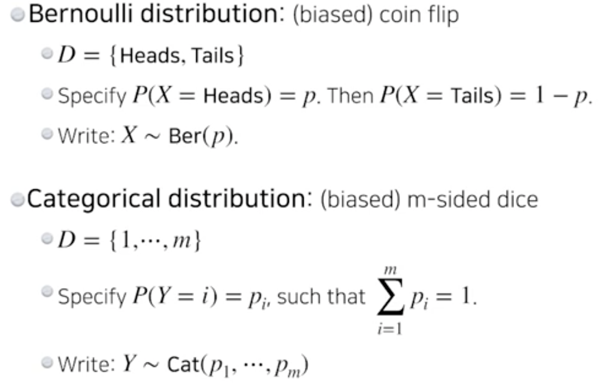
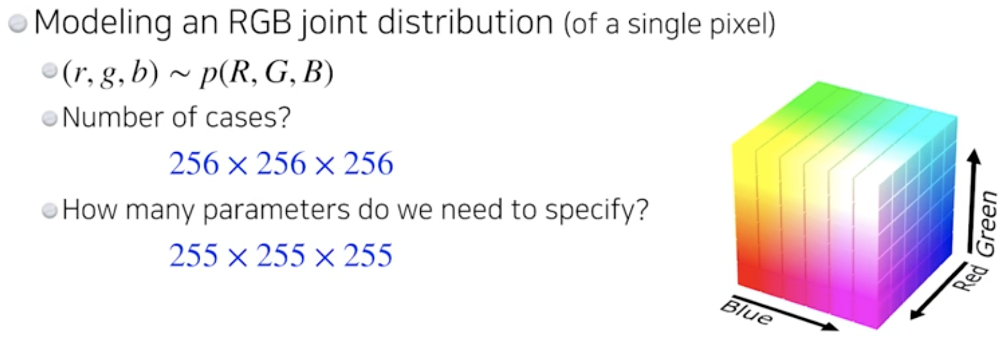
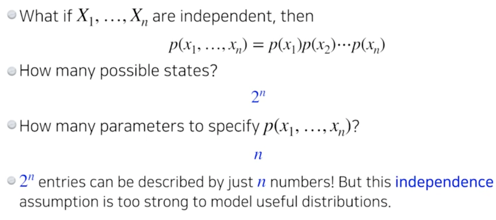
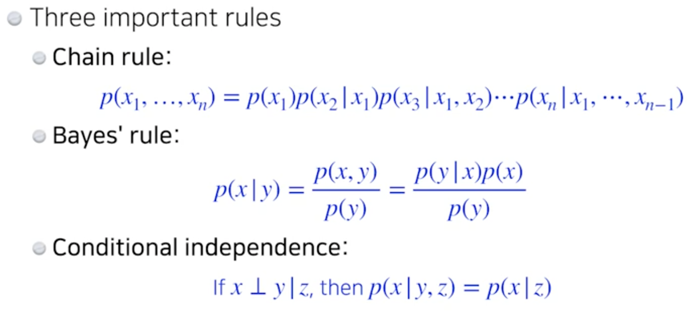
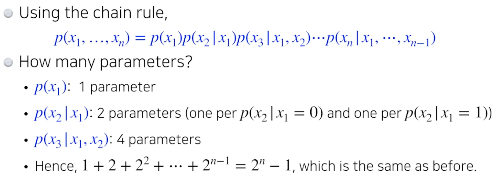
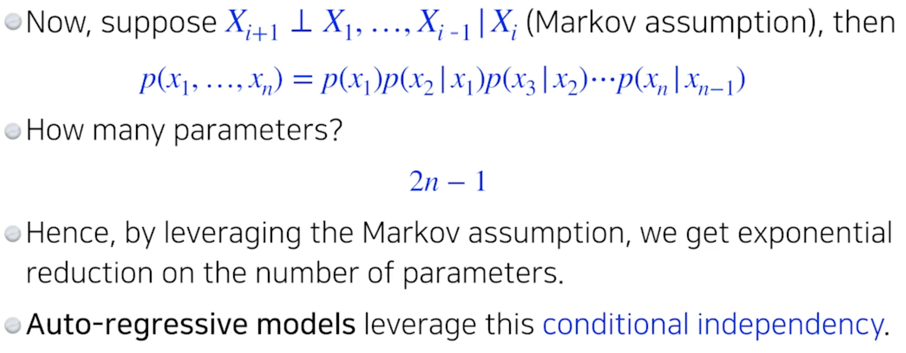
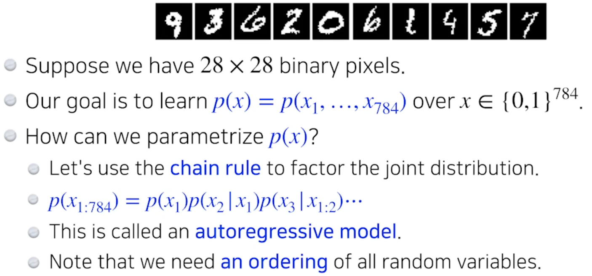
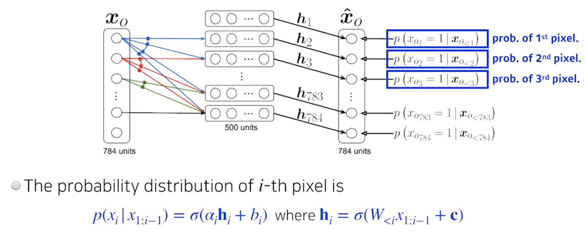
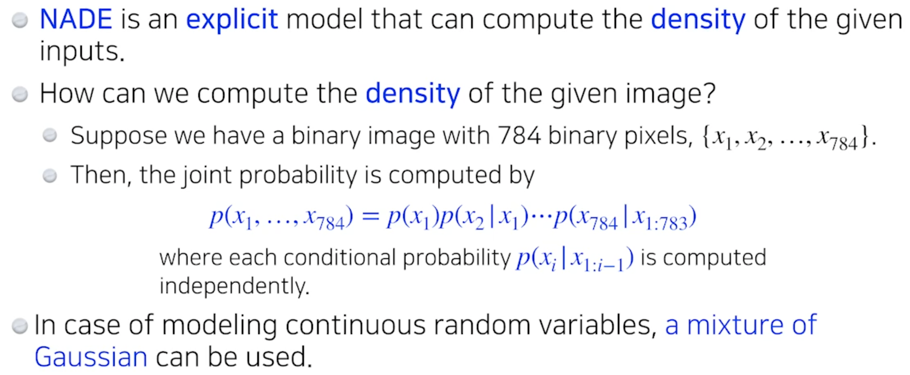
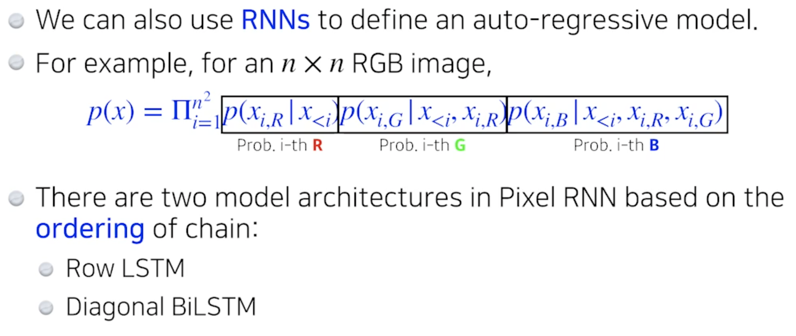

# Day 15 Generative model

## Generative Models 1
> 생성 모델

### Introduction
> What I cannot create I do not understand
> What does it mean to learn a generative model?
- GAN으로 이미지 또는 문장을 만드는 것?
    - 하지만 그것이 전부는 아니다

### Learning a Generative Model
> Suppose we are given images of dogs
We want to learn a probability distribution p(x) such that
- Generation: if we sample xnew ~p(x), xnew should look like a dog (sampling)
- Density estimation: p(x) should be high if x looks like a dog, and low otherwise (anomaly detection)
    - Also known as, explit models   
    - generative model은 구분하는 것 까지 포함
- Unsupervised representation learning: We should be able to learn what these images have in common, e.g., ears, tail, etc (feature leanring)

- Then, how can we represent p(x)

### Basic Discrete Distributions

### Example

- 하나의 이미지 픽셀을 표현하기 위해 많은 parameters가 필요하다

> Supppose we have X1, .., Xn of n binary pixels (a binary image)
- How many possible states? 2*2*2*...*2 = 2^n
- Samling from p(x1,...,xn) generates an image
- How many parameters to specify p(x1,...,xn)? 2^n -1
- parameters가 많을수록 학습이 어렵다

### Structure Through Independence

### Conditional Independence

- fully dependent model + fully indepednet model 사이의 좋은 모델을 만드는 것 => auto-regress model

- i+1번째 pixel은 i번째 pixel에만 dependent한 것

### Auto-regressive Model

- i가 i-1에만 dependent한 것 
- i가 1~ i-1에 dependent한 것도!
    - 이전 n개를 고려하는 것을 ar-n model
    - 이전 1개를 고려하는 것을 ar-1 model

### NADE: Neural Autoregressive Density Estimator

### Pixel RNN

- row LSTM 위쪽의 정보 활용
- Diagonal BiLSTM biriderctional 정보 활용

**연휴간 추가 공부 다시 필요**

## 마스터 클래스

### 실제 업무에서도 CNN, RNN을 활용하여 모델을 만드는 것인지, 아니면 밑바닥부터 모델을 구축하는지 궁금합니다.
- tensorflow, pytorch 당연히 사용

### 실습시간에 배운 코드들을 어느정도 까지 익혀야 하는지 궁금합니다. 코드를 밑바닥부터 구현 가능한 정도까지 익히는 것이 시간이 오래걸리더라도 투자 할 만 한가요?
- 연구목적은 밑바닥부터 다 가능
- 실무형 코드는 가독성이 진짜 중요. 실무는 많은 것들이 라이브러리화 되어있음

### 국내에서 석사, 박사를 하신걸로 알고 있는데 영어 공부는 어떻게 하셨나요? 강의 중간중간에 보면 네이티브한 어조가 나오는데 회화나 쓰기 역량은 어떻게 쌓으셨는지 궁금합니다.
- 디즈니리서치에서 배움

### 마스터님만의 논문을 보는 특별한 팁을 가지고 계신지 궁금합니다.
- 실험을 할 때는 실험세팅을 많이 보는 편
- 일반적으로 공부할 때는 introduction에서 이 연구를 왜 했는지 앞으로 어떤거를 진행할지를 중점으로 봄

### AI 엔지니어의 역량이 무엇이라 생각하시나요? 데이터 전처리 및 파이프라인 구축 역량, 모델 구현 및 서비스단까지 전달 역량 두 가지중에서 어떠한 역랴을 중점으로 가져가야 할 지 궁금합니다.
- 카카오 브레인 엔지니어들은 둘 다 잘함

### RNN 이나 LSTM 같은 모델들을 보면 굉장히 복잡해 보잉는데 처음 이러한 네트워크를 만들기위한 intuition은 어디에서 얻을 수 있을까요?
- 잘 모르겠음. LSTM도 실제로 많이 reject됨. 교수님도 궁금쓰

### 모델을 그리므로 표현할 때 따로 사용하시는 툴이 있낭요?
- 없음 그냥 키노트

### 파라미터를 줄이면 일반화 성능이 오른다고 하셨는데, 실제로 많은 task에서는 파라미터를 줄이기보다 늘릴수록 성능이 올라가는 경우가 많은 것 같습니다. 이에 대한 의견이 궁금합니다.

### 설명을 엄청 잘하십니다. 강의나 발표 준비할 때 따로 팁이 있을까요?
- 생존으로 해보니 늘었다
    - 주변 사람들이 똑똑해서 자신잉 

### 엔지니어와 연구자 사이에서 고민중인 대학생입니다. 대학원에 진학해 연구하고 싶은 마음도 있는데 수학이 어느정도로 중요할까요? 르벡적분이나 대학원 수준의 확률론도 중요할까요??
- 수학은 많이 알수록 좋음
    - 많이 알면 상대적으로 다른쪽이 부족
    - 교수입장에서 말하면 다 중요함

### 회사에서 머신러닝 엔지니어 직무를 맡길 때 석사로 기대하는 것과 학사로 기대하는 것이 어떤 차이점이 있을까요?
- 대기업(삼성): 상대적으로 학사와 석사가 하는 일이 달라짐
- 스타트업(스타트업): 학사 석사 둘 다 잘해양됨
- 카카오브레인: 학사 석사 중요하지 않음 잘하면 붙고 못하면 떨어짐

### 디즈니에서 리서쳐로 계실 때 구체적으로 어떤 업무를 하셨는지 간략하게 소개 부탁드립니다!
- 언론에 나온 것들로: 로봇 모션 등 쪽으로 많이 함
    - 로봇들 라이드들의 모션등을 만듦

### 최신 연구 트렌드를 캐치하는 팁을 얻고 싶습니다. 단순히 논문을 많이 읽어서 트렌드를 잡기에는 매년 나오는 논문의 양도 많고 이들을 선택하는 데도 시간이 너무 많이 소요됩니다. ㅠㅠ
- 논문을 많이 읽는 사람을 옆에 두면 됨
- 자기만의 연구분야가 생기면 연구 trend는 덜 중요해짐. 
    - Twitter, facebook에 올라오는 논문을 봐라
    - 잘하는 사람과 study, 

### 왜 서빙을 할때는 tensorflow가 많이쓰이나요?
- Pytorch로 서빙하면 버그가 좀 많다고 함

### 엔지니어를 목표로 하는 캠퍼입니다! 모르는게 너무 많기도 하고, 공부해야 할 양도 많아보여서 그런지, 요즘 대학원 진학에 대한 생각을 다시 해 보게 되었습니다. 교수님이 석사(혹은 박사)로 진학하게 된 계기가 궁금합니다!
- 군대 대신 회사감
    - 청소로봇회사갔는데 회사 경영이 어렵고 지식의 한계를 느낌

### 딥러닝 자세하게 볼 수있는 책 있으면 추천해주세요(이론위주)
- 교수님은 책으로 공부를 해본적이 없음

### 강의에서 내주신 Further Question: LSTM에서는 Modern CNN 내용에서 배웠던 중요한 개념이 적용되어 있습니다. 무엇일까요?의 교수님 의견이 궁금합니다...... 너무 궁금해요....................................
- 교수님도 모르겠음

### self supervised learning(이하 ssl)이 뜰거라 하셨는데 회사에서 뉴스에 감성 score나 tag를 적어놓은 data를 비싸게 사오더라고요. ssl을 이용하면 사온 데이터를 이용해score/tag 모델을 리버스 엔지니어링 할 수 있나요? 이런 모델의 한계는 뭘까요?
- 한계?: 얼마나 믿을 수 있을지, 어디에 쓰일 수 있는 라벨인지

### 데이터 파이프라인이라는게 어떤 것인지 감이 안옵니다 .. dataloader를 말하는 건가요?
- 중요한 것은 pre processing
    - 현실 data는 너무 noisy
    - 삼성,LG에서 log data를 많이 봄.. 거의 log data만 보는데 어떻게 처리할지

### 논문을 보실때 어떠한 기준으로 보는지 또 어떤 내용을 중점적으로 보는지 알려주세요(수식을 위주로, 결과를 위주로, 기술을 위주로 등)
- 주로 introduction을 많이봄 (기존 연구에 이런 문제가 있었는데)

### 교수님 골격이 상당하신데 어떤 운동하시나요 ?? ㅎㅎ
- 다 살임

### 교수님이 연구실에서 진행하고 계신 연구 분야가 궁금합니다!
- 로보틱스, 사람의 모션을 만드는 일

### 슬럼프가 왔을 때 어떻게 극복하셨나요? 벽을 느꼈을 때나..?
- 안 없어짐 ㅎㅎ
- 박사 졸업하면 괜찮아진다던데 더 심해짐

### 개인 공부를 하시거나, 연구한 것을 정리하실 때, 노하우가 있다면 조언 부탁드립니다!
- 잘 안됨.. 

### 기업에서 리서치를 하신다고 하셨는데, 리서치 결과를 실제 서비스에 반영하기 위해 엔지니어는 어떤 일을 하게 되나요? 리서쳐와 여러 커뮤니케이션 과정을 거쳐 모델을 개발하게 되는걸까요?
- 이 질문은 .. 왠만하면 엔지니어가 다함 ㅋㅋㅋ
    - 데이터 전처리부터 서빙 

### continuous signal을 입력으로 사용하려면 discrete signal로 바꿔야 할텐데 어떤 방법으로 바꾸는지 궁금합니다.
- 왜 discrete signal로 바꿔야죠? 그냥 사용 하면 됨

### RL을 적용한 Robotics연구에서 역학이나 기계공학적의 학부정도의 지식수준이 필요하나요?
- 본인 생각에는 잘해야함

### 분류 문제에서 기타 혹은 unknown 클래스를 분류해낼 수 있는 효과적인 방법이 궁금합니다.
- 

### 강화학습에 관심이 많은 학생입니다. 아직 회사에서는 강화학습 엔지니어? 직군은 잘 없는 것 같아 강화학습을 전공할지 고민이 됩니다. 교수님 생각에는 강화학습이 적용이 어떤 식으로 될 것 같은지 궁금합니다!
- 재밌는 문제지만 현실 세계로 들어오기 위한 많은 제약이 있는듯. 진짜 현실에 쓰이려면 먼듯
    - 바둑, 체스는 룰이 확실하기 때문
- 잘 모르겠음
- 본인은 재밌고 논문도 많이 썼지만, 이거로 많은 유의미한 일을 할 수 있다고 답을 내리지 못함
    - 여러 의견이 있다

### 교수님, pyTorch source code를 처음 보는 순간 머리가 하얘졌는데, 계속보다보면 이해가 될까요? 그리고 이러한 소스코드의 원리를 이해하는 것이 도움이 많이 될까요?
- 본인도 잘 모름. 김재열님 코드 보면서 자기도 배움
- 무식하게 처음부터 보고 따라 쳐보셈

### 딥러닝 모델을 돌릴 때 학습이 잘 되었다고 말할 수 있을 정도의 데이터 양이 얼마나 될까요? 지금 조별로 데이터셋을 만들어서 실습 중인데, 한 라벨 당 어느 정도의 데이터를 넣어야할지 고민입니다.
- 잘 될떄 까지. 아무도 모름

### IT 계에서 유명한 인플루언서들은 SNS 를 통해서도 많은 소통을 한다고 들었어요. 혹시 교수님이 사용하시는 sns 가 있으신지 궁금해요 그리고 AI 관련 정보 얻기 위한 계정도 추천해주세요~. (클럽하우스도 하시나요?)
- 페이스북함! 
- 트위터에 많다던데 자기는 안씀
- 클럽하우스 .. ㅠ 인싸만 가능한듯

### GAN 관련 논문들이 수천가지가 있다고 하셨는데 꼭 봐야될 논문 5개만 추천 부탁드립니다.  (edited)  
- infogan, stargan, anogan

### Back통해 파라미터를 업데이트는 하는 과정이, 차원이 적을때는(가령 y=w1X+b) 직관적으로 이해가 되는데..차원이 많아질 수록 직관적 이해가 어렵습니다.머릿속에 안그려진다 해야할까요?? 교수님께서는 차원이 많은 모델들의 파라미터 업데이트 과정을 직관적으로 머릿속에 그려지시나요??
- layer의 parameter 숫자를 계산하는 연습을 많이 해보셈

### GAN은 상당히 매력적인 기술이라고 생각하지만, 실생활에서 쓰이는 것은 잘 못 본 것 같습니다. 혹시 어느 분야에 쓰이는지 알려주실 수 있으신가요??
- deep fake(face swapping) 많이 뜨는듯

### 교수님은 딥러닝을 어떻게 시작하고 공부하셨나요?
- 2011 재밌어보여서 함
    - 처음에 교수님이 못하게함 (당시 안떠서) 뜨고 난뒤에 더 하게 된듯

### 해외에서 일하다가 국내로 돌아오신 이유가 있으신가요? 국내외 일의 차이가 궁금해요! 분위기라던가 다른점?
- 더 오래 일하고 싶었는데 코로나 때문에
- 국내에서와의 일의 차이: 카카오 브레인은 어느곳에 가도 꿀리지 않음
    - 둘 다 좋았음

### 리서치에는 파이토치를 많이 사용하고 실제 배포 시에는 텐서플로우를 많이 사용한다면 엔지니어로 취직하려면 텐서플로우를 배워야할까요??
- 엔지니어가 되려면 둘 다 할 줄 알아야함.

### 가상환경에서 로봇을 Training 하시나요? 그럼 unity로 Environment를 만드시나요?
- unity는 visualizaer에 가깝고 그 안에 물리 엔진잉 있는 것 다른거 씀

### 아까 기계공학적인 지식을 질문한 전자전기공학부 학부생입니다. 혹시 교수님께서도 electronic and computer science를 전공하셨다고 들었습니다 그렇다면 처음부터 역학책을 사서 자세하게 공부하셨나요?? 역학은 양이 상당하다고 들었습니다!!
- 독학해서 구현함

### 딥러닝 공부를 책으로 한적이 없다고 하셨는데, 그럼 살짝 공부의 순서나 키워드를 잡을 때 어떻게 잡으셨나요? 책을 쓰는 가장 큰 장점은 그런 순서를 제공하는거라고 생각하는데 처음 공부를 하실 때 어떤 방식으로 하셨는지 궁금합니다.
- 과거에 책이 없었기 때문
    - 남들을 가르칠 수 있는 기회가 생겨서.. 목차 및 키워드를 스스로 잡아야했기 때문

### 실력이 좋다는 게 정확히 어떤 것을 의미할까요? 차근차근 실력을 키울 수 있는 가이드 라인이 있을까요?
- 구현을 잘하는 것, 인사이트가 좋은 것, 
- 하지만 아이디어는 조심해야함. 아이디어는 누구나 낼 수 있음. 아이디어를 구현할 수 있는 능력이 실력

### 교수님 인생의 목표나 사명같다고 느껴지는 것이 있으신가요? 있으시다면 설명부탁드리겠습니다!
- 내가 만듬 청소로봇이 팔렸을 때 좋았음

### 저는 스스로 공부하는 힘이(과제나 시험 아니면 안해요) 부족한데 교수님은 공부가 재밌으셔서 하셨나요?
- 공부가 재밌는건 이상한 것
- 학교가 중요한 건 강제성이 있기 때문
    - 공부를 해야하는 강제성을 부여

### 교수님이 현재 관심있는 분야가 궁금합니다.
- 로보틱스, 모션 제너레이션

### 대학원 랩실을 고를 때, 어떤 것을 중점적으로 보는것이 좋을까요? (학교 이름, 교수님 논문 등등,,)
- 대가의 연구실은 회사 프리패스
- 작은 연구실은 성과를 내야되서 많이 쪼고 실력이 늘음

### 대학원에 진학하고싶은데 나이때문에 고민입니다. 30대에 석사 시작하는 분들도 꽤 있나요?
- 꽤 많음
- 연구를 위한 석사는 비추
- 석사 마치고 회사에서 연구하는데 phd오면 눌림. 그리고 후회함
- 엔지니어 track으로 가면 석사 학사는 중요하지 않ㅇ음

### 사실 대학원이 연구를 위해 존재하는 기관인데, 엔지니어를 목표로 하고 있으면서 더 공부를 하기위해 석사를 진학한다는 게 어떻게 보면 조금 어불성설같다고 느껴지기도 하는데, 어떻게 생각하시나요??
- 대학원은 학교임 교육을 위한 기관임. 랩실에 취직하는 거서이 아닌 돈을 내고 공부하는 곳임

## LSTM

## Transformer
- 

## 피어세션 발표

### A
- xdim hdim 256 ydim 10 layer2 batch size 256
- batch 하나당 사진 하나

### B nn.lstm
- x_torch(2,20,28)

- n_batch 문장의 개수
- n_q 단어의 개수
- 