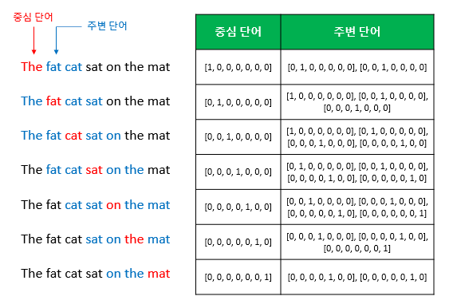

# day 16

## Intro to NLP, Bag-of-Words

### Goal of This Course
- 글 또는 긴 문장을 이해하는 NLU와 자연어를 상황에 맞게 생성하는 NLG가 있음

### Academic Displines related to NLP
- NLP(Natular Language Processing)
    - 학회: ACL, EMNLP, NAACL
    - 'I study math'라는 문장에서 각 단어들을 정보단위로 생각할 수 잇음
        - 각 단어들을 token이라 부르고
    - Low-level task: 각 단어를 준비하는 low level task
        - tokenize: 이렇게 단어단위로 쪼개나가는 과정
        - stemming: 다양한 어미의 변화에도 그 의미의 변화를 없애고 단어의 어근을 추출하는 것
            - study의 범위 변화 (studying, studied), 맑다(맑지만, 맑고 ..)
            - 수많은 어미의 변화에도 컴퓨터가 같은 단어라는 것을 이해할 수 있어야함
    - Word and phrase level task
        - NER(Named entity recognition): 단일 단어 또는 여러단어로 이루어진 고유명사를 인식하는 task
            - ex) new york times
        - POS(part-of-speech) tagging: 단어 중 품사의 성분을 알아내는 task
            - ex) 어떤 단어는 분사, 주어, 형용사구인지..
    - Sentence level
        - Sentiment analysis: 주어진 문장이 긍정 부정어조 인지 예측 
            - ex) I love this movie, This was not bad (긍정) I have this movie (부정)
        - Machine translation: 각 단어들의 번역과 정확한 어순으로
            - ex) I study math -> 나는 수학을 공부합니다.
    - Multi-sentence and paragraph level:
        - Entailment prediction: 두 문장간의 논리적인 내포 혹은 모순관계 예측
            - ex) 어제 존이 결혼했다, 어제 최소한 한명은 결혼을 했다. (참)
            - ex) 어제 존이 결혼하지 않았다, 어제 최소한 한명은 결혼을 했다. (모순관계)
            - 이러한 관계를 예측하는 것
        - Question answering: 독해 기반의 질의 응답
            - ex) Where did napoleon die? - 과거에는 이 단어에 해당하는 내용을 list로 나열했다면, 지금은 그 답에 해당하는 것을 보여줌
        - Dialog systems: 챗봇과 같은 대화
        - Summarization: 주어진 문서를 한 줄 자동 요약하는 task
- Text mining
    - big data 분석과 관련
    - 키워드의 빈도수를 시간순서로 trend 분석
    - 상품에 대한 키워드 분석을 통한 소비자 반응 파악
    - Document clustering(topic modeling): 서로 다른 키워드지만 비슷한 의미를 가지는 단어를 그룹핑
        - ex) 가성비 내구성 세부적인 요소같은 정보를 빠르게 얻어 낼 수 있음
    - Highly related to computational social science
        - 트위터/인스타그램에서 정보를 수집해서 분석했더니 어떠한 신조어를 많이 쓰는것이 나타났고 이는 사회의 어떤 사회 현상과 관련이 있다
        - 혼밥 키워드가 많이 나오는 것을 보아 사람들의 사회 패턴이 이렇게 변화하는 것 같다
    - 여러 insight를 발견하는데 text-mining을 사용

- Information retrieval (구글,네이버에서 사용하는 검색 기술)
    - 추천 시스템
        - 음악/유튜부 관심 분야 추천
        - 개인화된 광고, 상품 추천

### Trends of NLP
- 컴퓨터는 입력(+결과)를 숫자로 된 데이터로 구성
    - word embedding: text data를 단어단위로 분리하고 각 단어를 특정한 dimension, 차원으로 이루어진 벡터로 표현하는 과정을 거침
- 자연어 처리는 연속된 데이터를 처리해야하므로 RNN-family models(LSTMs and GRUs) 들이 딥러닝 핵심모델로 자리 잡음
- 구글에서 발표한 Attention is all you need에서 나온 transformer모델이 큰 성능 향상을 가져와, RNN-family models를 대체
- 룰 기반 언어의 번역 기술을 RNN기반의 딥러닝으로 학습(지금은 trnasformer?)하여 번역하였더니 더 좋은 결과가 나옴
    - 영상처리, 시계열 예측, 신약 개발등에도 사용됨
- 과거에는 NLP tasks마다 커스터마이즈한 모델들을 분리해서 발전시켰지만 현재는  self-attention모델을 단순히 쌓아가는 형태로 대규모 텍스트 데이터를 통해, 자가 주도 학습을 통해 범용적 모델을 학습하고 사전에 학습된 모델을 transfer learning 즉 전이 학습에 그대로 적용해 기존에 특화되어 적용된 모델보다 더 좋은 결과를 얻고 있음
    - BERT, GPT-3 (범용 인공지능 기술)
- 자가 지도학습을 통한 pre-trained model을 학습하기 위해서는 대규모 resources + GPU가 필요
    - 구글,페이스북, openAI 같은 큰 회사들에서만 진행됨

### Bag-of-Words
> 과거 딥러닝 모델이 적용되기 전에 활용되던 기법

### Bag-of-Words representation
1. Constructing the vocabulary containing unique words
    - 사전처럼 중복단어 제거
2. Encoding unique words to one-hot vectors
    - for any pair of words, the distance is root(2)
    - for any pair of words, cosine similarity is 0 (내적, 유사도)
    - 단어의 의미에 상관없이 모두가 동일한 관계로 단어를 표현
- A sentence/document can be represented as the sum of one-hot vectors
    - bag-of-words: 각 문장이나 문서에 포함된 word들의 one-hot-vector들을 모두 더한 vector 
        - 각 word별로 가방을 준비하고, 순차적으로 각 차원에 해당하는 가방에 들어감

### NaiveBayes Classifier for Document Classification
- for a document d and a class c
    - MAP(maximum a posteriori)P(c|d) 특정한 문서 d가 주어졌을때, c에 속할 확률 분포
    - P(d|c)P(c) / P(d)
    - P(d|c)P(c)
        - c가 고정되었을 때, d가 나타날 확률
        - 각 컨디션이 독립적이면, 다 곱해서 나타낼 수 있음

- 한번도 나타내지 않는 word의 경우 확률0이 되므로 이를 해결하기 위한 normalization방법도 같이 사용됨

### Word Embedding
- PDF 필기 진행

## 개인공부
### [텍스트 전처리](https://wikidocs.net/21694)
> 텍스트 전처리는 용도에 맞게 텍스트를 사전에 처리하는 작업
> 요리에 있어서 재료를 손질하는 것

#### 1. 토큰화
- 자연어 처리에서 크롤링 등으로 얻어낸 코퍼스 데이터가 필요에 맞게 전처리되지 않은 상태라면, 해당 데이터를 사용하고자하는 용도에 맞게 토큰화(tokenization) & 정제(cleaning) & 정규화(normalization)하는 일을 하게 됩니다
- 단어 토큰화(Word Tokenization)
    - 토큰의 기준을 단어로 하는 경우
- 입력:`Time is an illusion. Lunchtime double so!`
- 출력: `"Time", "is", "an", "illustion", "Lunchtime", "double", "so"`
    - 보통 토큰화 작업은 단순히 구두점이나 특수문자를 전부 제거하는 정제(cleaning) 작업을 수행하는 것만으로 해결되지 않습니다. 
    - 구두점이나 특수문자를 전부 제거하면 토큰이 의미를 잃어버리는 경우가 발생하기도 합니다. 
    - 심지어 띄어쓰기 단위로 자르면 사실상 단어 토큰이 구분되는 영어와 달리, 한국어는 띄어쓰기만으로는 단어 토큰을 구분하기 어렵습니다
- 토큰화 중 생기는 선택의 순간
    - `Don't be fooled by the dark sounding name, Mr. Jone's Orphanage is as cheery as cheery goes for a pastry shop.`
        - 어포 스트로피가 들어간 Don't과 Jone's는 어떻게 토큰화 할 수 있을까?
    - 원하는 결과가 나오도록 토큰화 도구를 직접 설계 또는 기존에 공개된 도구를 사용하여 결과가 원하는 목적에 맞는 것을 찾아 사용!
- 토큰화에서 고려해야할 사항
    - 토큰화 작업을 단순하게 코퍼스에서 구두점을 제외하고 공백 기준으로 잘라내는 작업이라고 간주할 수는 없습니다
    1. 구두점이나 특수 문자를 단순 제외해서는 안 된다.
        - 문장의 끝을 알 수 있는 경우
        - m.p.h Ph.D At&T $45.55 01/02/06 숫자 사이의 ,
    2. 줄임말과 단어 내에 띄어쓰기가 있는 경우
        - we're I'm
        - New York rock 'n' roll : 하나의 단어이지만 중간에 띄어쓰기가 존재
- 문장 토큰화(Sentence Tokenization)
    - EX1) IP 192.168.56.31 서버에 들어가서 로그 파일 저장해서 ukairia777@gmail.com로 결과 좀 보내줘. 그러고나서 점심 먹으러 가자.
    - EX2) Since I'm actively looking for Ph.D. students, I get the same question a dozen times every year.
- 이진 분류기(Binary Classifier)
    1. 마침표(.)가 단어의 일부분일 경우. 즉, 마침표가 약어(abbreivation)로 쓰이는 경우
    2. 마침표(.)가 정말로 문장의 구분자(boundary)일 경우를 의미할 것입니다.
- 한국어에서의 토큰화의 어려움
    - 영어는 New York같은 합성어를 또는 다른 예외를 제외하면, 띄어쓰기로 수행하기 수월
    - 한국어는 영어와는 달리 띄어쓰기만으로는 토큰화를 하기에 부족합니다. 한국어의 경우에는 띄어쓰기 단위가 되는 단위를 '어절'이라고 하는데 즉, 어절 토큰화는 한국어 NLP에서 지양되고 있습니다
    1. 한국어는 교착어이다 (교착어란 조사, 어미 등을 붙여서 말을 만드는 언어)
        - 그가, 그에게, 그와, 그를, 그는
        - 띄어쓰기 단위가 영어처럼 독립적인 단어라면 띄어쓰기 단위로 토큰화를 하면 되겠지만 한국어는 어절이 독립적인 단어로 구성되는 것이 아니라 조사 등의 무언가가 붙어있는 경우가 많아서 이를 전부 분리해줘야 한다는 의미
        -  한국어 토큰화에서는 형태소(morpheme)란 개념을 반드시 이해해야 합니다. 형태소(morpheme)란 뜻을 가진 가장 작은 말의 단위를 말합니다
            - 자립 형태소 : 접사, 어미, 조사와 상관없이 자립하여 사용할 수 있는 형태소. 그 자체로 단어가 된다. 체언(명사, 대명사, 수사), 수식언(관형사, 부사), 감탄사 등이 있다.
            - 의존 형태소 : 다른 형태소와 결합하여 사용되는 형태소. 접사, 어미, 조사, 어간를 말한다.
            - 문장 : 에디가 딥러닝책을 읽었다
            - 자립 형태소 : 에디, 딥러닝책
            - 의존 형태소 : -가, -을, 읽-, -었, -다
        - 한국어에서 영어에서의 단어 토큰화와 유사한 형태를 얻으려면 어절 토큰화가 아니라 형태소 토큰화를 수행해야한다는 것
    2. 한국어는 띄어쓰기가 영어보다 잘 지켜지지 않는다
        - EX1) 제가이렇게띄어쓰기를전혀하지않고글을썼다고하더라도글을이해할수있습니다.
        - EX2) Tobeornottobethatisthequestion
- 품사 태깅(Part-of-speech tagging)
    - 품사에 따라서 단어의 의미가 달라지기도 합니다
    - fly - 날다, 파리
    - 못 - 못, 못 먹는다
        - 그에 따라 단어 토큰화 과정에서 각 단어가 어떤 품사로 쓰였는지를 구분해놓기도 하는데, 이 작업을 품사 태깅(part-of-speech tagging)이라고 합니다
    - 각 형태소 분석기는 성능과 결과가 다르게 나오기 때문에, 형태소 분석기의 선택은 사용하고자 하는 필요 용도에 어떤 형태소 분석기가 가장 적절한지를 판단하고 사용 

#### 2. 정제(Cleaning) and 정규화(Normalization)
- 코퍼스에서 용도에 맞게 토큰을 분류하는 작업을 토큰화(tokenization)라고 하며, 토큰화 작업 전, 후에는 텍스트 데이터를 용도에 맞게 정제(cleaning) 및 정규화(normalization)하는 일이 항상 함께합니다
    - 정제(cleaning) : 갖고 있는 코퍼스로부터 노이즈 데이터를 제거한다.
    - 정규화(normalization) : 표현 방법이 다른 단어들을 통합시켜서 같은 단어로 만들어준다.
- 규칙에 기반한 표기가 다른 단어들의 통합
    - USA, US
- 대, 소문자 통합
    - 대문자와 소문자가 구분되어야 하는 경우도 있기 때문입니다. 가령 미국을 뜻하는 단어 US와 우리를 뜻하는 us는 구분되어야 합니다. 또 회사 이름(General Motors)나, 사람 이름(Bush) 등은 대문자로 유지되는 것이 옳습니다.
- 불필요한 단어의 제거(Removing Unnecessary Words)
    - 정제 작업에서 제거해야하는 노이즈 데이터(noise data)는 자연어가 아니면서 아무 의미도 갖지 않는 글자들(특수 문자 등)을 의미하기도 하지만, 분석하고자 하는 목적에 맞지 않는 불필요 단어들을 노이즈 데이터라고 하기도 합니다
    1. 등장 빈도가 적은 단어(Removing Rare words)
        - 때론 텍스트 데이터에서 너무 적게 등장해서 자연어 처리에 도움이 되지 않는 단어들이 존재
        - 총 100,000개의 메일을 가지고 정상 메일에서는 어떤 단어들이 주로 등장하고, 스팸 메일에서는 어떤 단어들이 주로 등장하는지를 가지고 설계하고자 합니다. 그런데 이때 100,000개의 메일 데이터에서 총 합 5번 밖에 등장하지 않은 단어가 있다면 이 단어는 직관적으로 분류에 거의 도움이 되지 않을 것임을 알 수 있습니다.
    2. 길이가 짧은 단어(Removing words with very a short length)
        - 영어권 언어에서는 길이가 짧은 단어를 삭제하는 것만으로도 어느정도 자연어 처리에서 크게 의미가 없는 단어들을 제거하는 효과를 볼 수 있다고 알려져 있습니다

#### 3. 어간 추출(Stemming) and 표제어 추출(Lemmatization)
- 정규화 기법 중 코퍼스에 있는 단어의 개수를 줄일 수 있는 기법인 표제어 추출(lemmatization)과 어간 추출(stemming)의 개념에 대해서 알아봅니다
    - 눈으로 봤을 때는 서로 다른 단어들이지만, 하나의 단어로 일반화시킬 수 있다면 하나의 단어로 일반화시켜서 문서 내의 단어 수를 줄이겠다는 것
- 표제어 추출(Lemmatization)
    - 표제어(Lemma)는 한글로는 '표제어' 또는 '기본 사전형 단어' 정도의 의미를 갖습니다
        - ex)예를 들어서 am, are, is는 서로 다른 스펠링이지만 그 뿌리 단어는 be라고 볼 수 있습니다. 이 때, 이 단어들의 표제어는 be라고 합니다
    - 표제어 추출을 하는 가장 섬세한 방법은 단어의 형태학적 파싱을 먼저 진행하는 것
        - 형태소란 '의미를 가진 가장 작은 단위'를 뜻합니다
            1. 어간(stem): 단어의 의미를 담고 있는 단어의 핵심 부분.
            2. 접사(affix): 단어에 추가적인 의미를 주는 부분
            - 형태학적 파싱은 이 두 가지 구성 요소를 분리하는 작업
            - 표제어 추출기(lemmatizer)가 본래 단어의 품사 정보를 알아야만 정확한 결과를 얻을 수 있음
- 표제어 추출 vs 어간 추출
    - 표제어 추출은 문맥을 고려하며, 수행했을 때의 결과는 해당 단어의 품사 정보를 보존합니다
    - 어간 추출을 수행한 결과는 품사 정보가 보존되지 않습니다. (다시 말해 POS 태그를 고려하지 않습니다.) 더 정확히는, 어간 추출을 한 결과는 사전에 존재하지 않는 단어일 경우가 많습니다
- 어간 추출
    - 어간 추출은 형태학적 분석을 단순화한 버전이라고 볼 수도 있고, 정해진 규칙만 보고 단어의 어미를 자르는 어림짐작의 작업이라고 볼 수도 있습니다. 다시 말해, 이 작업은 섬세한 작업이 아니기 때문에 어간 추출 후에 나오는 결과 단어는 사전에 존재하지 않는 단어일 수도 있습니다.

#### 4. 불용어(stopword)
- 갖고 있는 데이터에서 유의미한 단어 토큰만을 선별하기 위해서는 큰 의미가 없는 단어 토큰을 제거하는 작업이 필요
    - 이러한 단어들을 불용어(stopword)라고 하며, NLTK에서는 위와 같은 100여개 이상의 영어 단어들을 불용어로 패키지 내에서 미리 정의

#### 6. 정수 인코딩(Integer Encoding)
- 컴퓨터는 텍스트보다는 숫자를 더 잘 처리 할 수 있습니다
    - 각 단어를 고유한 정수에 맵핑(mapping)시키는 전처리 작업이 필요할 때가 있습니다
    - 인덱스를 부여하는 방법은 여러 가지가 있을 수 있는데 랜덤으로 부여하기도 하지만, 보통은 전처리 또는 빈도수가 높은 단어들만 사용하기 위해서 단어에 대한 빈도수를 기준으로 정렬한 뒤에 부여
- dictionary 사용
    - 텍스트를 숫자로 바꾸는 단계라는 것은 본격적으로 자연어 처리 작업에 들어간다는 의미이므로, 단어가 텍스트일 때만 할 수 있는 최대한의 전처리를 끝내놓아야 합니다
    - 이제 높은 빈도수를 가진 단어일수록 낮은 정수 인덱스를 부여
    - 1의 인덱스를 가진 단어가 가장 빈도수가 높은 단어가 됩니다. 그리고 이러한 작업을 수행하는 동시에 각 단어의 빈도수를 알 경우에만 할 수 있는 전처리인 빈도수가 적은 단어를 제외시키는 작업을 합니다. 등장 빈도가 낮은 단어는 자연어 처리에서 의미를 가지지 않을 가능성이 높기 때문입니다. 여기서는 빈도수가 1인 단어들은 전부 제외시켰습니다.
    - 단어 집합에 존재하지 않는 단어들을 Out-Of-Vocabulary(단어 집합에 없는 단어)의 약자로 'OOV'라고 합니다. word_to_index에 'OOV'란 단어를 새롭게 추가하고, 단어 집합에 없는 단어들은 'OOV'의 인덱스로 인코딩
- Counter 사용하기
- NLTK의 FreqDist 사용하기

#### 7. 패딩
- 자연어 처리를 하다보면 각 문장(또는 문서)은 서로 길이가 다를 수 있습니다. 그런데 기계는 길이가 전부 동일한 문서들에 대해서는 하나의 행렬로 보고, 한꺼번에 묶어서 처리할 수 있습니다. 다시 말해 병렬 연산을 위해서 여러 문장의 길이를 임의로 동일하게 맞춰주는 작업이 필요

#### 8. 원-핫 인코딩(One-Hot Encoding)
- 두 가지 과정
    1. 각 단어에 고유한 인덱스를 부여합니다. (정수 인코딩)
    2. 표현하고 싶은 단어의 인덱스의 위치에 1을 부여하고, 다른 단어의 인덱스의 위치에는 0을 부여합니다.
- 원-핫 인코딩(One-Hot Encoding)의 한계
    - 단어의 개수가 늘어날 수록, 벡터를 저장하기 위해 필요한 공간이 계속 늘어난다는 단점
    - 원-핫 벡터는 단어의 유사도를 표현하지 못한다는 단점
        - 단어 간 유사성을 알 수 없다는 단점은 검색 시스템 등에서 심각한 문제
    - 이러한 단점을 해결하기 위해 단어의 잠재 의미를 반영하여 다차원 공간에 벡터화 하는 기법으로 크게 두 가지
        - 첫째는 카운트 기반의 벡터화 방법인 LSA, HAL 등이 있으며, 
        - 둘째는 예측 기반으로 벡터화하는 NNLM, RNNLM, Word2Vec, FastText 등이 있습니다
        - 그리고 카운트 기반과 예측 기반 두 가지 방법을 모두 사용하는 방법으로 GloVe라는 방법이 존재

### [나이브 베이즈 분류기](https://wikidocs.net/22892)
- 텍스트 분류(Text Classification)은 텍스트를 입력으로 받아, 텍스트가 어떤 종류의 범주(Class)에 속하는지를 구분하는 작업
    - 텍스트 분류에서 분류해야할 범주가 두 가지라면 이진 분류(Binary Classification)라고 하며, 세 가지 이상이라면 다중 클래스 분류(Multi-Class Classification)라고 합니다
- 예시
    - P(정상 메일 | 입력 텍스트) = 입력 텍스트가 있을 때 정상 메일일 확률
    - P(스팸 메일 | 입력 텍스트) = 입력 텍스트가 있을 때 스팸 메일일 확률
    - 입력 텍스트가 주어졌을 때, P(정상 메일 | 입력 텍스트)가 P(스팸 메일 | 입력 텍스트)보다 크다면 정상 메일이라고 볼 수 있으며, 그 반대라면 스팸 메일이라고 볼 수 있습니다. 그런데 두 확률 모두 식을 보면 P(입력 텍스트)를 분모로 하고 있음을 알 수 있습니다. 그렇기 때문에 분모를 양쪽에서 제거하여 식을 간소화
    - 그런데 메일의 본문을 어떻게 나이브 베이즈 분류기의 입력으로 사용할 수 있을까요?
        - 메일의 본문을 단어 토큰화하여 이 단어들을 나이브 베이즈의 분류기의 입력으로 사용
    - 나이브 베이즈 분류기에서 토큰화 이전의 단어의 순서는 중요하지 않습니다
- 스팸 메일 분류
    - P(정상 메일 | 입력 텍스트) = P(you | 정상 메일) × P(free | 정상 메일) × P(lottery | 정상 메일) × P(정상 메일)
    - P(스팸 메일 | 입력 텍스트) = P(you | 스팸 메일) × P(free | 스팸 메일) × P(lottery | 스팸 메일) × P(스팸 메일)

    - P(정상 메일) = P(스팸 메일) = 총 메일 6개 중 3개 = 0.5
    - 위 예제에서는 P(정상 메일)과 P(스팸 메일)의 값은 같으므로, 두 식에서 두 개의 확률은 생략이 가능합니다.

    - P(정상 메일 | 입력 텍스트) = P(you | 정상 메일) × P(free | 정상 메일) × P(lottery | 정상 메일)
    - P(스팸 메일 | 입력 텍스트) = P(you | 스팸 메일) × P(free | 스팸 메일) × P(lottery | 스팸 메일)
    - P(you | 정상 메일)을 구하는 방법은 정상 메일에 등장한 모든 단어의 빈도 수의 총합을 분모로하고, 정상 메일에서 you가 총 등장한 빈도의 수를 분자로 하는 것입니다. 이 경우에는 2/10 = 0.2가 됩니다
    - P(정상 메일 | 입력 텍스트) = 2/10 × 2/10 × 0/10 = 0
    - P(스팸 메일 | 입력 텍스트) = 2/10 × 3/10 × 2/10 = 0.012
    - 그런데 예제를 보니 이상한 점이 보입니다. 물론, 직관적으로 보기에도 you, free, lottery라는 단어가 스팸 메일에서 빈도수가 더 높기때문에 스팸 메일인 확률이 더 높은 것은 확실합니다. 그러나 입력 텍스트에 대해서 단, 하나의 단어라도 훈련 텍스트에 없었다면 확률 전체가 0이 되는 것은 지나친 일반화입니다. 이 경우에는 정상 메일에 lottery가 단 한 번도 등장하지 않았고, 그 이유로 정상 메일일 확률 자체가 0%가 되어버렸습니다. 이를 방지하기 위해서 나이브 베이즈 분류기에서는 각 단어에 대한 확률의 분모, 분자에 전부 숫자를 더해서 분자가 0이 되는 것을 방지하는 라플라스 스무딩을 사용하기도 합니다.

### [카운트 기반의 단어 표현(Count based word Representation)](https://wikidocs.net/22650)
> 머신 러닝 등의 알고리즘이 적용된 본격적인 자연어 처리를 위해서는 문자를 숫자로 수치화할 필요가 있음
#### 다양한 단어의 표현 방법

- 국소 표현(Local Representation) 방법 (discrete)
    - 해당 단어 그 자체만 보고, 특정값을 맵핑하여 단어를 표현하는 방법
    - puppy(강아지), cute(귀여운), lovely(사랑스러운)라는 단어가 있을 때 각 단어에 1번, 2번, 3번 등과 같은 숫자를 맵핑(mapping)하여 부여한다면 이는 국소 표현 방법에 해당
    - 국소 표현 방법은 단어의 의미, 뉘앙스를 표현할 수 없지만
-  분산 표현(Distributed Representation) 방법 (continuous)
    - 그 단어를 표현하고자 주변을 참고하여 단어를 표현하는 방법
    - puppy(강아지)라는 단어 근처에는 주로 cute(귀여운), lovely(사랑스러운)이라는 단어가 자주 등장하므로, puppy라는 단어는 cute, lovely한 느낌이다로 단어를 정의
    - 산 표현 방법은 단어의 뉘앙스를 표현 가능

#### Bag of Words(BoW)
> Bag of Words는 국소 표현에(Local Representation)에 속하며, 단어의 빈도수를 카운트(Count)하여 단어를 수치화하는 단어 표현 방법
> 단어의 등장 순서를 고려하지 않는 빈도수 기반의 단어 표현 방법인 Bag of Words
> 단어들의 가방
- BoW를 만드는 과정
    1. 우선, 각 단어에 고유한 정수 인덱스를 부여합니다.
    2. 각 인덱스의 위치에 단어 토큰의 등장 횟수를 기록한 벡터를 만듭니다.
```
from konlpy.tag import Okt
import re  
okt=Okt()  

token=re.sub("(\.)","","정부가 발표하는 물가상승률과 소비자가 느끼는 물가상승률은 다르다.")  
# 정규 표현식을 통해 온점을 제거하는 정제 작업입니다.  
token=okt.morphs(token)  
# OKT 형태소 분석기를 통해 토큰화 작업을 수행한 뒤에, token에다가 넣습니다.  

word2index={}  
bow=[]  
for voca in token:  
         if voca not in word2index.keys():  
             word2index[voca]=len(word2index)  
# token을 읽으면서, word2index에 없는 (not in) 단어는 새로 추가하고, 이미 있는 단어는 넘깁니다.   
             bow.insert(len(word2index)-1,1)
# BoW 전체에 전부 기본값 1을 넣어줍니다. 단어의 개수는 최소 1개 이상이기 때문입니다.  
         else:
            index=word2index.get(voca)
# 재등장하는 단어의 인덱스를 받아옵니다.
            bow[index]=bow[index]+1
# 재등장한 단어는 해당하는 인덱스의 위치에 1을 더해줍니다. (단어의 개수를 세는 것입니다.)  
print(word2index) # ('정부': 0, '가': 1, '발표': 2, '하는': 3, '물가상승률': 4, '과': 5, '소비자': 6, '느끼는': 7, '은': 8, '다르다': 9) 
bag # [1, 2, 1, 1, 2, 1, 1, 1, 1, 1]  
```
- 불용어 제거 가능

#### 문서 단어 행렬(Document-Term Matrix, DTM)
> 서로 다른 문서들의 BoW들을 결합한 표현 방법인 문서 단어 행렬(Document-Term Matrix, DTM) 
- 문서 단어 행렬은 문서들을 서로 비교할 수 있도록 수치화할 수 있다는 점에서 의의

- DTM의 한계
    1. 희소 표현(Sparse representation)
        - 원-핫 벡터나 DTM과 같은 대부분의 값이 0인 표현을 희소 벡터(sparse vector) 또는 희소 행렬(sparse matrix)라고 부르는데, 희소 벡터는 많은 양의 저장 공간과 계산을 위한 리소스를 필요로 합니다
            - 앞서 배운 텍스트 전처리 방법을 사용하여 구두점, 빈도수가 낮은 단어, 불용어를 제거하고, 어간이나 표제어 추출을 통해 단어를 정규화하여 단어 집합의 크기를 줄일 수 있습니다.
    2. 단순 빈도 수 기반 접근
        - 여러 문서에 등장하는 모든 단어에 대해서 빈도 표기를 하는 이런 방법은 때로는 한계를 가지기도 합니다. 예를 들어 영어에 대해서 DTM을 만들었을 때, 불용어인 the는 어떤 문서이든 자주 등장할 수 밖에 없습니다. 그런데 유사한 문서인지 비교하고 싶은 문서1, 문서2, 문서3에서 동일하게 the가 빈도수가 높다고 해서 이 문서들이 유사한 문서라고 판단해서는 안 됩니다
        - DTM에 불용어와 중요한 단어에 대해서 가중치를 줄 수 있는 방법은 없을까요? 이를 위해 사용하는 것이 다음 챕터에서 배우게 될 TF-IDF입니다

#### TF-IDF(Term Frequency-Inverse Document Frequency)
> TF-IDF를 사용하면, 기존의 DTM을 사용하는 것보다 보다 더 많은 정보를 고려하여 문서들을 비교할 수 있습니다
> DTM 내에 있는 각 단어에 대한 중요도를 계산할 수 있는 TF-IDF 가중치
- DTM 내의 각 단어들마다 중요한 정도를 가중치로 주는 방법입니다. 사용 방법은 우선 DTM을 만든 후, TF-IDF 가중치를 부여
- TF-IDF는 TF와 IDF를 곱한 값을 의미
    - 문서를 d, 단어를 t, 문서의 총 개수를 n이라고 표현
        - tf(d,t) : 특정 문서 d에서의 특정 단어 t의 등장 횟수
        - df(t) : 특정 단어 t가 등장한 문서의 수.
        - idf(d, t) : df(t)에 반비례하는 수.
            - log를 씌워주지 않으면, 희귀 단어들에 엄청난 가중치가 부여될 수 있습니다. 로그를 씌우면 이런 격차를 줄이는 효과
            - log 안의 식에서 분모에 1을 더해주는 이유는 첫번째 이유로는 특정 단어가 전체 문서에서 등장하지 않을 경우에 분모가 0이 되는 상황을 방지하기 위함
    - TF-IDF는 모든 문서에서 자주 등장하는 단어는 중요도가 낮다고 판단하며, 특정 문서에서만 자주 등장하는 단어는 중요도가 높다고 판단
        - 즉, the나 a와 같이 불용어의 경우에는 모든 문서에 자주 등장하기 마련이기 때문에 자연스럽게 불용어의 TF-IDF의 값은 다른 단어의 TF-IDF에 비해서 낮아지게 됩니다.

 ### [word embedding](https://wikidocs.net/22644)
- 자연어를 컴퓨터가 이해하고, 효율적으로 처리하게 하기 위해서는 컴퓨터가 이해할 수 있도록 자연어를 적절히 변환할 필요
- 단어를 벡터로 표현하는 방법으로, 단어를 밀집 표현으로 변환
- 희소 표현(Sparse Representation)
    - 앞서 원-핫 인코딩을 통해서 나온 원-핫 벡터들은 표현하고자 하는 단어의 인덱스의 값만 1이고, 나머지 인덱스에는 전부 0으로 표현되는 벡터 표현 방법이었습니다. 이렇게 벡터 또는 행렬(matrix)의 값이 대부분이 0으로 표현되는 방법을 희소 표현(sparse representation)이라고 합니다. 그러니까 원-핫 벡터는 희소 벡터(sparse vector)
    - 희소 벡터의 문제점은 단어의 개수가 늘어나면 벡터의 차원이 한없이 커진다는 점
- 밀집 표현(Dense Representation)
    - 희소 표현과 반대되는 표현
    - 밀집 표현은 벡터의 차원을 단어 집합의 크기로 상정하지 않습니다. 사용자가 설정한 값으로 모든 단어의 벡터 표현의 차원을 맞춥니다
    - 또한, 이 과정에서 더 이상 0과 1만 가진 값이 아니라 실수값을 가지게 됩니다
- 단어를 밀집 벡터(dense vector)의 형태로 표현하는 방법을 **워드 임베딩(word embedding)**이라고 합니다
- 워드 임베딩 방법론으로는 LSA, Word2Vec, FastText, Glove

#### 워드투벡터(Word2Vec)
> 단어 간 유사도를 반영할 수 있도록 단어의 의미를 벡터화 할 수 있는 방법
- Distributed Representation
    - 분포 가설(distributional hypothesis): 이 가정은 '비슷한 위치에서 등장하는 단어들은 비슷한 의미를 가진다'라는 가정
    - 분산 표현은 분포 가설을 이용하여 단어들의 셋을 학습하고, 벡터에 단어의 의미를 여러 차원에 분산하여 표현
    - 분산 표현은 저차원에 단어의 의미를 여러 차원에다가 분산하여 표현합니다. 이런 표현 방법을 사용하면 단어 간 유사도를 계산할 수 있습니다

- CBOW(Continuous Bag of Words)
    - CBOW는 주변에 있는 단어들을 가지고, 중간에 있는 단어들을 예측하는 방법입니다. 반대로, Skip-Gram은 중간에 있는 단어로 주변 단어들을 예측하는 방법
        - 메커니즘 자체는 거의 동일하기 때문에 CBOW를 이해한다면 Skip-Gram도 손쉽게 이해 가능
    - 예문 : "The fat cat sat on the mat"
        -  가운데 단어를 예측하는 것이 CBOW라고 했습니다. 
        - {"The", "fat", "cat", "on", "the", "mat"}으로부터 sat을 예측하는 것은 CBOW가 하는 일
            - 예측해야하는 단어 sat을 중심 단어(center word)라고 하고, 예측에 사용되는 단어들을 주변 단어(context word)라고 합니다
        - 중심 단어를 예측하기 위해서 앞, 뒤로 몇 개의 단어를 볼지를 결정했다면 이 범위를 윈도우(window)라고 합니다
            - 예를 들어서 윈도우 크기가 2이고, 예측하고자 하는 중심 단어가 sat이라고 한다면 앞의 두 단어인 fat와 cat, 그리고 뒤의 두 단어인 on, the를 참고합니다
            - 윈도우 크기를 정했다면, 윈도우를 계속 움직여서 주변 단어와 중심 단어 선택을 바꿔가며 학습을 위한 데이터 셋을 만들 수 있는데, 이 방법을 슬라이딩 윈도우(sliding window)라고 합니다

- 좌측의 중심 단어와 주변 단어의 변화는 윈도우 크기가 2일때, 슬라이딩 윈도우가 어떤 식으로 이루어지면서 데이터 셋을 만드는지 보여줍니다
- 우측 그림은 중심 단어와 주변 단어를 어떻게 선택했을 때에 따라서 각각 어떤 원-핫 벡터가 되는지를 보여줍니다.
- **링크의 설명이 너무 명료함 그냥읽어보기!**
- Skip-gram
    - 중심 단어에 대해서 주변 단어를 예측하므로 투사층에서 벡터들의 평균을 구하는 과정은 없고, 메커니즘 자체는 CBOW와 동일
