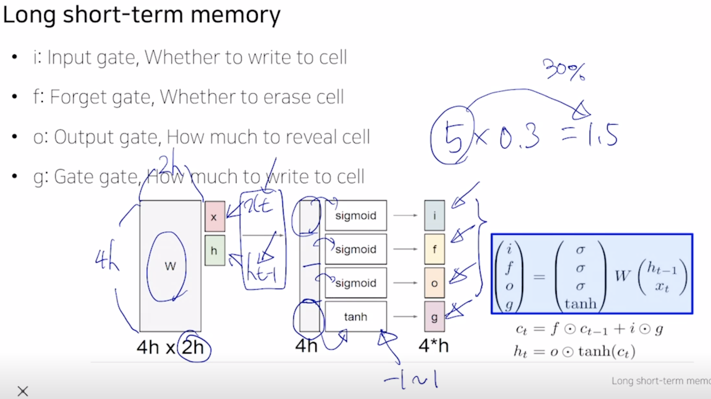

# day 017

## Recurrent Neural Network and Language Modeling
> 동일한 RNN 모델이 재귀적으로 매 타입스탭에 사용됨
- RNN에서의 hidden state vector가 다음 타임스탭에 쓰이며, 필요할 때는 출력값을 계산해주는데 사용

### Recurrent Neural Network
- fw(ht-1,xt)
    - 출력: ht
    - 최종 output yt는 ht를 통해 계산됨
    - output이 매 timestep마다 계산되는 경우도 있고, 마지막에만 계산되는 경우도 있다
    - RNN을 정의하는 parameter W는 모든 tiemstep에서 동일한 값을 공유한다

### Types of RNNs

- one-to-one
    - sequence data가 아닌 하나의 데이터
- one-to-many
    - image caption
    - 단일한 입력으로 여러 타임스탭에는 0으로 채워진 vector가 들어감
- Many-to-one
    - sentiment classification
- Many to Many
    - Sequence to sequence
    - machine translation
    - 다른 many to many
    - video classification on frame level

### Character-level Language Model
> Lanugage model task는 주어진 문자열을 input으로 다음 단어를 맞추는 것
- word-level, character-level 둘 다 수행가능
    1. hello에서
    2. 사전 구축 [h,e,l,o] -> 개수에 맞는 one hot vector로 나타냄
    

- rnn으로 다음날 주식 가격 예측 가능
- 단어뿐아니라 문단에서도 활용 가능
- c언어 제조

### Backpropagation through time (BPTT)
> Forward through entier sequence to compute loss, then backward through entier sequence to compute gradient
> Run foward and backward through chunks of the sequence instead of whole sequence
> Carry hidden states forward in time forever, but only backpropagate for some smaller number of steps

- Wxh, Whh, Why가 학습됨
- 한번에 다 처리할 수 없으로, 제한된 sequence로 truncate해서 계산

### Searching for Interpretable Cells
- 필요한 지식을 어떻게 배울 수 있는지 분석
    - 매 타입스탭마다 업데이트를 수행하는 hidden state에 저장
        - hidden state의 몇차원에 해당 정보가 저장되 있는지 각자 고정하며 확인가능

### Vanishing/Exploding Gradient Problem in RNN
- 앞에서본 예제들은 vanilla RNN의 결과가 아닌 더 진보된 RNN을 사용한 결과임
    - 반복적으로 whh가 곱해지면서, vanishing/exploding이 됨

## (4강) LSTM and GRU
> Vanilla RNN보다 좀 더 진보된 구조

### Long Short-Term Memory (LSTM)
- gradient vanishing/exploding문제 해결, timestep이 먼 경우 정보를 가져올 수 있음
- 단기 기억을 보다 길게 기억할 수 있는 모델
- 전 타임에서 두 가지 vector가 넘어옴
    - Ct
        - 노출할 정보만 남긴 필터링된 정보를 갖고 있는 벡터
    - ht = fw(wt, ht-1)
        - 예측값에 직접으로 필요한 정보를 담고 있음
    - {Ct,ht} = LSTM(xt,Ct-1,ht-1)

- A gate exists for controlling how much information could flow from cell state

### Gated Recurrent Unit (GRU)
- LSTM을 경량화하여 좀 더 빠르게 연산 가능하게
- cell state vector와 hidden state vector에서 hidden state만 존재

### Backpropagation in LSTM?GRU
- 정보를 담는 cell state가 업데이트 되는 방식이 기존의 Whh가 계속 곱해지는 연산이 아닌, 다른 값인 forget gate값을 곱하고, 필요로 하는 정보를 덧셈을 통해 만드는 것으로 vanishing gradient가 사라짐

## 피어세션
다들 준비한 발표를 진행하고, 시간상 못한 발표는 다음날 진행하기로 했다

## 과제 및 느낀점
- 과제 내용의 빈칸 넣는 문제는 어렵지 않는 것 같다. 하지만, skeleton code없이 구현을 해야 한다면.. 많은 연습이 필요할 것 같다.
    - 의문점은 사실 웹 개발에서도 어느 정도 시작점과 가이드라인이 존재하는데.. 실제 AI관련 구현에 있어서는.. 수식을 이해하고 맨땅에 시작을 하는 것인지 궁금하다 (과거 인턴십에서 실제 라이브러리를 사용하지않고 vanillaJS로 구현한적이 있는데.. 그 분야는 수식보다는 아이디어를 구현하는 것이었지만.. 수식구현이 얼마나 흥미가 생길지 모르겠다)
    - '사실 프로덕트를 만들 때 이런게 필요할 것 같다'에서 시작해서 필요한 수식 및 논문을 구현한다면 재미가 있을 것 같긴 하다.
- AI엔지니어의 역할에 대한 고민이 조금 생긴다. 논문을 구현하고 튜닝하는 일은 석사이상 또는 AI공부에 상당한 도를 튼 수준에서 할 수 있는 것 같다. 그 말은.. 그 외의 엔지니어는 프런트/백엔드 개발 능력이 필요한데.. 지금의 교육이 AI 개발을 tool로서 사용하여 웹 개발에 접목시키는 엔지니어를 양성하는 것이 목표인지.. 아니면 석사레밸이상의 능력을 갖춘 인재를 선별하는 것인지.. 잘 모르겠다. 일단 고민은 되지만.. 공부나 하자는게 결론이다.