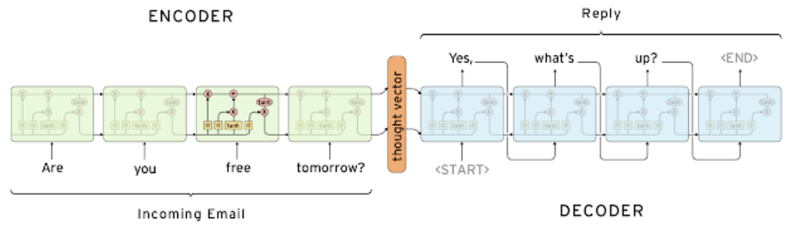
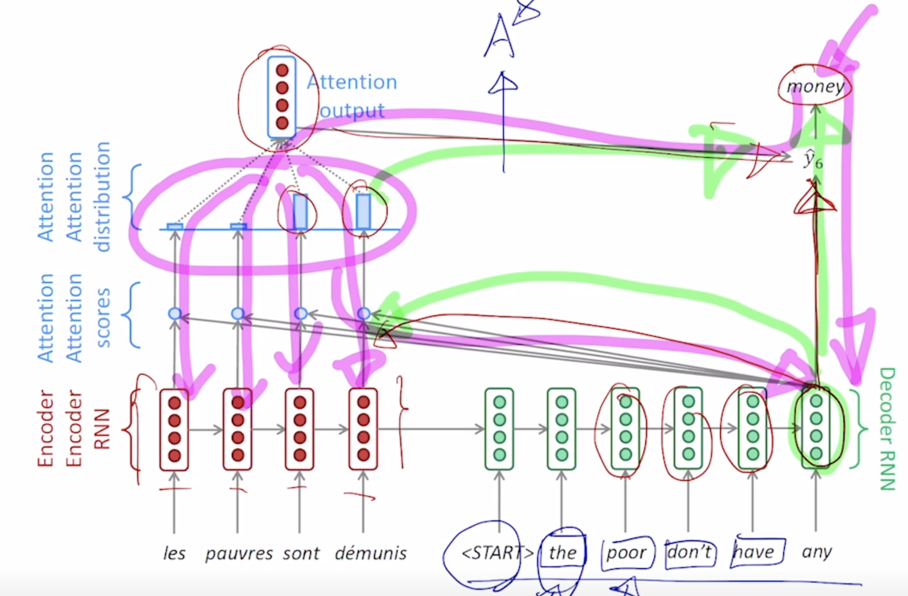

# day 018

## Seq2Seq
> RNN 구조의 many to many에 해당

- It takes a sequence of words as input and gives a sequence of words as output
- It composed of an encoder and a decoder
    - 입력문장을 읽는 RNN
        - LSTM 모델 채용
    - 출력문장 생성하는 RNN
    - 둘 다 parameters를 공유하지 않음
- Encoder의 마지막 hidden state는 decoder의 h_0로서 입력으로 들어감
    - 문장을 생성하는 task에서 첫 단어로 SOS token라는 특수한 word를 넣어줌
    - 언제까지 단어를 생성할지는 EOS token라는 특수한 word가 나올때까지
- rnn의 특성상 hidden state의 dimension이 정해져있다
    - 마지막 time step의 hidden state에, 고정된 크기의 hidden state에 앞의 내용을 우겨넣어야함
        - 멀리 있는정보는 변질 및 손실 가능
    - ex) I go home을 번역할 때, I라는 주어가 상대적으로 먼저 나왔지만 초반정보가 손실 될 수 있음
        - 해결책으로 순서를 뒤집어서하는 방법 제안
### Seq2Seq Model with Attention
> Use the attention distribution to take a weighted sum of the encoder hidden states
> The attention output mostly contains information the hidden states that received high attention
- 각 state에서 생성된 hidden_state vector를 전체적으로 decoder에 제공
    - decoder는 각 time step에서 필요한 정보를 선별적으로 가져가서 예측에 도움을 주는 형태로 활용
- attention의 입력으로는 decoder의 hidden state vector 하나와, encoder hidden state vector set
    - 출력: 가중 평균 된 vector 값
- decoder hidden state vector와 attention output과 concanate되서 특정 time step에서의 예측값을 뽑아냄
- decoder의 한 hidden state값과 encoder의 hidden state들의 값의 내적을 구해 유사도를 구하는 것

- teacher forcing:초기 학습에는 ground truth값을 넣어줌

### Different Attention Mechanism
- Luong attention
    - 단순히 내적만 사용한 것을, 안에 weight를(항등행렬을 넣듯) 추가시켜 학습가능한 형태로 변형
    - concat 기반의 attention 추가
        - Wa를 적용하고, 

### Attention is Great!
- Attention significantly improves NMT performance
    - It is useful to allow the decoder to focus on particular parts of the source
- Attention solves the bottleneck problem(information bottleneck)
    - Attention allows the decoder to look directly at source; bypass the bottleneck

## Master class
### 교수님께서 세부 연구분야를 선정하실 때 어떻게 결정하셨는지 스토리가 궁금합니다. P stage에서 nlp, vision 등 하위태스크를 결정해야하는데 이때 참고할 만한 팁이 있을까요?
- 본인 밑 학생 60~70%(CV) 25%(NLP)
    - 비전쪽이 좀 더 연구하기 친숙함 (접근성이 좋음)
- job search에서는 좀 더 전략적으로 접근 필요
    - NLP수요가 적지는 않음
        - 하는사람이 적은 만큼.. 기회가 많을수도 있다
    - CV쪽도 수요가 많음..
        - 쉬운만큼 하는 사람이 많다
### 신입 AI 개발자에게 요구하는 역량은 어느정도라고 생각하시나요? 혹은 이정도는 알고 취업을 하는게 좋겠다 라는 정도의 기준이 있나요?
- CS 기초지식이 많이 요구됨
    - 코테는 패스해라
- 실제 산업에서는 앞뒤 파이프라인 개발 기술이 중요함

### 많은 NLP 데이터를 구할 때 인터넷이 방대한 자료의 소스가 될 것 같은데, 웹의 여러 텍스트 데이터를 크롤링 하는 것도 현업에서 많이 쓰이나요? 크롤링이 산업 현장에서 NLP 딥러닝 엔지니어에게 유효한 기술 스택인지 궁금합니다.
- 필요한 기술스택임
    - 별로 어렵지 않음

### AI를 공부하다 보면, 신기하면서도 한편으로는 직관적으로 와닿지 않아 답답한 느낌이 있습니다. 교수님께서는 이 부분을 받아들이고 넘어가시나요? 이런 점들 때문에 공부를 지속하기 힘들어 지쳐가는데요, 딥러닝 분야를 공부하면서 계속해서 연구할 수 있게 하는 본인만의 원동력이 있으신가요?
- 맘맞는 사람과 함께 공부하기

### 채용공고 기준으로 CV분야를 더 많이 찾아볼 수 있는데, 시장에서 NLP의 실제 수요는 어떨까요?  AI 엔지니어로서 NLP분야의 서비스를 구현하는데 있어서 무엇을 공부하고, 어떤 함정들을 조심해야할까요? (언어학적 지식이나, 데이터 활용의 윤리적 문제 등)
- job search에는 NLP쪽이 더 유리한듯
- 외부적으로 내세울만한 실적이 있는지.. (공부만 하고 잘하면 좋지만.. 보여줄만한게 있어야함)

### 저는 프론트엔드에 관심이 많습니다. AI와 백엔드와의 결합은 쉽게 떠오르는데 프론트엔드 단에서의 AI 기술 결합은 어떤게 존재할지 궁금합니다. 또한 이러한 분야를 공부하기 위해서는 어떤 부분을 추가적으로 살펴봐야 할까요?
- 깊은 AI에 공부보다는 사용자 측면에서 생각을 많이 해보는게 좋음

### 대학원을 가는 목적이 연구가 아닌 취업이 목적이라면 어떻게 생각하시나요? 취업을 위해서 석사 학위가 필요한 경우가 많다고 생각해서 석사까지 하고 취업할 생각을 하고 있는데, 교수님의 의견이 궁금합니다
- 현재는 AI, DL수업이 대학원수업에 포진되어 있음

### 깊은 이해
- 쉽게 설명할 수 있을정도!