# day 21

## 그래프 이론 기초 & 그래프 패턴

### 그래프란 무엇일까?
- 그래프는 정점 집함과 간선 집합으로 이루어진 수학적 구조입니다.
- 간선: 두 개의 정점을 연결
    - 모든 정점 쌍이 반드시 간선으로 직접 연결되는 것은 아닙니다
- 그래프는 네트워크로도 불림
- 정점(vertex)은 노드(node), 간선은 edge or link

### 그래프가 왜 중요할까?
> 우리 주변에는 많은 복잡계(complex system)가 있습니다
- 사회는 70억 인구로 구성된 복잡계입니다
- 통신 시스템은 전자 장치로 구성된 복잡계입니다.
- 그 밖에도, 정보와 지식 뇌, 신체 역시 복잡계로 생각할 수 있습니다
- Q:이런 복잡계가 가진 공통적인 특성은 무엇일까요?
- A:구성 요소간의 복잡한 상호작용
- Q: 이런 복잡계를 어떻게 표현할까요?
- A: Graph
    - 그래프는 복잡계를 효과적으로 표현하고 분석하기 위한 언어
- 전자상거래: 구매내역이 있으면 사용자와 물품과 연결하여 내역 표현
- 인터넷, 웹페이지간 하이퍼링크, 위키페디아, 뇌(뉴런 간 연결), 지식 그래프, 화학 분자, 단백질 상호작용, 세포간 유사도 그래프, 이미지 분해

- 그래프는 복잡계를 효과적으로 표현하고 분석하기 위한 언어입니다
- 복잡계는 구성 요소들 간의 상호작용으로 이루어집니다 상호작용을 표현하기 위한 수단으로 그래프가 널리 사용됩니다
- 복잡계를 이해하고, 복잡계에 대한 정확한 예측을 하기 위해서는 복잡계 이면에 있는 그래프에 대한 이해가 반드시 필요합니다
- 그래프를 공부함으로써 복잡계가 등장하는 수많은 분야에 활용할 수 있습니다 전산학, 물리학, 생물학, 화학, 사회과학 등이 그 예시입니다

### 그래프 관련 인공지능 문제
> 정점 분류(Node Classification) 문제: 정점의 유형을 추측하는 문제
- 트위터에서의 공유(Retweet) 관계를 분석하여, 각 사용자의 정치적 성향을 알 수 있을까?
    - 보수적 <-> 진보적
    - 같은 성향끼리의 사람들이 글을 공유
- 단백질의 상호작용을 분석하여 단백질의 역할을 알아낼 수 있을까?
    - 단백질의 상호작용 확인을 통한 단백질의 역할분류
> 연결 예측(Link Prediction) 문제
- 페이스북 소셜네트워크는 어떻게 진화할까?
    - 점점 더 증가할까? 아닐까?
> 추천(Recommendation) 문제: 미시적 관점의 연결 예측 문제는, 앞으로 어떤점과 연결될지 예측
- 각자에게 필요한 물건은 무엇일까? 어떤 물건을 구매해야 만족도가 높을까?
> 군집 분석(Community Detection) 문제: 서로 밀접하게 연결된 접점들의 집합(군집) - 군집들은 의미있는 구조를 나타내는 경우가 많음
- 연결 관계로부터 사회적 무리(Social Circle)을 찾아낼 수 있을까?
- 빽빽하게 연결된 정점중에 군집을 자동으로 찾아내는 알고리즘
> 랭킹(Ranking) 및 정보 검색(Information Retrieval) 문제
- 웹(Web)이라는 거대한 그래프로부터 어떻게 중요한 웹페이지를 찾아낼 수 있을까?
    - 웹을 거대한 그래프를 표현하고, 서로 관련성 있는 웹페이지들을 찾음
> 정보 전파(Information Cascading) 및 바이럴 마케팅(Viral Marketing) 문제
- 정보는 네트워크를 통해 어떻게 전달될까? 어떻게 정보 전달을 최대화 할 수 있을까?
    - SNS를 통해 어떻게 광고주가 광고를 잘?

### 그래프의 유형 및 분류
> 방향이 없는 그래프(Undirected Graph) vs 방향이 있는 그래프(Directed Graph)
- 간선에 방향이 없는 그래프
    - 협업 관계 그래프
    - 페이스북 친구 그래프
- 간선에 방향이 있는 그래프 
    - 인용 그래프 (인용을 하거나 받는 것)
    - 트위터 팔로우 그래프 (Twice 계정을 follow, 하지만 twice는 팔로우 안함ㅠ)
> 가중치가 없는 그래프(Unweighted Graph) vs 가중치가 있는 그래프(Weighted Graph)
- 간선에 가중치가 없는 그래프 
    - 웹 그래프
    - 페이스북 친구 그래프 (이 두사람이 얼마나 많은 상호작용을 했냐를 분류하면 가중치 부여)
- 간선에 가중치가 있는 그래프 
    - 전화 그래프 (전화를 많이 할 경우 친밀도 표시 가능)
    - 유사도 그래프
> 동종 그래프(Unpartite Graph) vs 이종  그래프(Bipartite Graph)
- 동종 그래프는 단일 종류의 정점을 가집니다
    - 웹 그래프
    - 페이스북 친구 그래프
- 이종 그래프는 두 종류의 정점을 가집니다 다른 종류의 정점사이에만 간선이 연결됩니다 
    - 전자 상거래 구매내역 (사용자, 상품)
    - 영화 출연 그래프 (배우, 영화)
- Q. 다음 전자 상거래 구매 내역은 어떤 유형의 그래프일까요?
    - A. 방향성이 없고, 가중치가 있는 이종 그래프입니다
        - 방향성을 부여할 수 있지만, 연결관계중 사용자가 사는 관계인게 명확하여 굳이.. 방향을 갖을 필요가 없음
### 그래프 관련 필수 기초 개념
> 그래프(Graph)는 정점 집합과 간선 집합으로 이루어진 수학적 구조입니다
- 보통 정점들의 집합을 𝑽, 간선들의 집합을 𝑬, 그래프를 𝑮 = (𝑽, 𝑬)로 적습니다
> 정점의 이웃(Neighbor)은 그 정점과 연결된 다른 정점을 의미합니다 
- 정점 𝑣의이웃들의집합을보통𝑵(𝒗) 혹은𝑵𝒗로적습니다
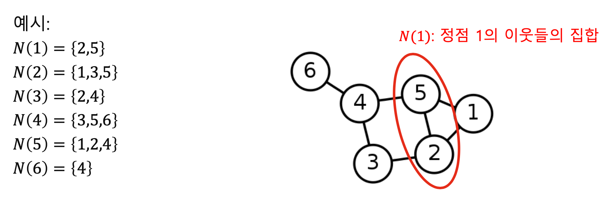
> 방향성이 있는 그래프에서는 나가는 이웃과 들어오는 이웃을 구분합니다
- 정점 v에서 간선이 나가는 이웃(Out-Neighbor)의 집합을 보통 Nout(v)
- 정점 v로 간선이 들어오는 이웃(In-Neighbor)의 집합을 보통 Nin(v)로 적습니다
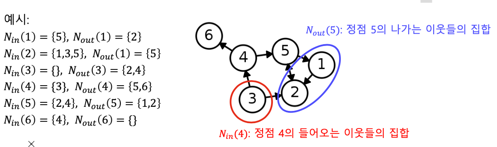

### 파이썬 라이브러리 NetworkX 소개
> 본 수업에서는 그래프를 다루기 위해 파이썬 라이브러리인 NetworkX를 사용합니다. 
- NetworkX를 이용하여, 그래프를 생성, 변경, 시각화할 수 있습니다. 
- 그래프의 구조와 변화 역시 살펴볼 수 있습니다 
    - 속도가 느리지만 사용이 편리
- 본 수업에서는 사용하지 않지만, Snap.py 라는 라이브러리도 많이 사용됩니다
    - 사용하기 조금 불편하지만, 속도가 빠르다
### 그래프의 표현 및 저장
> 간선 리스트(Edge List): 그래프를 간선들의 리스트로 저장
- 각 간선은 해당 간선이 연결하는 두 정점들의 순서쌍(Pair)으로 저장됩니다
> 간선 리스트(Edge List): 그래프를 간선들의 리스트로 저장
- 방향성이 있는 경우에는 (출발점, 도착점) 순서로 저장됩니다
    - 사용할 때 좀 비효율적(리스트를 순회해야하기 때문에)
> 인접 리스트(Adjacent list) – 방향성이 없는 경우
- 각 정점의 이웃들을 리스트로 저장
> 인접 리스트(Adjacent list) – 방향성이 있는 경우
- 각 정점의 나가는 이웃들과 들어오는 이웃들을 각각 리스트로 저장
    - 상대적으로 효율적(처음부터 다 읽을 필요 없고, 필요한 index에서 확인 가능)
> 인접 행렬(Adjacency Matrix) – 방향성이 없는 경우
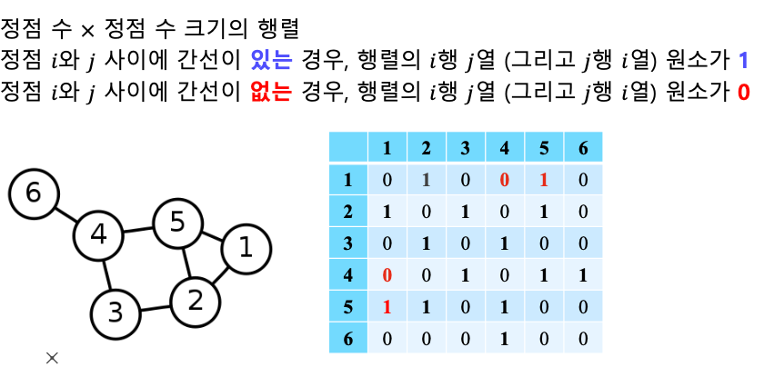
> 인접 행렬(Adjacency Matrix) – 방향성이 없는 경우
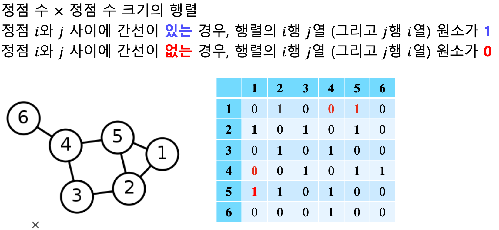
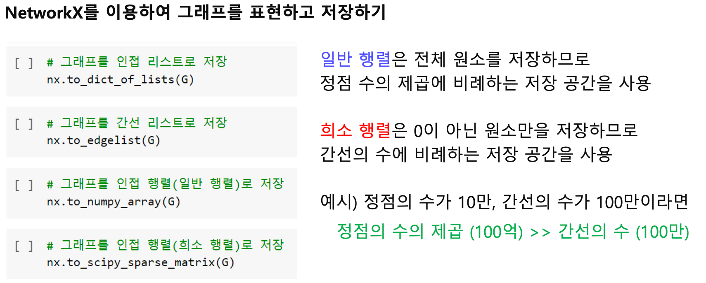
- 대부분 0이 아닐경우, sparse가 regular보다 더 빠름

## [Graph 2강] 실제 그래프는 어떻게 생겼을까?
### 1. 실제 그래프 vs. 랜덤 그래프
> 실제 그래프(Real Graph)란 다양한 복잡계로 부터 얻어진 그래프를 의미합니다
- 소셜 네트워크, 전자상거래 구매 내역, 인터넷, 웹, 뇌, 단백질 상호작용, 지식 그래프 등
> 랜덤 그래프(Random Graph)는 확률적 과정을 통해 생성한 그래프를 의미합니다
- 본 수업에서는 에르되스(Erdős)와 레니(Rényi)가 제안한 랜덤 그래프 모델을 사용합니다
> 에르되스-레니 랜덤 그래프(Erdős-Rényi Random Graph)
- 임의의 두 정점 사이에 간선이 존재하는지 여부는 동일한 확률 분포에 의해 결정됩니다
- 에르되스-레니 랜덤그래프 𝐺(𝑛, 𝑝)는
    - 𝑛개의 정점을 가집니다
    - 임의의 두 개의 정점 사이에 간선이 존재할 확률은 𝑝입니다 
    - 정점 간의 연결은 서로 독립적(Independent)입니다
        - 1,2가 연결된 것은 1,3이 연결될 확률에 영향을 주지 않는다
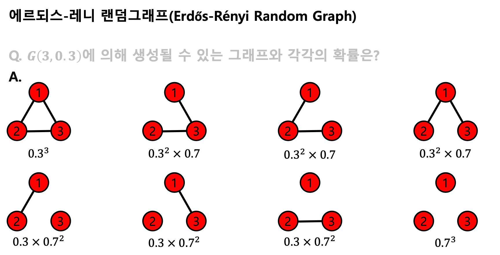
### 작은세상 효과
### 필수 개념: 경로, 거리 및 지름
> 정점 𝑢와 𝑣의 사이의 경로(Path)는 아래 조건을 만족하는 정점들의 순열(Sequence)입니다 
    - (1) 𝑢에서 시작해서 𝑣에서 끝나야 합니다
    - (2) 순열에서 연속된 정점은 간선으로 연결되어 있어야 합니다
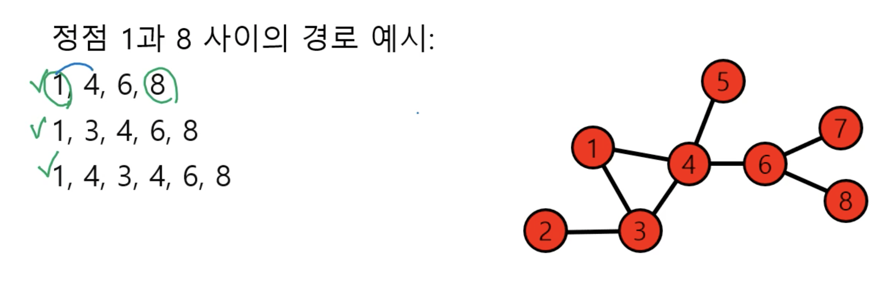
- 마지막 경로는 4번이 두 번 등장하지만, 조건만 만족하면 경로임
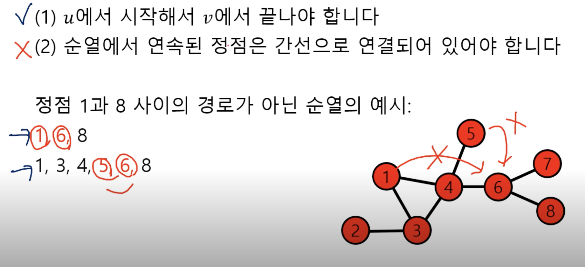
> 경로의 길이는 해당 경로 상에 놓이는 간선의 수로 정의됩니다
- 경로 1, 4, 6, 8의 길이는 3 입니다 
- 경로 1, 3, 4, 6, 8의 길이는 4 입니다 
- 경로 1, 4, 3, 4, 6, 8의 길이는 5 입니다
    - 순열의서 정의된 정점의 길이보다 하나 적음
> 정점 𝑢와 𝑣의 사이의 거리(Distance)는 𝑢와 𝑣 사이의 최단 경로의 길이입니다 예시:
- 정점 1과 8 사이의 최단 경로(Shortest Path)는 1, 4, 6, 8 입니다 
    - 해당 경로의 길이는 3 입니다
    - 따라서 정점 1과 8 사이의 거리는 3 입니다
> 그래프의 지름(Diameter)은 정점 간 거리의 최댓값입니다 
- 예시 그래프에서의 지름은 4 입니다
- 이는 정점 2와 8 사이의 최단 경로의 거리와 같습니다
> 임의의 두 사람을 골랐을 때, 몇 단계의 지인을 거쳐 연결되어 있을까?
- 여섯 단계 분리(Six Degrees of Separataion) 실험
    - 사회학자 스탠리 밀그램(Stanley Milgram)에 의해 1960년대에 수행된 실험입니다 - 오마하 (네브라스카 주)와 위치타 (켄사스 주)에서 500명의 사람을 뽑았습니다
    - 그들에게 보스턴에 있는 한 사람에게 편지를 전달하게끔 하였습니다
    - 단, 지인를 통해서만 전달하게끔 하였습니다
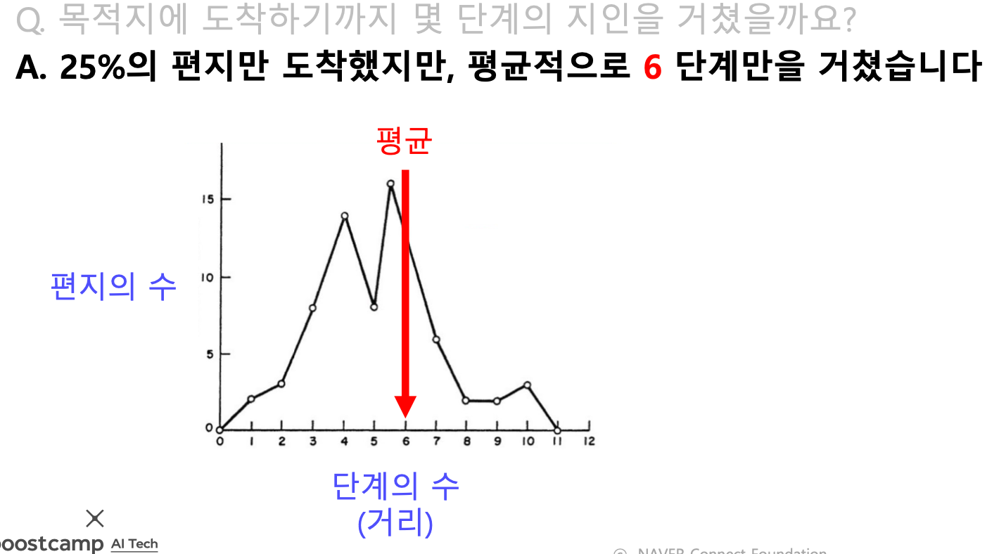
- Q. MSN 메신저 그래프에서는 어떨까요?
- A. 정점 간의 평균 거리는 7 정도 밖에 되지 않습니다
- 단, 거대 연결 구조만 고려했습니다. 거대 연결 구조는 뒤에서 설명합니다
> 이러한 현상을 작은 세상 효과(Small-world Effect)라고 부릅니다: 실제 그래프의 이미의 정점들의 사이가 적다는 사실
- 한국에서는 “사돈의 팔촌”이 먼 관계를 나타내는 표현으로 사용됩니다 
- 즉, 아무리 먼 관계도 결국은 사돈의 팔촌(10촌 관계)입니다
> 작은 세상 효과는 높은 확률로 랜덤 그래프에도 존재합니다
- 모든 사람이 100명의 지인이 있다고 가정해봅시다
- 다섯 단계를 거치면 최대 100억(= 1005)명의 사람과 연결될 수 있습니다
- 단, 실제로는 지인의 중복 때문에 100억 명보다는 적은 사람일 겁니다 하지만 여전히 많은 사람과 연결될 가능성이 높습니다
> 하지만 모든 그래프에서 작은 세상 효과가 존재하는 것은 아닙니다
- 체인(Chain), 사이클(Cycle), 격자(Grid) 그래프에서는 작은 세상 효과가 존재하지 않습니다
    - 서로 거리가 먼 정점이 존재
### 필수 개념: 연결성
> 정점의 연결성(Degree)은 그 정점과 연결된 간선의 수를 의미합니다
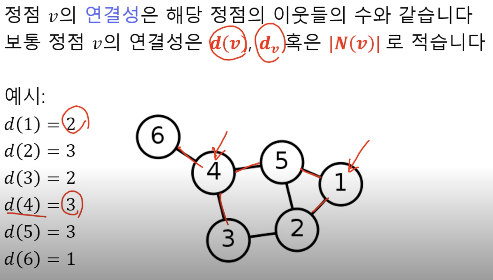
- 방향이 있는 경우 나가는 연결성, 들어오는 연결성을 따로 센다

### 연결성의 두터운 꼬리 분표
> 실제 그래프의 연결성 분포는 두터운 꼬리(Heavy Tail)를 갖습니다 
- 즉, 연결성이 매우 높은 허브(Hub) 정점이 존재함을 의미합니다
> 랜덤 그래프의 연결성 분포는 높은 확률로 정규 분포와 유사합니다
- 이 경우, 연결성이 매우 높은 허브(Hub) 정점이 존재할 가능성은 0에 가깝습니다
- 정규 분포와 유사한 예시로는 키의 분포가 있습니다
- 키가 10 미터를 넘는 극단적인 예외는 존재하지 않습니다
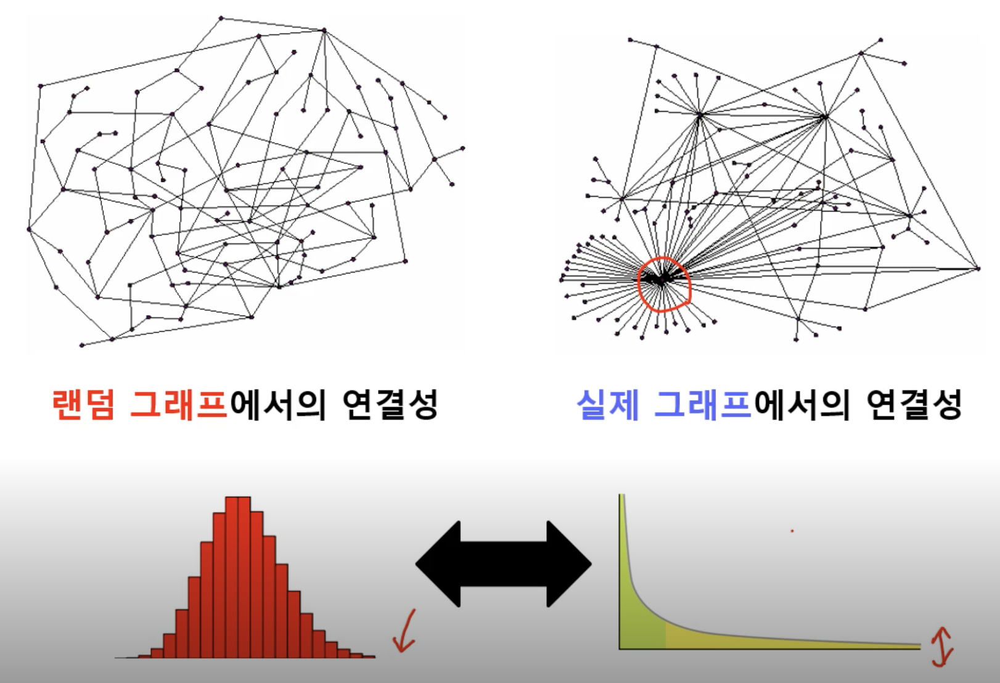
- 랜덤: 두터운 꼬리가 없는듯
- 실제: 두터운 꼬리 존재

### 연결 요소
> 연결 요소(Connected Component)는 다음 조건들을 만족하는 정점들의 집합을 의미합니다 
- (1) 연결 요소에 속하는 정점들은 경로로 연결될 수 있습니다
- (2) (1)의 조건을 만족하면서 정점을 추가할 수 없습니다

### 거대 연결 요소
> 실제 그래프에는 거대 연결 요소(Giant Connected Component)가 존재합니다 
- 거대 연결 요소는 대다수의 정점을 포함합니다
- MSN 메신저 그래프에는 99.9%의 정점이 하나의 거대 연결 요소에 포함됩니다
> 랜덤 그래프에도 높은 확률로 거대 연결 요소(Giant Connected Component)가 존재합니다 
- 단, 정점들의 평균 연결성이 1보다 충분히 커야 합니다
- 자세한 이유는 Random Graph Theory를 참고하시기 바랍니다
    - 평균 연결성이 3일 때, 거대 연결 요소가 대부분의 정점을 포함

### 군집
> 군집(Community)이란 다음 조건들을 만족하는 정점들의 집합입니다 
- (1) 집합에 속하는 정점 사이에는 많은 간선이 존재합니다
- (2) 집합에 속하는 정점과 그렇지 않은 정점 사이에는 적은 수의 간선이 존재합니다 수학적으로 엄밀한 정의는 아닙니다
- 예시 그래프에는 11 개의 군집이 있는 것으로 보입니다

### 지역접 군집 계수
> 지역적 군집 계수(Local Clustering Coefficient)는 한 정점에서 군집의 형성 정도를 측정합니다 
- 이웃상 사이의 간선이 증가할수록 지역적 군집 계수가 증가
- 이웃상 사이의 간선이 줄어들수록 지역적 군집 계수가 감소
- 참고로 연결성이 0인 정점에서는 지역적 군집 계수가 정의되지 않습니다

> 잠깐, 지역적 군집 계수가 군집이랑 어떻게 연결되는 것이죠?
- 정점 𝑖의 지역적 군집 계수가 매우 높다고 합시다
- 즉, 정점 𝑖의 이웃들도 높은 확률로 서로 간선으로 연결되어 있습니다 
- 정점 𝑖와 그 이웃들은 높은 확률로 군집을 형성합니다

> 전역 군집 계수(Global Clustering Coefficient)는 전체 그래프에서 군집의 형성 정도를 측정합니다
- 그래프 𝐺의 전역 군집 계수는 각 정점에서의 지역적 군집 계수의 평균입니다 
- 단, 지역적 군집 계수가 정의되지 않는 정점은 제외합니다

> 실제 그래프에서는 군집 계수가 높습니다. 
- 즉 많은 군집이 존재합니다 여러가지 이유가 있을 수 있습니다
- 동질성(Homophily): 서로 유사한 정점끼리 간선으로 연결될 가능성이 높습니다 같은 동네에 사는 같은 나이의 아이들이 친구가 되는 경우가 그 예시입니다
- 전이성(Transitivity): 공통 이웃이 있는 경우, 공통 이웃이 매개 역할을 해줄 수 있습니다 친구를 서로에게 소개해주는 경우가 그 예시입니다

> 반면 랜덤 그래프에서는 지역적 혹은 전역 군집 계수가 높지 않습니다
- 구체적으로 랜덤 그래프 𝐺(𝑛, 𝑝)에서의 군집 계수는 𝑝입니다
- 랜덤 그래프에서의 간선 연결이 독립적인 것을 고려하면 당연한 결과입니다 
- 즉 공통 이웃의 존재 여부가 간선 연결 확률에 영향을 미치지 않습니다
    - 전이성 동질성이 없기 때문에 군집을 형성할 확률이 낮음

- 모두 나타나는 현상(실제그래프,랜덤그래퍼): 작은세상효과, 거대연결요소
- 실제그래프: 연결성의 두터운 꼬리 분포, 군집 구조

## 피어세션
팀원분들이 각각 캐글팁을 공유해주었습니다. 각자 중요하게 보면 접근했던 방향이 달랐고, 과제 중 단순히 파라미터 변경이 아닌 주로 봐야하는 코드에 대해 알게 되었습니다.(추후 실제 업무투입 관점) 그리고 팀원 중 1등하신분이 계셔서 또 많은 것을 배울 수 있었습니다. (+ 새로운 모델의 적용 및 코드분석)

## 회고
오늘 수업은 그래프이론이나와서 뭔가 다르지만 친숙한 느낌이 들어좋았습니다. 상대적으로 아는 이론이 나온만큼 안주하지않고 자신이 부족하다고 생각하는 부분을 더 공부해야겠습니다!