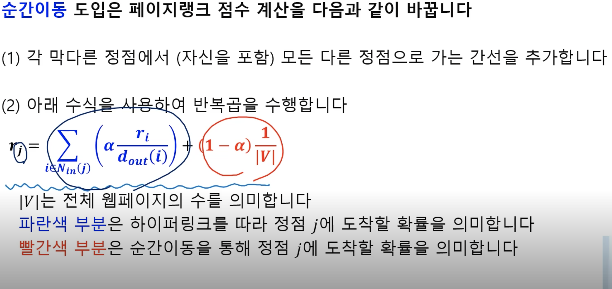

# day 22

## 검색 엔진에서는 그래프를 어떻게 활용할까?

### 웹과 그래프
> 웹은 웹페이지와 하이퍼링크로 구성된 거대한 방향성 있는 그래프입니다
- 웹페이지는 정점에 해당합니다
- 웹페이지가 포함하는 하이퍼링크는 해당 웹페이지에서 나가는 간선에 해당합니다
- 단,웹페이지는 추가적으로 키워드 정보를 포함하고 있습니다

### 검색엔진
- 초기에는 디렉토리 구조러 정리
    - 카테고리가 및 깊이가 증가하며 어려움이 생김
- 두번째 시도는 웹페이지에 포함된 키워드에 의존한 검색 엔진
    - 악의적인 웹페이지에 취약
> Q.사용자 키워드와 관련성이 높고 신뢰할 수 있는 웹페이지를 어떻게 찾을 수 있을까요?
- 구글의 창업자인 래리 페이지(LarryPage)와 세르게이 브린(SergeyBrin)은 ThePageRankCitation
Ranking:BringingOrdertotheWeb라는 제목의 논문을 통해 이 질문에 답합니다
당시 둘은 스탠포드 대학의 박사과정 학생이었습니다

### 페이지 랭크의 정의 (투표관점)
> 페이지랭크의 핵심 아이디어는 투표입니다
> 즉,투표를 통해 사용자 키워드와 관련성이 높고 신뢰할 수 있는 웹페이지를 찾습니다
- 투포의 주체는 웹페이지
- 웹페이는 하이퍼링크를 통해 투표
- 들어오는 간선이 많을 수록 신뢰할 수 있다는 점
- Q.그런데 들어오는 간선의 수를 세는 것만으로 충분할까요?
    - A.아닙니다.악용될 소지가 있습니다
    - 웹페이지를 여러 개 만들어서 간선의 수를 부풀릴 수 있습니다 즉, 관련성과 신뢰도가 높아 보이도록 조작할 수 있습니다
    - 악용을 줄이기 위해, 가중 투표를 부여 (신뢰할 수 있는 웹사이트를 좀 더 가중치)

### 2페이지랭크의 정의:임의 보행 관점

### 페이지랭크의 계산: 반복곱

- 점수를 갱신하기전의 pagerank 점수의 베겉와 점수를 갱신한 후의 pagerank의 점수가 같을 때가지

### 문제점과 해결책?
- 수렴하지 않을경우?
    - 스파이더 트랩: 들어오는 간선은 있지만, 나가는 간선이 없는 경우
- 반복곱이 합리적인 점수로 수렴을 보장?
    - Dead End: 들어오는 간선은 잇지만, 나가는 간선은 없는
- 해결책 순간이동(teleport)

- 보통 0.8

## 그래프를 바이럴 마케팅에 어떻게 활용할까?
- 선형 임계치 모형: 주변 사람의 의사에 따라 결정
- 확률적 전파 모형
- 전파 최대화 문제: NP-hard (찾기 어려움)

    