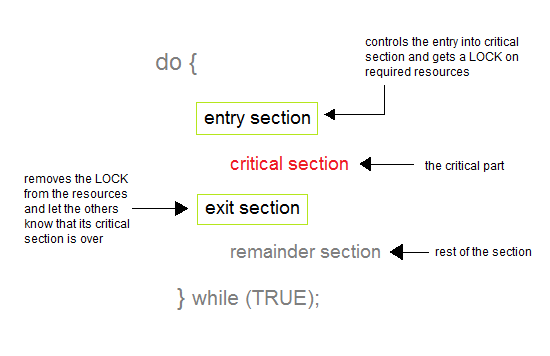

# Operating System

## 공부자료
[x] [studytonight_os](https://www.studytonight.com/operating-system/)

[] [Qualcomm대비_개인정리자료][https://docs.google.com/document/d/1Pdg4fWfAP8jZ4exJevQO4fwnQUGKxVZwhciTt6-ixcw/edit]

[] 연대수업자료 추가(시간이 된다면, 개인필기노트까지 추가)

## OS
OS acts a manger of resources(processor, memory, files, I/O devices) and allocate them to specific programs and users, whenever necessary to perform.
- the interface between the user and the machine
- processor management, memory management, device management, stroage management, application, user interface

## Process
A prograim in execution
- program is written once. if it is executed, its a process(located in main memory)
- A process is an ‘active’ entity, as opposed to a program, which is considered to be a ‘passive’ entity.

Stack: contains the temporary data, such as function parameters, returns addresses, and local variables.
- temporary data, function, local variable, paramter
Heap Section: Dynamically allocated memory to process during its run time.
- dynamically allocated to process during run time
- ex) new, delete, malloc, free
Data Section: Contains the global variable.
- contains global variable, static variable
Text Section: A Process, sometimes known as the Text Section, also includes the current activity represented by the value of the Program Counter.
- contents of processors, regeisters, program counter

### Different process states
- new: The process is being created.
- ready: The process is waiting to be assigned to a processor.
- running: Instructions are being executed.
- blocked (or waiting): The process is waiting for some event (e.g., I/O completion) to occur.
- exit (or terminated): The process has finished execution.

waiting이라는 state는 ready와는 다르게 I/O나 다른 이벤트가 발생하기를 기다리는 것을 나타내는 상태

1. 프로세스가 실행 중 로그인이 필요(I/O)
2. 입력을 기다리면서(I/O 발생 기다림) 다른 프로세스를 돌림 (running -> wait)
3. 로그인 정보를 입력(I/O 발생) (wait -> ready)

### PCB(Process Control Block)
A process control block (PCB) is a data structure used by computer operating systems to store all the information about a process.

## Process Scheduling
The act of determining which process is in the ready state, and should be moved to the running state
- The prime aim of the process scheduling system is to keep the CPU busy

Non Pre-emptive Scheduling
- When the currently executing process gives up the CPU voluntarily.

Pre-emptive Scheduling
- When the operating system decides to favour another process, pre-empting the currently executing process.

### Scheduling Queues
A new process is initially put in the Ready queue. It waits in the ready queue until it is selected for execution(or dispatched). 
Once the process is assigned to the CPU and is executing, one of the following several events can occur:
1. The process could issue an I/O request, and then be placed in the I/O queue.
2. The process could create a new subprocess and wait for its termination.
3. The process could be removed forcibly from the CPU, as a result of an interrupt, and be put back in the ready queue.
In the first two cases, the process eventually switches from the waiting state to the ready state, and is then put back in the ready queue.

### Types of Schedulers
1. Long Term Scheduler (Job Scheduling)
 - runs less frequently 
 - decide which program must get into the job queue
 - to maintain a good degree of Multiprogramming
2. Short Term Scheduler (CPU Scheduling)
 - runs very frequently
 - to enhance CPU performance and increase process execution rate
3. Medium Term Scheduler 
 - removes the processes from memory
 - reduces the degree of multiprogramming
 - swapping

### Context Switching
The process of saving the context of one process and loading the context of another process is known as Context Switching. In simple terms, it is like loading and unloading the process from running state to ready state.
- When a context switch occurs, the Kernel saves the context of the old process in its PCB and loads the saved context of the new process scheduled to run.

When does context switching happen?
1. When a high-priority process comes to ready state (i.e. with higher priority than the running process)
2. An Interrupt occurs
3. User and kernel-mode switch (It is not necessary though)
4. Preemptive CPU scheduling used.

### Process Creation
parent process can create child process
- wait for the child process to terminate before proceeding

### Process Termination
By making the exit(system call), typically returning an int, processes may request their own termination

The processes which are trying to terminate but cannot do so because their parent is not waiting for them are termed zombies. 
- These are eventually inherited by init as orphans and killed off.

## CPU Scheduling
A process which allows one process to use the CPU while the execution of another process is on hold(in waiting state) due to unavailability of any resource like I/O etc, thereby making full use of CPU
- The dispatcher is the module that gives control of the CPU to the process selected by the short-term scheduler

### Types of CPU scheduling
1. When a process switches from the running state to the waiting state(for I/O request or invocation of wait for the termination of one of the child processes).
2. When a process switches from the running state to the ready state (for example, when an interrupt occurs).
3. When a process switches from the waiting state to the ready state(for example, completion of I/O).
4. When a process terminates.
When Scheduling takes place only under circumstances 1 and 4, we say the scheduling scheme is **non-preemptive**; otherwise the scheduling scheme is **preemptive**.
Non-Preemptive Scheduling
- once the CPU has been allocated to a process, the process keeps the CPU until it releases the CPU either by terminating or by switching to the waiting state
Preemptive Scheduling
- the running task is interrupted for some time and resumed later when the priority task has finished its execution.

## Scheduling Algorithms
to achieve maximum CPU utilisation

### First Come First Serve Scheduling
just like FIFO(First in First out) Queue data structure, where the data element which is added to the queue first, is the one who leaves the queue first.
- It is Non Pre-emptive algorithm, which means the process priority doesn't matter.
- If a process with very least priority is being executed, more like daily routine backup process, which takes more time, and all of a sudden some other high priority process arrives, like interrupt to avoid system crash, the high priority process will have to wait, and hence in this case, the system will crash, just because of improper process scheduling.

### Shortest Job First(SJF) Scheduling
works on the process with the shortest burst time or duration first.
- This is the best approach to minimize waiting time.
- the burst time/duration time of the processes should be known to the processor in advance, which is practically not feasible all the time.

Non-preemptive
- If the arrival time for processes are different, this leads to the problem of Starvation, where a shorter process has to wait for a long time until the current longer process gets executed.

Preemptive
- The Pre-emptive SJF is also known as Shortest Remaining Time First, because at any given point of time, the job with the shortest remaining time is executed first.

Advantages
- According to the definition, short processes are executed first and then followed by longer processes.
- The throughput is increased because more processes can be executed in less amount of time.

Disadvantages
- The time taken by a process must be known by the CPU beforehand, which is not possible.
- Longer processes will have more waiting time, eventually they'll suffer starvation.

### Priority CPU Scheduling
Preemptive Priority Scheduling
- If the new process arrived at the ready queue has a higher priority than the currently running process, the CPU is preempted, which means the processing of the current process is stoped and the incoming new process with higher priority gets the CPU for its execution.

Non-Preemptive Priority Scheduling
- In case of non-preemptive priority scheduling algorithm if a new process arrives with a higher priority than the current running process, **the incoming process is put at the head of the ready queue**, which means after the execution of the current process it will be processed.

problem
- starvation

solution
- use the concept of aging where we keep on increasing the priority of low-priority process based on the its waiting time.

advantages
- The priority of a process can be selected based on memory requirement, time requirement or user preference. For example, a high end game will have better graphics, that means the process which updates the screen in a game will have higher priority so as to achieve better graphics performance.

disadvatages
- A second scheduling algorithm is required to schedule the processes which have same priority.
- In preemptive priority scheduling, a higher priority process can execute ahead of an already executing lower priority process. If lower priority process keeps waiting for higher priority processes, starvation occurs.

### Round Robin Scheduling
A fixed time is allotted to each process, called quantum, for execution.
- if time quantum shorts, a lot of process switching (Efficieny low)
- if time quantum longer, its just FIFO

advantages
- Each process is served by the CPU for a fixed time quantum, so all processes are given the same priority.
- Starvation doesn't occur because for each round robin cycle, every process is given a fixed time to execute. No process is left behind.

disadvantages
- The throughput in RR largely depends on the choice of the length of the time quantum. If time quantum is longer than needed, it tends to exhibit the same behavior as FCFS.
- If time quantum is shorter than needed, the number of times that CPU switches from one process to another process, increases. This leads to decrease in CPU efficiency.

### Multilevel Queue Scheduling
A multi-level queue scheduling algorithm partitions the ready queue into several separate queues. The processes are permanently assigned to one queue, generally based on some property of the process, such as memory size, process priority, or process type. Each queue has its own scheduling algorithm
Each queue has absolute priority over lower-priority queues.

In a multilevel queue-scheduling algorithm, processes are permanently assigned to a queue on entry to the system. Processes do not move between queues. This setup has the advantage of low scheduling overhead, but the disadvantage of being inflexible.

### Multilevel Feedback Queue Scheduling
Multilevel feedback queue scheduling, however, allows a process to move between queues. 
- The idea is to separate processes with different CPU-burst characteristics. 
- If a process uses too much CPU time, it will be moved to a lower-priority queue. Similarly, a process that waits too long in a lower-priority queue may be moved to a higher-priority queue.
- This form of aging prevents starvation.

## Thread
an execution unit which consists of its own program counter, a stack, and a set of registers
known as Lightweight processes

### User-level Thread vs Kernel level thread
User level thread
- user manages thread
- the thread management kernel is not aware of existence of thread
  - Thread library codes for creating, destroying threads, passing msg, data between threads, scheduling thread

advantages
- it does not require kernel-mode privileges
- it can run on any OS 
- faster to create and manage

disavantages 
- most system calls blocking

Kernel level Thread
- os Manged managed thread
- thread management is done by a kernel
- Kernel threads are supported directly by OS
- Kernel maintains context information in the process as a whole and for individual threads within process
- kernel performs thread creation, scheduling, management

advantage
- it can simulatenously schedule multiple thread from the same process on multiple processes
- if one thread is blocked, kernel can schedule another thread of the same process

disadvantage
- these are slower to create and manage
- Requires mode switch

Thread Libraries?
- provide programmers with API for creation and management of threads

## Process Synchronization
Concurrent access to shared data is handled thereby minimizing the chance of inconsistent data

A **Critical Section** is a code segment that accesses shared variables and has to be executed as an atomic action.
- If any other process also wants to execute its critical section, it must wait until the first one finishes.

Entry Section – It is part of the process which decide the entry of a particular process in the Critical Section, out of many other processes.

Critical Section – It is the part in which only one process is allowed to enter and modify the shared variable.This part of the process ensures that only no other process can access the resource of shared data.

Exit Section – This process allows the other process that are waiting in the Entry Section, to enter into the Critical Sections. It checks that a process that after a process has finished execution in Critical Section can be removed through this Exit Section.

Remainder Section – The other parts of the Code other than Entry Section, Critical Section and Exit Section are known as Remainder Section.

### Solutions
Semaphore, mutex, busy wait
- A Semaphore is an integer variable, which can be accessed only through two operations wait() and signal().
- There are two types of semaphores : Binary Semaphores and Counting Semaphores
- TestAndSet is a hardware solution to the synchronization problem. 

Mutex/semaphores
Mutex - **locking mechanism** used to synchronize access to a resource. Only one task can acquire the mutex. It means there is ownership associated with mutex, and only the owner can release the lock

Semaphore - **Signal mechanism**  (“I am done, you can carry on” kind of signal). For example, if you are listening songs (assume it as one task) on your mobile and at the same time your friend calls you, an interrupt is triggered upon which an interrupt service routine (ISR) signals the call processing task to wakeup.

## Deadlock
a situation where a set of processes are blocked because each process is holding a resource and waiting for another resource acquired by some other process.

Condition for deadlock
- all these four has to happen simultaneously
  - Mutual exclusion (not shareable)
    - only one process can use a resource at one time
    - if not sharable deadlock may occur
  - hold and wait 
    - holding one resource and waiting for another to come.
  - no preemption
    - A resource can be released voluntarily on its completion
  - circular wait
    -  acquire some resources that is need by B, B acquires some resources that is needed by C, C acquires some resources that is needed by D, D acquires resources that are needed by A
- if we prevent any one of these conditions, you can prevent deadlock

## Methods for handling deadlock
Deadlock Ignorance
- if occur just ignore
- whenever deadlock occurs, OS just restart the system.
- deadlock is very rare, let it happen and reboot the system.

Deadlock Prevention 
- prevent deadlock before occurring
- try to find a solution before deadlock occurs
  - try to remove all of the conditions or at least try to remove make false any one of the conditions.
1. Make Mutual exclusion false -> Just share the resources
  - not always possible ex) printer not sharable print one page by page
2. Make No preemption false -> preemptions true
  - using time quantum method to accessing a resource
3. Make hold and wait false -> try to do no hold and wait
  - try to give all the resources to the process before it starts
4. Make Circular wait false -> try to make Circular wait false
  - To remove circular wait just give the numbering to all resources
  - so that the process can request in increasing order.
    - ex) CPU -1, printer -2, Scanncer -3

Deadlock Avoidance
- each process declare max no of resources that it may need
- ensure that a system will never enter a unsafe stage
- deadlock avoidance alg dynamiccaly examines the resources allocatino can never be a circular wait condition.
- Banker’s algorithm (Deadlock Avoidance)
  - When process used resources with max, must return
  - [Banker's algorithm](https://www.youtube.com/watch?v=T0FXvTHcYi4&ab_channel=SlavenP)

Deadlock detection and recovery
- Real-time operating systems use Deadlock recovery.
  - **Killing the process**: killing all the process involved in the deadlock. Killing process one by one. After killing each process check for deadlock again keep repeating the process till system recover from deadlock.
  - **Resource Preemption**: Resources are preempted from the processes involved in the deadlock, preempted resources are allocated to other processes so that there is a possibility of recovering the system from deadlock. In this case, the system goes into starvation.

