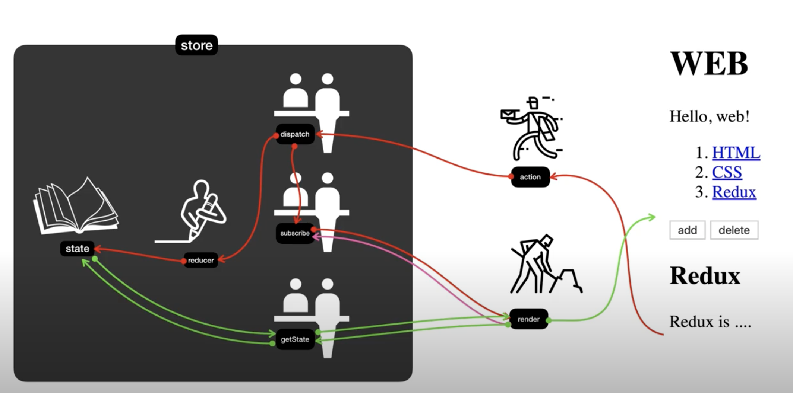

# redux

## 공부자료
[x] [생활코딩](https://www.opentutorials.org/module/4078)

## 수업소개
Redux - A predictable state container for JavaScript apps
- 코드의 복잡성을 낮추기 위함
- 복잡성을 갖춰서 예측가능하게함
- 하나의 상태를 갖는다. (application에 필요한 모든 데이터를 넣는다.)
- 현재의 중요한 상태를, 외부와 단절 시킴. 
 - 하지만, 인가된 함수만 접근 가능 (dispather, reducer)
 - getState로 data를 가져감
 - state가 바뀔때마다 지령을 내림

장점:
undo, redo를 쉽게 할 수 있음
- 원본을 바꾸는 것이 아니라, 원본을 복제하고 사는 것
- 현재 상태 뿐만 아니라, 과거 여러 시점을 볼 수 있음
- module reloading -> 우리가 작성한 코드가 자동으로 적용되는 것 (hot module reloading)



## state와 render의 관계
redux의 핵심은 store(은행이라고 비유)
store - 정보가 저장되는 곳.
```
var store = Redux.createStore(reducer);

```
- store을 생성할 때 reducer를 인자를 줌.

state - 실제 정보가 저장
- 직접 접근하면 안됨. 누군가를 통해야함.
reducer함수를 만들어서 공급해야함.

render는 UI를 만드는 역할을 하는 우리가 짜는 코드.(store의 밖에 있음)
```
function render(){
    var state = store.getState();
    //....
    document.querySelector('#app').innerHTML = `
    <h1>WEB</h1>
    ....
    `
}
```
- render는 내부적으로 store에서 데이터를 가져옴 
 - getstate는 state의 값을 가져오고 render로 전해줌
- rendor는 state값을 참조해서 UI를 만드는 것.

subscribe
```
store.subscribe(render);
```
- 목표: state의 값이 바뀔때마다 render의 값이 바뀌게 하는것

은행의 창구 직원처럼 (dispatch, subscribe, getState)

dispatch
```
function reducer(state, action) {
    if(action.type === 'create') {
        var newContents = old.state.contents.concat();
        var newMaxId = oldState.maxId+1;
        newContents,push({id:newMaxId, title:action.pa})
        return Object.assign({}, state, {
            contents: newContents,
            maxId: newMaxId,
            mode:'read',
            selectedId:newMaxId
        });
    }
}

<form onsubmit="
    //....
    store.dispatch({type:'create', payload:{title:title, desc:desc}});
">
```
- 객체를 전송하는데 type이 create -> action!
- dispatch가 하는일 두 가지
 - reducer를 호출해서 state의 값을 바꿈
  - 두 개의 값을 전달 (현재의 state값, action data를 전달)
  - reducer는 state를 입력값으로 받고, action을 참조해서 새로운 state값을 만들어서 리턴해주는 state를 가공하는 가공자
  - reducer가 리턴하는 값이 새로운 state가 된다.
  - state값이 변경 되면 render가 변경되어야함! 그러려면 dispatch에 등록되어있는 구독자를 다 호출하고 render를 다 호출하여 getState호출해서 다시 새로운 state에 맞게 UI가 바뀜!
 - 그 작업이 끝나면 subscribe를 이용해서 render함수를 호출함.

정리: state를 기반으로 render가 화면을 그려준다. 중간에 store의 state에 직접 접속하는 것이 금지되어 있기 때문에, getState를 통해 값을 가져오고 dispatch를 통해 값을 변경하고, susbscribe를 통해서 값이 변경되었을 때 구동될 함수들을 등록해준다. reducer를 통해서 state의 값을 변경한다!

## Redux가 좋은 이유
각각의 부품들은 독립성이어야한다.
it makes applications more efficient.
redux tool을 통한 시간 여행 가능.
- application 상태에 대한 버전관리.
- debugger는 현 상태에 대한 디버깅. time tarveling은 과거의 상태도 확인 가능.
중압집중적인 데이터 스토어를 통해서 애플리케이션을 쉽게 개발 할 수 있음.

## redux적용

store생성
1. store를 만든다.(state의 값이 생김)
 - state값을 가져올 때는 getState를 사용한다.
2. reducer라는 함수를 만들어서 state에 주입해준다. (dispatch에 의해 action이 들어오면 reducer가 그 actino값과 기존에 있던 state의 값을 참조해서 새로운 state의 값을 만들어주는 것.)
 -  reducer를 통해서 state값을 만들어줘야하는데 그 때에 기존 state === undefined면 reducer내에서 최초로 실행되는 초기값을 넣는다. 

reducer와 action을 이용해서 새로운 state값 만들기
state를 변경하기 위해서는 action을 만들어야함
그리고 그것을 dispatch에게 제출하면 dispatch는 이것을 reducer를 호출하는데, 이전의 state값과 action의 값을 동시에 준다.
그럼 우리가 짠 redcuer함수가 그것을 분석해서 state의 최종적인 값을 return해주면 된다.

state의 변화에 따라서 UI 반영하기
reducer - action의 값과 기존의 state값을 이용하여 새로운 state값을 리턴해준다. 그 return의 값은 원본을 바꾸는 것이 아니라 이전의 값을 복제한 결과를 리턴해야 redux의 최대한으로 활용할 수 있다.

blue의 부품은 green이나 red에대한 부품에 대한것에 알 필요가 없어지고, blue가 해야되는 일에만 집중해도 됨.

## redux 시간 여행
redux dev tools
- store에 전달된 action들을 version관리 함.
redux는 단일 스토어
[redux 이슈 해결](https://writingdeveloper.tistory.com/305)

## 실전 Redux
Store를 만들어야함.


reducer가 있어야함 -> 이전의 state와 해당 redcuer가 호출된 action을 갔는다. return new state. 최초 1회 reducer를 호출 할 때, state 값이 undefined면, 초기 값에 해당하는 값을 넣어준다.

store의 state값 변경, action이라는 것을 발생시키고, 그 action이 dispatch를 통해서 reducer를 실행시키면 reducer가 state에 새로운 값을 뱉어준다. 그리고, state의 값이 바뀌면, subscribe하고 있는 함수들을 호출해줌을 통해서 UI가 업데이트된다.